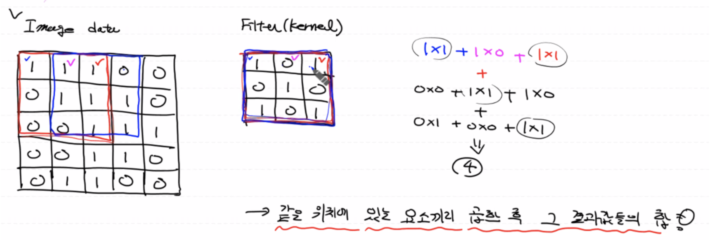
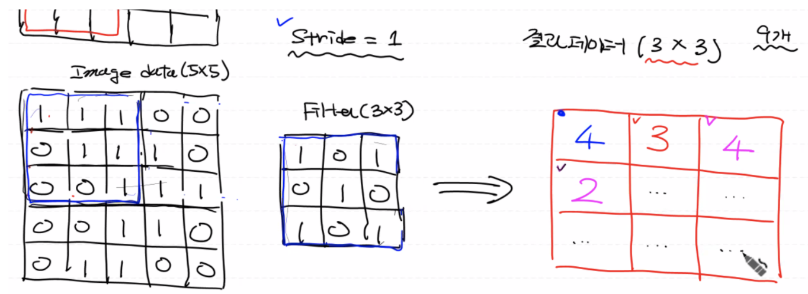
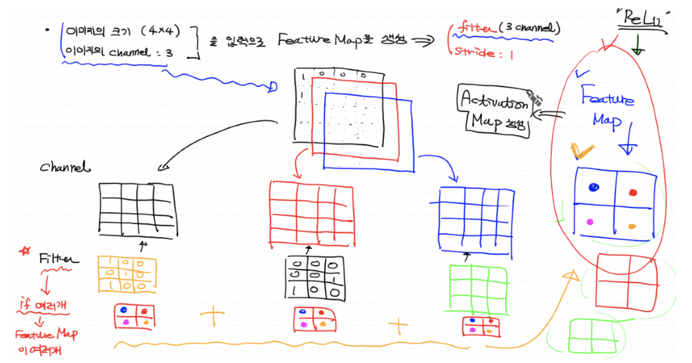
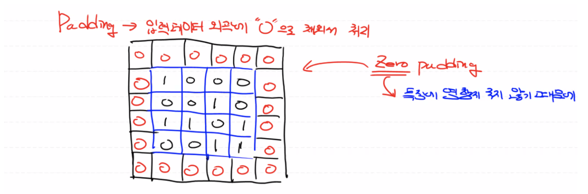
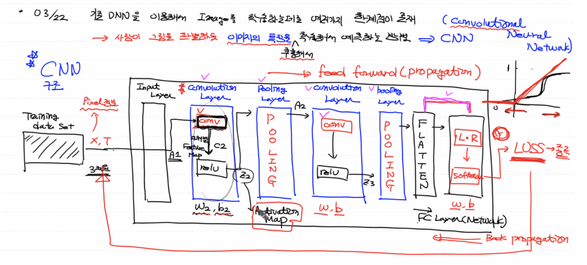

# Convolution Layer - Conv 작업

Convolution(합성곱)연산은 두 함수 f, g가 존재할 때 하나의 함수를 반전(reverse)시키고 전이(shift)시킨 후 다른 함수와 곱을 한다. 그리고 그 결과를 적분한다.

## 예제를 통해 "합성곱 연산" 이해하기

2차원 Binary 이미지 데이터에 대한 합성곱 연산을 진행해보자.

- 이미지 데이터에 대해 특정 작업을 시행하는 정방형 형태의 filter(kernel)가 필요하다.
- 이미지 데이터에 대해 필터를 적용하여 같은 위치에 있는 요소끼리 곱해서 결과값들을 모두 더한다. (동일한 작업을 모든 픽셀에 대해 수행)
- 필터를 한 칸 옆으로 이동하여(필터의 위치를 옮겨가면서) Convolution 연산을 반복 시행한다.



## Channel

이미지 픽셀의 형태는 실수값으로, 컬러 이미지의 경우 각 픽셀을 R,G,B 세 개의 실수로 표현한다. 즉 컬러 이미지는 3차원 데이터로 가로, 세로, 각 픽셀의 depth (=channel)로 표현된다. 이때 R,G,B 3개의 채널로 구성된다고 한다.

다시 말해, 각 픽셀의 값의 개수를 채널이라 한다.

- 채널은 컬러의 수가 아니라 속성값이다.

  (참고: png 파일의 경우, 각 픽셀의 값이 R,G,B,α(투명도) 4개로 되어있으므로 4 channel이라 한다.)

- 정확히는 현재 차원에 몇 개의 channel이 있는지를 명시한다.

- 즉, 각 픽셀에 대해 몇 개의 값이 있는 지가 채널을 의미한다.

Gray-scale(흑백 이미지)은 R,G,B 평균 하나의 값을 이용해 2차원 데이터로 표현이 가능하고 3차원으로 표현할 경우에는 `(height, width, 채널수: 1)`로도 표현이 가능하다.

- 흑백 이미지를 표현하는 세가지 형태
  - `(height, width, 1)`: 2차원 데이터에 채널 한 개를 강제로 올리게 되면 3차원 데이터가 된다.
  - `(height, width, 3)`: 채널의 수가 3인 3차원 데이터 (R,G,B 값의 평균값)
  - `(height, width)`: 2차원 데이터

## 이미지 처리 방식

일반적으로 이미지를 처리할 때 R,G,B 연산에 대한 오차를 줄이고 처리할 연산의 양을 줄이기 위해 전처리 과정을 통해 이미지를 흑백으로 변환하여 처리한다. 즉, 채널을 1로 만들어서 처리한다.

<br>

## Filter, Stride


### **Filter (=kernel)**

CNN에서 정방형으로 구성돼있는 필터는 컨볼루션 연산을 통해 이미지의 **특징**을 찾아내기 위한 공용 파라미터이다. 처음에는 랜덤으로 만들어지고 학습을 통해 **필터값**이 적절한 값으로 갱신되고 필터값을 이용해서 해당 이미지의 특징들을 잘 추출해낼 수 있다.

즉, 필터가 입력 파라미터인 이미지 픽셀에 (마치 Linear Regression에서 Wx+b 하는 것 처럼) 결합이 되어 연산이 수행되므로 **적절한 필터값을 찾는 것이 CNN 학습의 주요 요점**이 된다. 다시 말해, 필터 안의 구성 요소들이 CNN에서 학습의 대상이 된다.

  - 대부분의 경우, 3⨉3 크기(9개)의 필터를 많이 사용한다.
  - 필터가 Weight이다.

결국 이미지의 특징들을 다양하게 추출하기 위해 여러 개의 필터를 중첩해서 사용하며 **크기가 작은** 필터 여러 개를 중첩할 경우, 연산양을 줄이고 특징을 정교하게 추출할 수 있다.

### **Stride**

필터를 입력 이미지 데이터 위에서 지정된 간격(스칼라 값)마다 오른쪽, 아래로 이동하면서 컨볼루션 연산을 시행한다.

만약 Stride 값이 2일 경우,

- **Stride 값이 커질경우, Convolution 연산의 결과값 개수가 적어지게 된다.**

- Stride 값을 마음대로 결정할 수 있으나, 이미지 사이즈를 넘기지 않는 범위 내에서 칸이 서로 맞게 정할 수 있다.

  만약 Stride가 3일 경우 이미지 사이즈 5⨉5에서 필터 사이즈 3⨉3이 적용되지 않는다. (칸이 서로 맞지 않는다.)

- 따라서, Stride 값은 필터 사이즈와 이미지의 사이즈에 따라 제한된다. 일반적으로 Stride 값은 1 또는 2로 정해진다.

<br>

## **Feature Map**

각 필터 당 Feature Map 하나씩 나오므로 필터의 개수와 Feature Map의 개수가 같다.

<details>
  <summary>예)2차원 이미지 데이터</summary>
  <p>
  	<b>filter: 3⨉3, stride: 1 → Feature Map: 3⨉3</b>
  </p>
  
</details>
<details>
  <summary>예)3차원 이미지 데이터</summary>
  <p>
		이미지 크기: 4⨉4, 이미지 채널(각 픽셀의 값): 3인 입력 이미지로 결과 데이터 Feature Map을 생성해보자.
  </p>
  <ul>
    <li>Filter: 3(=이미지 채널)</li>
    <li>Stride: 1(스칼라 값)</li>
    <li>결과값: 2⨉2</li>
  </ul>
  
</details>

<br>

Feature Map은 이미지 또는 필터의 채널수와 상관이 없고 필터 당 Feature Map 한 개가 나오므로 커널의 개수와 관계가 있다.

(참고: 채널의 수는 컨볼루션 연산이 수행되는 횟수와 연관이 되지만 결국 연산 결과를 모두 합한 결과값 Feature Map 한개가 나온다.)

따라서, **Feature Map은 입력 데이터의 특징을 뽑아내는 커널(필터)을 적용해서 만든 것이므로 원래 이미지의 특징을 부각시킨 변형된 이미지이다. 일반적으로 Feature Map의 크기는 stride, filter 사이즈의 영향을 받는다.**

------

Filter가 여러 개 존재할 경우, Feature Map이 여러개 생성되고 이때, Feature Map의 개수를 Feature Map의 채널이라 부른다. 즉, Filter가 3개일 경우, Feature Map의 채널은 3이 된다.

<br>

## Padding

없는 데이터를 붙이는 작업으로 제로 패딩(입력 데이터 외곽, 상하좌우에 0으로 채워서 처리)을 주로 사용하게 된다. 원하는 픽셀만큼 0으로 채우면 기존 이미지에 대한 특징을 변화시키지 않고 이미지의 사이즈를 늘릴 수 있다.

입력 이미지에 대해서 stride와 filter(kernel)을 이용하게 될 경우 만들어지는 Feature Map은 입력 데이터보다 크기가 작아지게 된다. 따라서 컨볼루션 레이어를 통과하면서 입력 데이터 사이즈가 지속적으로 작아져 이미지의 특징을 추출할 수 없게되는 것을 방지하기 위해 더미 데이터를 넣어줄 수 있다.



- 필요에 따라 패딩의 수를 달리할 수 있다. (kernel, stride 사이즈에 따라 다름)
- 코드로 패딩 처리할 때, 두가지 옵션으로 처리할 수 있다. (Tensorflow 1.x)
  1. VALID: 패딩을 사용하지 않음 (→Convolution 처리를 하면서 입력보다 출력의 사이즈가 줄어든다.)
  2. SAME: Convolution 작업 전의 입력 데이터 사이즈와 출력 사이즈의 크기를 같게하는 패딩이 존재한다.

<br>

# Convolution Layer - Activation 작업

다채널의 Feature Map에 ReLU 함수를 적용하면 최종 출력 결과인 Activation Map이 생성되고 다음 레이어로 Activation Map이 넘어가게 된다. Activation Map은 원본 이미지의 특징을 가진 이미지 데이터이다.



이미지 한개에 여러 개의 필터를 사용하면 각 필터의 특징을 적용한 Feature Map이 생성된다. 일반적으로 Feature Map은 kernel과 stride로 인해 원본 사이즈보다 작아지므로 해상도가 떨어질 수 밖에 없다.

정리하면, CNN은 이미지의 특징에 대한 픽셀을 학습시키는 알고리즘이다. 이미지의 특징을 뽑아내서 데이터로 만들기 위해 Conv 연산을 수행하고 활성화 함수 ReLU를 적용시킨다.

<br>

## Convolution Layer 코드 구현

이미지는 3차원 데이터이고 이미지가 여러 개 있으므로 CNN에서 전체 입력 데이터는 **4차원 형태**이다.

(참고: 나중에 4차원 데이터가 DNN으로 들어갈 때는 2차원 데이터(이미지 개수, 이미지를 표현하는 데이터)로 변형(Flatten)이 되어 FC Layer로 들어가게 된다.)

<br>

### Convolution 연산

Kernel(=filter) 한 개당 Feature Map 한 개가 생성된다.

```python
import numpy as np
import tensorflow as tf

# 입력 이미지의 형태
# (이미지의 개수, height 픽셀수, width 픽셀수, channel)
# (1, 3, 3, 1), 4차원: 이미지 1장, 3x3, grey-scale
# 이미지 픽셀 데이터가 행렬의 값으로 들어가므로 0~225 사이의 값으로 채워진다.
# 위와 같은 형태를 가지는 넘파이 배열(벡터)을 생성 
image = np.array([[[[1],[2],[3]], 
                    [[4],[5],[6]],
                    [[7],[8],[9]]]], dtype=np.float32) # 뒤에서부터 생성
print(image.shape)
                  
# filter(kernel)의 형태 
# (filter height, filter width, filter channel(=입력 channel), filter의 개수)
# (2,2,1,1), 4차원
weight = np.array([[[[1]], [[1]]],
                   [[[1]], [[1]]]], dtype=np.float32)
print(weight.shape)

# (입력 데이터, 필터, stride(입력 데이터 형태), padding)
# tensor node
conv2d = tf.nn.conv2d(image, 
                      weight, 
                      strides=[1,1,1,1], # stride: 1(가로 1, 세로 1)
                      padding='VALID')   # VALID: 패딩 처리 안함

sess = tf.Session()
result = sess.run(conv2d) # 노드 실행 후 결과 리턴
print('feature map: \\n{}'.format(result))

# Convolution 결과
# (이미지의 개수, height, width, feature map channel(=filter 개수))
# (1, 2, 2, 1)
print(result.shape)
```

<br>

### 컬러 이미지

- 입력 이미지 채널: 3
- 필터: 2

```python
import numpy as np
import tensorflow as tf

# 입력 이미지의 형태
# (이미지의 개수, height 픽셀수, width 픽셀수, channel)
# (1, 3, 3, 3), 4차원: 이미지 1장, 3x3, color
# 위와 같은 형태를 가지는 넘파이 배열(벡터)을 생성 
image = np.array([[[[1,2,3],[1,2,3],[1,2,3]], 
                   [[1,2,3],[1,2,3],[1,2,3]],
                   [[1,2,3],[1,2,3],[1,2,3]]]], dtype=np.float32) # 뒤에서부터 생성
print(image.shape)
                  
# filter(kernel)의 형태 
# (filter height, filter width, filter channel(=입력 channel), filter의 개수)
# (2,2,3,2), 4차원
weight = np.array([[[[1,1],[1,1],[1,1]],
                  [[1,1],[1,1],[1,1]]],
                  [[[1,1],[1,1],[1,1]],
                  [[1,1],[1,1],[1,1]]]], dtype=np.float32)
print(weight.shape)

# (입력 데이터, 필터, stride(입력 데이터 형태), padding)
# tensor node
conv2d = tf.nn.conv2d(image, 
                      weight, 
                      strides=[1,1,1,1], # stride: 1(가로 1, 세로 1)
                      padding='VALID')   # VALID: 패딩 처리 안함

sess = tf.Session()
result = sess.run(conv2d) # 노드 실행 후 결과 리턴
print('feature map: \\n{}'.format(result))

# Convolution 결과
# (이미지의 개수, height, width, feature map channel(=filter 개수))
# (1, 2, 2, 2)
print(result.shape)
```

<br>

### 실제 이미지로 구현

- 최종 입력 이미지: channel_1_input_image
- 필터의 크기를 작게하고 필터를 여러 개 사용하는 편이 좋은 결과가 나온다.

```python
import numpy as np
import tensorflow as tf
import matplotlib.pyplot as plt
import matplotlib.image as img # PIL 대신 matplotlib 에 있는 image 모듈 사용

figure = plt.figure()
fig_1 = figure.add_subplot(1,2,1) # 원본 이미지
fig_2 = figure.add_subplot(1,2,2) # 결과 이미지

origin_img = img.imread('girl-teddy.jpg')
fig_1.imshow(origin_img)
plt.show()

# pillow 로 가져오면 이미지 객체로 가져오는데
# plt로 가져오면 numpy array로 가져옴
print(type(origin_img)) # <class 'numpy.ndarray'>
print(origin_img.shape) # (429, 640, 3), 3: RGB 평균
# 4차원 입력 데이터: (1, 429, 640, 3)
# 참고: 넘파이 함수 사용 가능
input_image = origin_img.reshape((1,) + origin_img.shape) # 앞으로 한차원 늘림
print(input_image.shape)

# 픽셀값 실수 형태로 변경 (행렬곱 연산 시 오류 방지)
input_image = input_image.astype(np.float32)

# 흑백 RGB
print(input_image[0,0,0,:]) # [17. 17. 17.]

# 3채널을 1채널로 변경 
channel_1_input_image = input_image[:,:,:,0:1] # 4차원(슬라이싱을 해야 []가 따라나옴), 0: 3차원
print(channel_1_input_image.shape) # (1, 429, 640, 1) -> 이제 필터 채널을 1로 설정할 수 있음
# filter: (3,3,1,1: 필터 개수)
weight = np.array([[[[-1]],[[0]],[[1]]],
                   [[[-1]],[[0]],[[1]]],
                   [[[-1]],[[0]],[[1]]]])
print('적용할 필터의 형태: {}'.format(weight.shape))

# strdie: 1
# padding: VALID
conv2d = tf.nn.conv2d(channel_1_input_image,
                      weight,
                      strides=[1,1,1,1], # 스칼라 1값을 가진 4차원 데이터 (내부적으로 4차원 데이터 연산)
                      padding='VALID')

# 수행
sess = tf.Session()
result = sess.run(conv2d)

# Feature Map
# 크기 변함: (429, 640) -> (427, 638)
print('Convolution 결과 형태: {}'.format(result.shape)) # (1, 427, 638, 1)

# 최종 3차원 이미지 데이터
# (1: 이미지 개수, 427, 638, 1) -> (427, 638, 1)
result_image = result[0,:,:,:]
print(result_image.shape) # (427, 638, 1)
figure = plt.figure()
fig_1 = figure.add_subplot(1,2,1) # 원본 이미지
fig_2 = figure.add_subplot(1,2,2) # 결과 이미지

# 원본 데이터 출력
fig_1.imshow(origin_img)

# 결과 이미지 출력
fig_2.imshow(result_image) # 이미지의 윤곽(특징)
plt.show()
```

<br>

Conv 작업을 통해 필터 1개당 새로운 이미지 1개가 생기기 때문에 필터의 개수 만큼 결과 이미지가 나온다. 따라서 필터(커널)의 개수를 늘리면 해당 이미지의 특징(윤곽) 여러 개를 뽑아낼 수 있게 된다.

결과적으로 필터의 개수를 늘리면 이미지 사이즈는 약간 줄고 입력 데이터의 양은 기하급수적으로 늘어나게 된다.

전체 데이터의 양이 많아지는 것은 어쩔 수 없지만 필터 결과 이미지의 사이즈를 줄여주기 위한 방법으로 **풀링 레이어**가 필요한 것이다. 즉, 이미지 학습량만 늘리는 많은 픽셀수는 불필요하므로 이미지의 특징(윤곽선)은 유지한 채로 이미지의 해상도(크기)를 줄이면 된다.

그러나 이미지 픽셀수가 너무 적을 경우 이미지가 뭉개져 보이므로 적절한 픽셀수가 필요하다.

(참고: 풀링 레이어는 옵션 레이어로 이미지 자체가 이미 작을 경우 굳이 풀링 레이어를 이용해서 이미지의 크기를 줄일 필요가 없다.)

-----

Reference: [DL_0322_CONV](https://github.com/sammitako/TIL/blob/master/Deep%20Learning/source-code/DL_0322_CONV.ipynb)