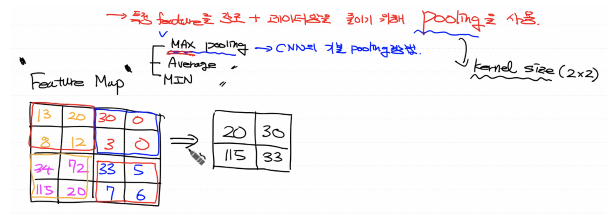
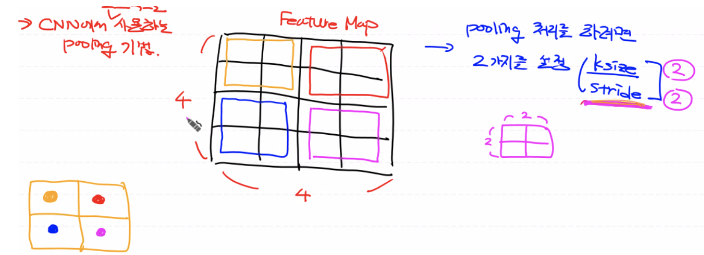

# Pooling Layer

Stride와 kernel(filter) 사이즈에 따라서 Feature Map의 사이즈가 결정된다. 일반적으로(VALID: 패딩을 쓰지 않을 경우) 풀링 레이어를 사용하면 이미지의 크기가 줄어든다.

만약, 필터를 여러개 사용하면 결과 이미지(Feature Map)의 개수(channel) 자체가 증가하게 되므로 실제 학습해야 하는 데이터량은 상당히 많아지게 된다.

따라서, 특정 feature(특징)들을 강조하고 데이터량(사이즈)을 줄여 전체 데이터의 사이즈를 줄이기 위해 Pooling Layer를 사용한다.



## Pooling 기법


1. **MAX Pooling (CNN의 기본 풀링)**

   : 이미지에 대한 손실을 최소화 하기 위해 가장 큰 특징값을 뽑아내어 이미지의 특징을 보존한다.

   (해당 이미지에서 가장 도드라진 특징을 추출할 수 있다.)

2. **Average Pooling**

3. MIN Pooling

<br>

## Pooling 처리를 위한 설정

풀링할 때 `kernel size`를 설정할 수 있는데, Feature Map에 대해서 **어떤 방식**으로 **몇 개(N⨉N)를 기준**으로 끊어서 풀링 처리를 할 것인지를 나타낸다.

- kernel size가 커질 수록 풀링된 결과 데이터의 사이즈가 작아진다.

- pooling layer에도 kernel과 stride가 존재한다.

- 일반적으로 Feature Map의 수를 줄이기 위해 kernel과 stride 크기를 동일하게 하여 이미지 각각의 사이즈를 줄이면서 전체 데이터의 사이즈를 줄여주는 처리를 하게 된다.

  (참고: Convolution Layer에서 kernel의 크기, stride의 크기에 따라 출력되는 Feature Map의 크기가 줄어든다. 하지만 필터를 여러개 쓰기 때문에 전체 데이터량은 상당히 많아지게 된다.)

------

1. **kernel size(ksize):** 가로, 세로방향으로 몇 칸 잡아서 풀링 처리를 할 것인지 설정
2. **stride:** 몇 칸 움직이면서 풀링 처리를 할 것인지 설정

보통 Feature Map의 크기에 따라 ksize와 stride가 정해지게 된다. (예: 16개 → 4개)



<br>

## 샘플 데이터를 이용한 Pooling Layer 구현

풀링 처리 후 이미지 사이즈가 줄어들어도 Feature Map 이미지의 특징을 그대로 유지하는 지 확인해 보자.

```python
import numpy as np
import tensorflow as tf

# Feature Map (입력 이미지)
# Convolution Layer의 결과값이므로 4차원 데이터
# (이미지 개수, 이미지 height, 이미지 width, feature map의 channel의 개수(=filter의 개수))
# (1, 4, 4, 1)

image = np.array([[[[13],[20],[30],[0]],
                  [[8],[12],[3],[0]],
                  [[34],[70],[33],[5]],
                  [[111],[80],[10],[23]]]], dtype=np.float32)

print(image.shape) # (1, 4, 4, 1): 16칸

# ksize = 2 (가로:2, 세로:2)
# stride = 2 
pooling = tf.nn.max_pool(image, 
                         ksize=[1,2,2,1], # 4차원 (맨 끝 두개의 값은 더미 데이터) 
                         strides=[1,2,2,1],
                         padding='VALID')

# tensor node
sess = tf.Session()
result = sess.run(pooling)
print('Pooling한 결과: \\n{}'.format(result))
print(result.shape) # (1, 2, 2, 1): 4칸
```

<br>

## 실제 이미지를 이용한 Convolution Layer, Pooling Layer 구현

Gray-scale 이미지를 이용해서 Convolution 연산과 Pooling 처리를 해보자.

### Input Image

```python
import numpy as np
import tensorflow as tf
import matplotlib.pyplot as plt # 이미지 출력용
import matplotlib.image as img  # 이미지 파일 데이터 -> 3차원 형태의 넘파이 배열

fig = plt.figure()
fig_1 = fig.add_subplot(1,3,1) # original
fig_2 = fig.add_subplot(1,3,2) # convolution
fig_3 = fig.add_subplot(1,3,3) # pooling

original_img = img.imread('girl-teddy.jpg')
fig_1.imshow(original_img)
print(original_img.shape) # (429, 640, 3; 평균값): 3차원 데이터 gray-scale
```

<br>

### Convolution

**Feature Map을 활성화 함수 ReLU를 통해 Activation Map으로 변환하는 과정은 제외한다.**

```
(이미지 개수, height, width, color channel)
```

- Convolution 처리 시, 기본적으로 4차원 형태의 데이터로 표현해야 한다.
- Convolution 처리 시, 모든 이미지의 사이즈는 동일해야 한다.

```python
# 4차원: (이미지 개수, height, width, color channel)
input_image = original_img.reshape((1,) + original_img.shape)
print(input_image.shape) # (1, 429, 640, 3) 

# 흑백 이미지의 channel 수 변경 (3->1)
channel_1_input_image = input_image[:,:,:,0:1]
channel_1_input_image = channel_1_input_image.astype(np.float32)
print(channel_1_input_image.shape) # (1, 429, 640, 1)

# filter: (filter height, filter width, filter channel(=input channel), filter 개수)
# (3, 3, 1, 1)
# -1, 0, 1: 윤곽선을 따라서 필터 처리가 됨
weight = np.array([[[[-1]],[[0]],[[1]]],
                   [[[-1]],[[0]],[[1]]],
                   [[[-1]],[[0]],[[1]]]], dtype=np.float32)

# stride: 1
# padding: VALID
sess = tf.Session()
conv2d = tf.nn.conv2d(channel_1_input_image, weight, 
                      strides=[1,1,1,1], padding='VALID')
conv2d_result = sess.run(conv2d)
print(conv2d_result.shape) # (1, 427, 638, 1: 필터 1개), 2 pixel 씩 줄어듦

# 3차원으로 변경
t_img = conv2d_result[0,:,:,:]
print(t_img.shape) # (427, 638, 1)

# 이미지 출력
fig_2.imshow(t_img)
```

<br>

### Pooling

만약, 필터값을 10개로 주면 원본 이미지 1장이 Conv 작업 후 이미지 10개가 만들어지고 이 10개의 이미지에 대해서 Pooling 작업을 각각 처리하면 결과적으로 이미지 10개로 나오게 된다.

```python
# ksize = 3
# stride = 3

pooling = tf.nn.max_pool(conv2d_result,  # Convolution 처리한 결과 (4차원)
                         ksize=[1,3,3,1],
                         strides=[1,3,3,1],
                         padding='VALID')
pooling_result = sess.run(pooling) # numpy array
print(pooling_result.shape) # (1, 142, 212, 1), 이미지 사이즈 줄어듦

# 3차원으로 변경
p_img = pooling_result[0,:,:,:]
print(p_img.shape) # (142, 212, 1)

# 이미지 출력
fig_3.imshow(p_img)
plt.show() # 이미지 형태 유지하고 이미지 사이즈가 줄고 윤곽선(특징)이 뚜렷해짐
```

<br>

------

Reference: [DL_0323_POOLING](https://github.com/sammitako/TIL/blob/master/Deep%20Learning/source-code/DL_0323_POOLING.ipynb)