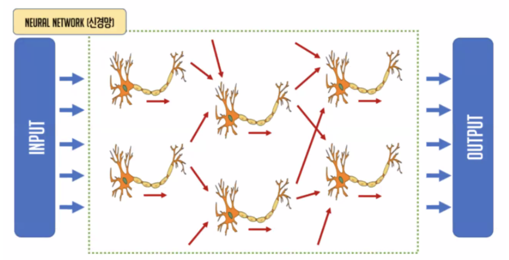
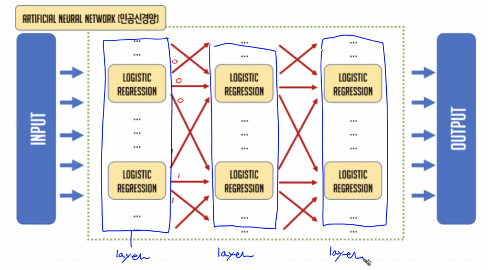
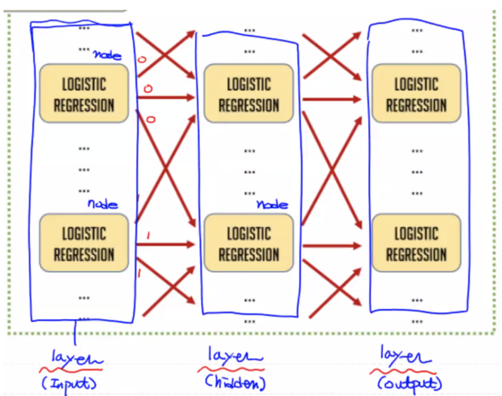
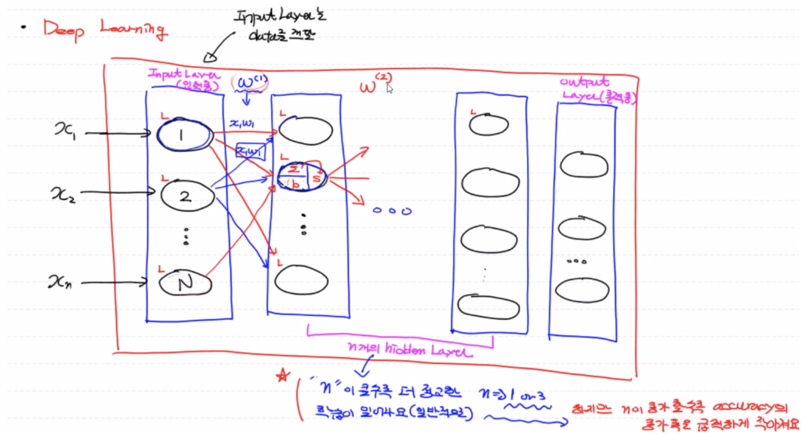
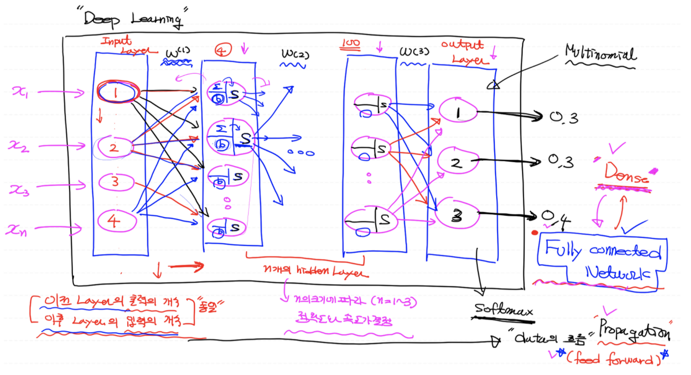

# 신경망 (Neural Network)

하나의 **뉴런이** 하나의 **로지스틱**으로 동작하는데, 뉴런이 여러개 모인 것을 **신경망**이라 한다. (뇌공학)

하나의 뉴런이 한 개 이상의 다음 뉴런에게 출력값(신호)을 전달할 수 있다. (뉴런의 신호전달 체계)

 

# 인공신경망 (Artificial Neural Network)

사람의 뇌를 프로그램적으로 모델링한 로지스틱(뉴런)이 인공 신경망의 기반이 된다. 이때 로지스틱들이 여러층으로 배치되어있는 구조를 레이어(layer)라고 한다.

(참고: 로지스틱 한개로 구성된 레이어를 Single Layer라고 한다.)

- Binary Classification(이진분류): 하나의 레이어 안에 **로지스틱 한 개만** 존재
- Multinomial Classification(다항분류): 하나의 레이어 안에 **로지스틱이 여러개(종속변수의 종류 만큼) 존재**

이제부터는 하나의 레이어의 출력값이 다른 레이어의 로지스틱에 대해서 입력값으로 들어가게 된다.

따라서 인공신경망이란, 레이어 개념으로 여러개의 로지스틱이 순차적으로 입력 데이터를 받아서 그 다음 로지스틱 레이어로 출력값을 내보내준다.

(참고: Keras 입장에서 녹색박스를 모델이라고 하고, 레이어는 각각의 레이어를 의미했다. 다시말해, 케라스는 인공신경망을 그대로 본떠서 만들었다.)

다시말해, 인공신경망에서 레이어란 로지스틱을 모아놓은 논리적인 단위(계층)이고 여러개의 로지스틱들이 한 레이어에서 다른 레이어로 아웃풋값을 전파시키는 구조이다.

 

# 딥러닝(Deep Neural Network, DNN)

한 개의 로지스틱 회귀를 나타내는 **노드(Node)**가 서로 연결되어 있는 신경망 구조로 N개의 레이어를 구축해서 만들어진다.

기본적으로 1개의 입력층(Input Layer), 1개 이상의 은닉층(Hidden Layers), 1개의 출력층(Output Layer)을 구축해서 **출력층의 오차를 기반으로 각 노드의 가중치를 학습시키는 머신러닝의 한 분야**를 지칭한다.

- 머신러닝
- 3개 이상의 레이어 구조
- 레이어 안의 로지스틱 노드가 여러개가 연결되어 있는 신경망 구조

정리하면, 출력층에서 나온 결과값(예측치)과 실제 정답과의 차이, 즉 오차를 이용하여 **각 노드의 가중치**를 구한다. 이 때 노드의 가중치는 편미분으로 구해지므로 학습 과정이 복잡하고 학습 속도가 오래걸린다.

 

## 딥러닝을 사용하는 이유

딥러닝 구조에서 한 개 이상의 은닉층을 사용하면 모델의 정확도가 훨씬 높아진다. 다시말해, 은닉층을 깊게(deep) 만들 수록(여러개 사용) 일반적으로 정확도가 더 높아진다.

그러나  은닉층 레이어의 개수가 증가할 수록 성능(accuracy)의 증가폭은 급격히 작아지지만, 학습 시간의 속도는 엄청 느려진다. 즉 학습 시간의 폭이 급격히 커진다.

따라서 가장 이상적인 은닉층 레이어의 개수는 1 ~ 3개일 때 모델의 정확도가 가장 높다.

## **딥러닝의 특징**

- 장점: 머신러닝 기법 중 모델의 정확도가 가장 높다.

- 단점: 레이어 별로 다수의 로지스틱 노드가 그 안에 포진되어 있고 레이어 자체도 많다. 따라서 가중치를 구하기 위해서 편미분을 해야하는 횟수가 굉장히 많아지게 된다. 즉 계산양이 많아져서 학습 속도가 오래걸린다.

  따라서 미분, 행렬 연산이 많으므로 각각의 코어들이 동작하는 클럭수(프로그램 연산 처리)는 느리지만 여러개의 로지스틱을 동시에 계산(수행)할 수 있는 병렬 처리 방식의 GPU을 이용해서 학습하게 된다.

  (참고: CPU는 코어 갯수가 정해져 있어서 동시에 다수를 처리하는데에 있어서는 한계가 있지만 하나의 연산에 대해서는 빠른 연산이 가능하다.)

  1. 그래픽 카드에 GPU가 달려있는 경우, NVIDIA 계열이라면 라이브러리를 통해 GPU 사용
  2. **Colab 이용 (무료)**
  3. AWS 이용 (유료)
  4. Google Cloud (유료)
  
   

## 딥러닝 동작 방식 이해하기

- **Input Layer**

  입력 데이터를 바로 다음 레이어인 은닉층으로 전달(bypass)해주는 역할을 한다. Input Layer 안에 있는 하나의 노드가 그 다음 은닉층 각각의 노드에게 데이터를 모두 전파(propagation, feed forward)하는데, 이때 **레이어 사이 사이에 존재하는 W값**을 곱해서 전달하게 된다.

- **Hidden Layers**

  입력값에 가중치가 곱해서 데이터가 들어오게 되면, 은닉층의 로지스틱 노드는 bias를 더해 Linear Regression을 만들고, 여기에 활성화함수인 sigmoid 함수를 취해 **Logistic Regression(확률값)**을 완성하게 된다. 마지막으로 이 결과값을 다음 레이어의 모든 노드에 입력값으로 보내준다.

  **(부록: 은닉층의 활성화함수는 시그모이드 함수이다.)**

- **Output Layer**

  최종적인 결과를 받아 각 라벨에 대한(Multinomial Classification) 확률값을 내보내게 된다. 이때 출력층에 대한 활성화함수는 softmax 함수가 사용된다.

  **(참고: 맨 마지막 출력층 노드가 1개이면 이진분류이므로 활성화함수로 시그모이드 함수를 사용한다.)**

데이터가 입력층부터 출력층까지 전파되면서 학습이 진행되는 데이터의 흐름을 propagation 또는 feed forward라고 한다.

따라서, 딥러닝의 최종 결과값과 정답과 비교해서 오차를 구하는 손실함수를 이용하여 최적의 W와 b를 구한다.

로지스틱 노드 한 개가 레이어 안에서 여러개로 확장되면 Multinomial이라 하고, 이 상태에서 레이어 자체가 여러개로 확장되면 딥러닝이라 한다.

즉, 하나의 로지스틱을 가로방향, 세로방향으로 늘리는 것이 딥러닝이다. 이때 이전 layer의 출력 개수가 이후 layer의 입력 개수와 동일해야 한다.

 

### **Fully Connected Network**

데이터를 제대로 받을 수 있게 이전 layer의 출력의 개수가 그 다음 layer의 입력의 개수와 동일한 상태를 뜻한다.

즉, 모든 노드들이 레이어 간에 서로 완전히 연결되어 있는 상태로 DNN은 기본적으로 Fully Connected Network이다.

- Dense Layer: Fully Connected Network로 구성된 노드를 가지는 레이어

  (현재 레이어를 기준으로 앞, 뒤 레이어 안에 있는 모든 노드와 현재 레이어 안의 모든 노드들이 서로 완전히 연결되어 있는 상태)

- Dense layer로 구성된 전체 네트워크를 Fully Connected Network라고 한다.

   

## 딥러닝 코드 구현 (XOR)

Single-Layer 대신 Multi-Layer를 통해 문제 해결

1. [Tensorflow 1.x 버전](https://github.com/sammitako/TIL/blob/master/Machine%20Learning/source-code/DL_0316(1).ipynb)

2. [Tensorflow 2.x 버전 (Keras)](https://github.com/sammitako/TIL/blob/master/Machine%20Learning/source-code/DL_0316(2).ipynb)

   

     
Keras 구현 결과 해석

     

       결과가 잘 안나오므로 hyper-parameter 중 활성화 함수를 시그모이드 함수에서 렐루 함수로 바꿔보았다.
     

     

       그런데도 예측 결과가 계속 달라진다? W, b가 처음에 랜덤으로 지정되었기 때문이다!
     

   

   

   

