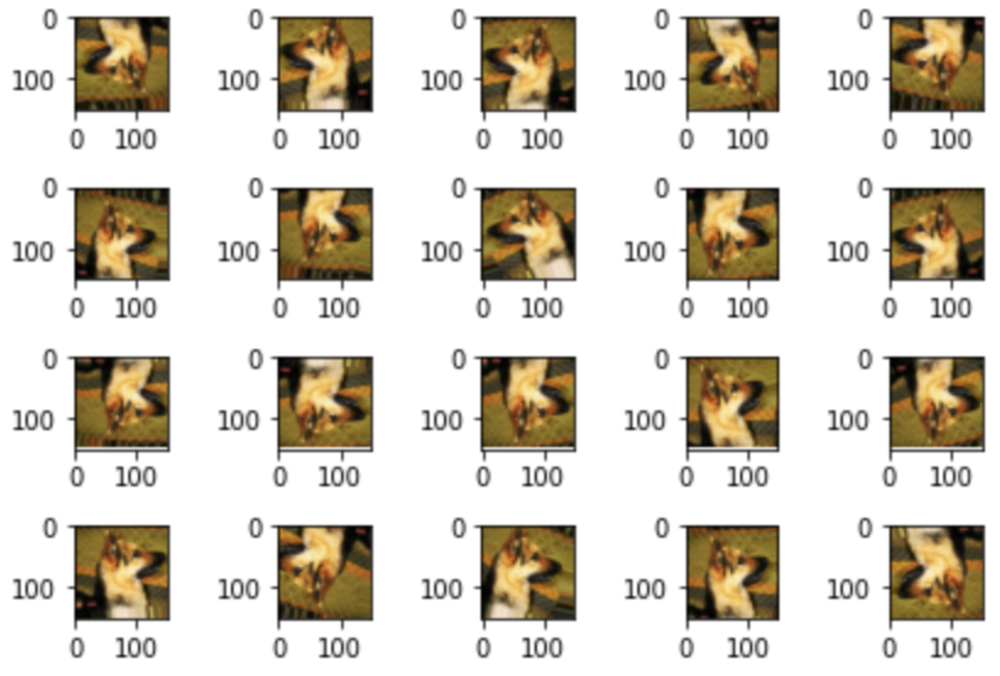

# Image Data preprocessing

## 1. **원초적(low_level) 방법 (85%)**

- 이미지 파일을 읽어서 RGB 픽셀값(ndarray)으로 디코딩하여 컬러 이미지인 3차원 데이터를 도출

- 3차원 데이터에서 Gray-scale을 표현하기 위해 1채널로 변경

- 입력 이미지의 사이즈(N⨉N)도 동일하게 처리

  (참고: x_feature(픽셀값)가 많을 경우 overfitting이 발생할 수 있으므로 **저해상도** 이미지가 적합)

- 정규화, 라벨링 작업 필요

- csv 파일로 생성

## 2. **Keras 라이브러리인 `ImageDataGenerator` 사용**

특정 폴더(디렉토리)나 특정 데이터프레임 안에 있는 이미지 데이터를 픽셀 데이터 형태로 생성

(즉, 파일을 읽어서 디코딩 후 학습에 사용하고 그 다음 데이터를 읽어서 디코딩 후 학습에 사용하고...)

그러나, 실시간으로 파일을 읽어서 픽셀값으로 변환시키기 때문에 I/O Latency가 발생하게 된다. 즉, 빠른 메모리에서 동작하지 않고 하드 디스크 Arm을 움직여서 디스크에서 데이터를 가져오는 작업은 굉장히 느리기 때문에 전체 학습 시간을 저하시키는 요인이 된다.

## 3. **Tensorflow의 기본 자료구조인 `TFRecord` 사용**

레이블과 데이터를 같이 붙여놓은 텐서플로우 자체에서 정의한 자료구조로 코드 자체가 어렵다.

(첫 번째 방식의 장점과 두 번째 방식의 혼합으로 사용할 것이다)

<br>

# ImageDataGenerator

배치 사이즈 만큼 끊어서 전체 이미지 데이터를 픽셀화 하지만, 전체 이미지 데이터를 모두 픽셀 데이터로 전환한 후에도 데이터를 끊임없이 생성한다. (무한히 반복 생성됨)

- `rescale`: 정규화하는 속성으로 MinMaxScale을 사용하기 위해 현재값을 255(컬러의 최대값)로 나눠줌
- `flow_from_directory(타겟 디렉토리, classes=[폴더명], target_size, batch_size, class_mode)`

```python
import os
from tensorflow.keras.preprocessing.image import ImageDataGenerator
import matplotlib.pyplot as plt

# 경로 설정
train_dir = '/content/drive/MyDrive/ML Colab/data/CAT_DOG/cat_dog_small/train'
validation_dir = '/content/drive/MyDrive/ML Colab/data/CAT_DOG/cat_dog_small/validation'
test_dir = '/content/drive/MyDrive/ML Colab/data/CAT_DOG/cat_dog_small/test'

# ImageDataGenerator 객체 생성 (MinMaxScaling 정규화 기능 포함)
# 픽셀값: RGB(0~255) 3채널을 가지는 3차원 데이터
train_datagen = ImageDataGenerator(rescale=1/255)
validation_datagen = ImageDataGenerator(rescale=1/255)

# 디렉토리로부터 데이터 가져오기 (-> ImageDataGenerator 객체에 설정 부여)
# 최종적인 이미지에 대한 픽셀 데이터 생성기
train_generator = train_datagen.flow_from_directory(train_dir)
train_generator = train_datagen.flow_from_directory(
    train_dir,               # target directory
    classes=['cats','dogs'], # label: [0, 1]
    target_size=(150,150),   # 이미지 리사이즈
    batch_size=20,           # 배치 사이즈
    class_mode='binary'      # 분류 종류
)

# Validation Data에도 동일 적용
validation_generator = validation_datagen.flow_from_directory(
    validation_dir,          # target directory
    classes=['cats','dogs'], # label: [0, 1]
    target_size=(150,150),   # 이미지 리사이즈 
    batch_size=20,           # 배치 사이즈 
    class_mode='binary'      # 분류 종류
)

# 이미지에 대한 픽셀 데이터와 레이블을 튜플 형태로 출력
for x_data, t_data in train_generator: # 20개
    print(x_data.shape) # (20, 150, 150, 3) =(이미지 개수, 세로, 가로, 채널)
    print(t_data.shape) # (20,); 1차원 벡터
    break               # ImageDataGenerator의 무한 반복 방지

# 픽셀 데이터 이미지화
fig = plt.figure()
fig_arr = list()
for i in range(20):
  fig_arr.append(fig.add_subplot(4,5,i+1))

for data_batch, label_batch in train_generator:
  for idx, img_data in enumerate(data_batch):
    fig_arr[idx].imshow(img_data)
  break;
  
fig.tight_layout()
plt.show()
```

이미지 사이즈, 이미지의 개수에 따라 CNN 구조가 달라지지만, 일반적으로 구글(Inception)이나 마이크로소프트(ResNet)에 따르면 콘볼루션 레이어가 7개에서 150개로 정해진다.

<br>

## CNN (Keras)

- `steps_for_epoch`: 1 epoch(전체 데이터를 1번 학습) 당 데이터를 몇개, 몇번 추출할 지를 설정

```python
model = Sequential()

# INPUT LAYER + CONVOLUTION LAYER 
model.add(Conv2D(filters=32, kernel_size=(3,3), activation='relu', input_shape=(150,150,3)))

# POOLING LAYER
model.add(MaxPooling2D(pool_size=(2,2)))

# CONVOLUTION LAYER, POOLING LAYER 반복
model.add(Conv2D(filters=64, kernel_size=(3,3), activation='relu'))
model.add(MaxPooling2D(pool_size=(2,2)))

model.add(Conv2D(filters=128, kernel_size=(3,3), activation='relu'))
model.add(MaxPooling2D(pool_size=(2,2)))

model.add(Conv2D(filters=128, kernel_size=(3,3), activation='relu'))
model.add(MaxPooling2D(pool_size=(2,2)))

# FC LAYER
model.add(Flatten())

# HIDDEN LAYER (option)
model.add(Dense(units=512, activation='relu'))

# OUTPUT LAYER
model.add(Dense(units=1, activation='sigmoid')) # 1: 확률값 

print(model.summary())

# OPTIMIZER
model.compile(optimizer=Adam(learning_rate=1e-4), loss='binary_crossentropy', metrics=['accuracy'])

# LEARNING
history = model.fit(train_generator,     # train_generator: x_data, t_data를 같이 뽑아줌
                    steps_for_epoch=100, # train_generator: 2000개 데이터를 1epoch 당 20개씩 학습
									  epochs=30,
                    validation_data=validation_generator,
                    validation_steps=50
)
```

트레이닝 데이터의 학습 결과로 나오는 `loss`(→0)와 `accuracy`(→1) 값은 학습이 잘 진행되고 있는 지 확인하는 지표로 사용할 수 있다.

에폭이 증가하면서 training 그래프와 validation 그래프의 격차가 커질 수 밖에 없다. 따라서 어느 에폭선까지 과대적합이 덜 발생하는 지, 많이 발생하는 지를 그래프로 그려서 확인해봐야 한다.

```python
# 모델 저장
model.save('./cat_dog_small_cnn_tf2.4.h5')

# history 객체 조사
print(history.history)
print(type(history.history))

print(history.history.keys())

# 과대적합 확인(O)
train_acc = history.history['accuracy']
val_acc = history.history['val_accuracy']

train_loss =history.history['loss']
val_loss =history.history['val_loss']

plt.plot(train_acc, color='r', label='training accuracy')
plt.plot(val_acc, color='b', label='validation accuracy')
plt.legend()
plt.show()
```

<br>

## Overfitting을 해결하기 위한 모델 개선 방법

컴퓨터 비전 쪽에서 이미지를 다룰 때 일반적으로 사용하는 과대적합 감소 방법 2가지

### **데이터 증식(Data Augmentation)**

과대적합 발생 원인인 데이터 부족을 해결하기 위해 현재 가지고 있는 기존 데이터의 변형을 통해 데이터량을 추가적으로 만들어내서 과대적합을 방지하려고 하지만 근본적인 해결책이 되지 않는다. (정확도가 조금은 올라감)

------

`ImageDataGenerator`: 이미지를 변형시키는 속성(옵션)을 통해 데이터를 증식시킨다.

- 이미지 회전: 지정된 각도 범위 내에서 임의로 원본 이미지를 회전
- 이미지 플립: 수평 또는 수직 방향으로 반전
- 이미지 중심점 이동: 가운데를 중심으로 전체 데이터에 대해서 가로 방향(왼쪽, 오른쪽)으로 또는 세로 방향(위, 아래)으로 이동
- 이미지 확대 및 축소: `1 - 수치` 혹은 `1 + 수치` 만큼 축소 및 확대 (1이 기준)

```python
from tensorflow.keras.preprocessing import image
from tensorflow.keras.preprocessing.image import ImageDataGenerator
import matplotlib.pyplot as plt

# 데이터 증식 (4차원)
datagen = ImageDataGenerator(rotation_range=20, 
                             width_shift_range=0.1, 
                             height_shift_range=0.1,
                             zoom_range=0.1,
                             horizontal_flip=True,
                             vertical_flip=True
)

# 이미지 객체
img = image.load_img('/content/drive/MyDrive/ML Colab/data/CAT_DOG/cat_dog_small/train/dogs/dog.107.jpg',
                     target_size=(150,150))

# 넘파이 배열(픽셀 정보)로 변경
x = image.img_to_array(img)
print(x.shape) # (150, 150, 3)

# 차원 변경
x = x.reshape((1,) + x.shape)
print(x.shape) # (1: 이미지 개수, 150, 150, 3)

# 증식된 이미지 데이터 확인
fig = plt.figure()
fig_arr = list()

for i in range(20):
    fig_arr.append(fig.add_subplot(4,5,i+1))

idx = 0
for batch in datagen.flow(x, batch_size=1): # 데이터가 한개이므로 배치 사이즈는 1로 설정
    fig_arr[idx].imshow(image.array_to_img(batch[0])) # batch: 이미지 객체, [0]: 픽셀 정보
    print(batch)
    idx += 1

    if idx % 20 == 0: # 이미지 한 개를 20번 반복하면서 20개로 데이터를 증식
      break

fig.tight_layout()
plt.show()
```



<details>
  <summary>Cats & Dogs CNN_TF2.4.1 전체 코드</summary>
  <a href="https://github.com/sammitako/TIL/blob/master/Deep%20Learning/source-code/DL_0326_Cats%26Dogs_CNN(Keras).ipynb">DL_0326_Cats&Dogs_CNN(Keras)</a>
</details>

