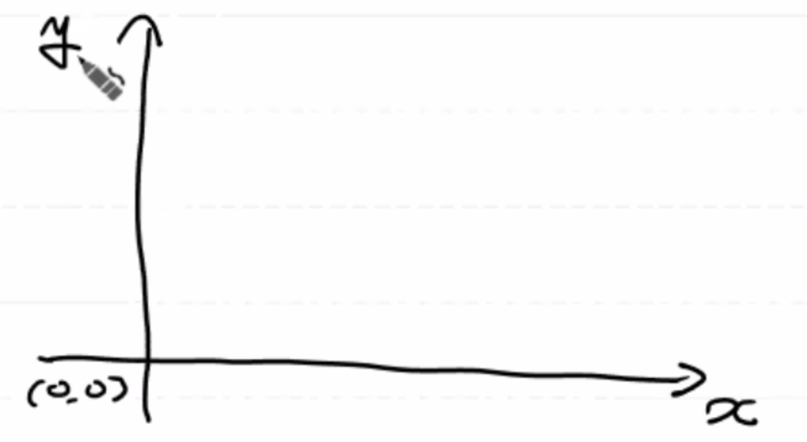
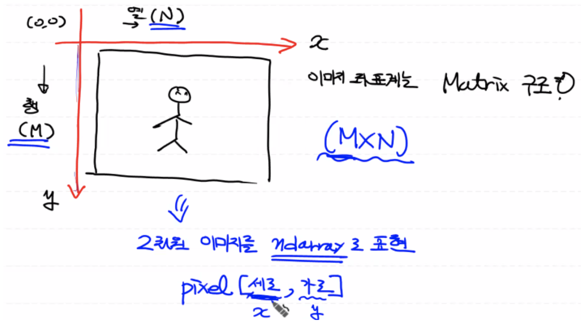
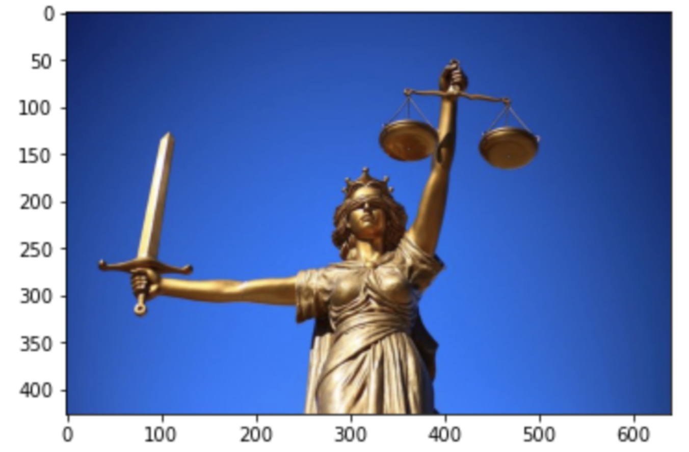
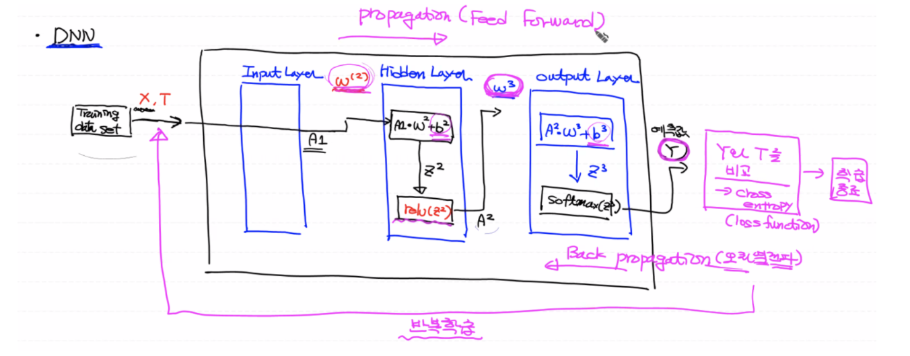
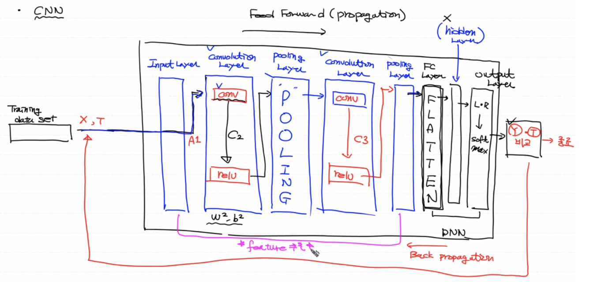

# 디지털 이미지

- 픽셀: 이미지를 이루고 있는 가장 기본적인 단위

  (참고: 메모리 공간에 저장되며 이미지 위치에 대한 밝기값을 가지고 있다.)

- 해상도: 픽셀의 개수 (해상도가 높을 수록 픽셀의 개수가 많다)

  <br>

### 디지털 이미지 좌표계


디지털 이미지는 2차원으로 표현하는 데카르트 좌표계와 다른 **이미지 좌표계**를 사용한다.

<details>
  <summary>데카르트 좌표계: 수학공식에서 사용되는 x-축, y-축 형태</summary>
  
</details>
<details>
  <summary>이미지 좌표계: y-축(행), x-축(열)로 표현되는 행렬 구조(M⨉N)</summary>
  <p>
  	예) 2차원 이미지(M⨉N)를 <b>pixel[세로축:M, 가로축:N]</b>형태인 넘파이 배열로 표현된다.
  </p>
  
</details>
<br>


## 이미지 처리

**라이브러리 설치**

- `OpenCV`: 가장 대표적인 이미지 처리의 오픈소스 외부 모듈 (이미지 처리계에서 판다스와 같은 존재)

  (참고: 라이브러리 자체에 기능이 많아서 무겁고 편하지 않다.)

- `Pillow`: 이미지 변환(회전, 사이즈 변경)을 쉽게 할 수 있다.

```bash
conda install Pillow
```

<details>
  <summary>이미지 좌표계를 사용하므로 y축 아래로 내려올 수록 값이 증가한다.</summary>
  
</details>

<br>

### **이미지 정보** 알아보기

프로그램적으로 픽셀 넘파이 배열을 통해 이미지 처리를 한다.

- 이미지 사이즈(가로, 세로)
- **이미지 픽셀(세로, 가로)**

```python
import numpy as np
from PIL import image
import matplotlib.pyplot as plt

# 이미지 객체 생성 (JpegImageFile 클래스를 이용하여 인스턴스화)
img = Image.open('justice.jpg')
print(type(img)) # <class 'PIL.JpegImagePlugin.JpegImageFile'>

# 이미지 출력
plt.imshow(img) # 인자: 이미지 객체, 넘파이 배열
plt.show()

# 픽셀 정보 (넘파이 배열)
# 이미지는 기본적으로 3차원(각 픽셀 당 RGB, 3개의 값을 가짐)
pixel = np.array(img)
print('x좌표: {}, y좌표: {}의 픽셀값: {}'.format(100,200,pixel[200,100])) # 이미지 좌표계
print('이미지 크기: {}'.format(img.size)) # 크기: (가로, 세로)
print('이미지 형태: {}'.format(pixel.shape)) # 형태: (세로, 가로, 3: 차원)
```

<br>

### **Pillow의 이미지 객체**를 통한 이미지 처리하기

일반적으로, 이미지의 크기를 작게하여 특징을 뽑아내서 학습을 시키는데에 초점을 맞추고 있다. 데이터의 양이 줄었으므로 수행속도가 줄어들어 이미지가 가지는 정보의 손실을 최소화할 수 있다.

(참고: 컴퓨터는 픽셀의 시퀀스으로 학습하므로 시퀀스가 증가할 수록 경우의 수가 늘어나므로 학습에 대한 정확도가 떨어진다.)

```bash
# 이미지 객체를 파일로 저장
img.save('my_img.jpg')

# 이미지 특정부분 자르기
crop_img = img.crop((30,100,150,330)) # (좌상, 우하)
plt.imshow(crop_img)

# 이미지 사이즈 조절 (인자: 튜플)
# 계산에 의한 더미값이 들어가게 되므로 원본 이미지를 잘 표현하지 못하게 될 수도 있다.
resize_img = img.resize((int(img.size[0]/8), int(img.size[1]/8))) # (가로, 세로)
plt.imshow(resize_img)
plt.show()

# 이미지 회전 (이미지 증식에 사용)
rotate_img = img.rotate(180) # radian
plt.imshow(rotate_img)
plt.show()
```

<br>

## 디지털 이미지의 형태

각 픽셀을 표현하는 비트수에 따라 3가지 형태로 분류된다.

### 1. **이진 이미지 (Binary Image)**

   : 이미지를 구성하고 있는 각각의 픽셀의 값을 0(어두움)과 1(밝음)로만 표현한 이미지

   - 각 픽셀을 1 bit만으로 표현하므로 이미지 사이즈가 작다.

     (참고: bit는 논리적으로 가장 작은 데이터 저장 공간으로 한 칸을 의미한다.)

   - 언뜻 생각하기에 각 이미지를 비트 하나로 표현할 수 있으므로 모든 이미지 표현 방식 중 가장 작은 사이즈로 이미지를 표현할 수 있다고 생각할 수 있지만 실제로는 그렇지 않다.

   - 이론과 다르게 프로그램적으로 하나의 픽셀을 표현하기 위해서는 **무조건 8비트를 사용**하게 된다. 따라서 맨 마지막의 한 비트만 사용하고 나머지 7비트 공간의 낭비가 생긴다.

   - 아래의 흑백 이미지(Gray-scale Image)와 사이즈 차이가 없으므로 굳이 이진 이미지로 흑백 이미지를 표현할 필요가 없다.

     <br>

### 2. **흑백 이미지 (Gray-scale Image)**

   : 하나의 픽셀을 표현하기 위해 8비트를 사용하기 때문에 각 픽셀의 값은 0~255($2^8)$의 값으로 표현된다.

   (참고: 2의 8제곱에서 2는 픽셀의 값 0과 1을 의미한다.)

   - 결국 위의 이진 이미지와 흑백 이미지의 사용공간과 2차원 형태는 동일하지만, 이미지의 품질이 다르다.
   - 그러나 흑백 이미지에 한해서는 3차원으로 표현이 가능하다.

------

<br>

### 3. **컬러 이미지 (Color Image)**

   : 각 픽셀에 3개의 채널(3개의 값)이 포함되며 각 채널은 빛의 3원색인 RGB 색상값으로 표현된다. `png` 파일의 경우 투명도(ɑ)가 들어가므로 4채널이 되며 4⨉8=32비트를 사용한다.

   각각의 색상값은 R: 0~225(8비트), G: 0~225(8비트), B: 0~225(8비트)의 값을 가지고 총 24개의 비트를 이용하게 된다. 24개의 비트를 이용하는 컬러를 True Color 라고 한다.

   컬러 이미지는 각 픽셀에 값이 3개가 있어야 하므로 **기본적으로 3차원 데이터**이다. 따라서 이미지 표현 형태 중 데이터 사이즈가 가장 크다.

   (참고: 이미지의 기본은 3차원이다.)

<br>

## 이미지 학습 용도


1. 이미지 색상도 학습

2. 이미지 형태만 학습 (대부분 이미지 처리 학습 시 사용)

   컬러 이미지를 흑백 이미지로 변경하여 대부분 이미지 처리를 진행하며 처리 속도가 빠르다.
   
   <br>

## Gray-scale Image

컬러 이미지를 흑백 이미지로 변환해보자. (픽셀 데이터를 넘파이 배열로 처리)

### **2차원 (데이터의 양이 줄어들어 학습 속도가 빠르다.)**

- 3차원 흑백 이미지의 1차원 벡터를 날리고 스칼라 값으로 바꾸면 전체 이미지 데이터는 **2차원이** 된다.
- `(가로, 세로, 각 픽셀에 대한 RGB값 3개: 0,1,2)`

```python
gray_2d_pixel = gray_pixel[:,:,0] # 3차원 흑백 이미지에 대한 슬라이싱 (세로, 가로, 평균컬러)
print(gray_2d_pixel.shape) # 2차원: (426, 640)

# 3차원 넘파이 배열에 대한 이미지 출력
plt.imshow(gray_2d_pixel) 
plt.show()

# 2차원 넘파이 배열에 대한 이미지 출력
# cmap 옵션: grey, Greys(=gray_r)
plt.imshow(gray_2d_pixel, cmap='gray') # Greys = gray_r 
plt.show()

plt.imshow(gray_2d_pixel, cmap='Greys') # gray_r 
plt.show()

# 이미지(흑백 처리된 2차원 ndarray)를 파일로 저장
gray_2d_img = Image.fromarray(gray_2d_pixel) # ndarray로 부터 이미지 객체를 생성
gray_2d_img.save('my_gray_img.jpg')
```

### 3차원

: 각 픽셀의 RGB 값의 평균을 구해서 각각의 R, G, B 값으로 설정

```python
import numpy as np
from PIL import Image
import matplotlib.pyplot as plt

# 이미지 객체 생성
color_img = Image.open('fruits.jpg')
plt.imshow(color_img)
plt.show()

# 넘파이 배열로 픽셀값 생성
color_pixel = np.array(color_img) # 3차원
print('color_pixel의 형태: {}'.format(color_pixel.shape)) # (426, 640, 3)

# 흑백 이미지로 처리
gray_pixel = color_pixel.copy() # 새로운 넘파이 배열 생성(3차원)

for y in range(gray_pixel.shape[0]): # 426
    for x in range(gray_pixel.shape[1]): # 640
        gray_pixel[y,x] = int(np.mean(gray_pixel[y,x])) # 해당 픽셀 안의 컬러 벡터 (RGB 넘파이 배열), broadcasting 27:00~31:00
```

<br>

# CNN(Convolutional Neural Network)

딥러닝의 대표적인 이미지 학습 알고리즘으로 convnet(합성곱 신경망)이라 불린다. 픽셀 정보로 이미지가 표현되므로 픽셀 정보를 통해 이미지의 **특징(패턴)**을 학습해서 이미지를 판단한다.

(참고: 이미지의 모든 픽셀, 즉 이미지 자체를 학습하는 방식이 아니다.)

<br>

## 용어정리

- **DNN(Deep Neural Network)**

  : 일반적인 딥러닝의 구조로 인공 신경망이 상하좌우로 커지면서 Deep Neural Network가 된다. 레이어와 로지스틱 노드를 늘려서 조금 더 정교하게 정확하게 데이터를 학습하는 방식이다.

- **FC(Fully Connected) Layer**

  : 일반적으로 DNN과 같은 의미로 혼용해서 사용되는데 사실 이전 레이어의 모든 노드가 다음 레이어의 모든 노드와 완전히 연결된 노드를 지칭한다. 프로그램적으로 표현할 때 Dense Layer라고 한다.

  다시 말해, 현재 레이어를 기준으로 연결이 되어있지 않은 노드가 없다. 노드들끼리 모두 연결되어 있다.

  (참고: FC Network는 전체 신경망을 구성하고 있는 레이어가 모두 Fully Connected Layer일 때 즉, FC Layer로 구성된 전체 신경망을 지칭한다.)

  <br>

## DNN vs. CNN

### **DNN 동작 방식**

FC Layer로만 구성된 DNN의 입력 데이터(이미지 1장)는 행렬곱 연산을 위해 1차원으로 한정된다. 그러나 입력 데이터를 여러개 사용하므로 결국, 모델로 들어오는 입력 이미지는 2차원이 된다.

CNN이 나오기 전 이미지 인식은 MNIST 처럼 2차원 또는 3차원 이미지를 1차원 배열로 바꾼 다음 FC Layer로 집어 넣었다.

그런데 이 방식은 이미지의 형상(feature)은 고려하지 않고 픽셀 데이터 전체를 FC Layer로 집어 넣기 때문에 많은 양의 데이터를 학습을 하게 된다. 따라서 픽셀의 분포를 이용해서 학습하므로 학습 시간이 오래 걸린다.

결국, 다양하고 많은 학습 데이터가 필요한데, 이미지 자체가 3차원이므로 데이터 사이즈가 크기 때문에 학습 시간이 오래 걸리게 되는 문제가 발생하게 된다.

<details>
  <summary>DNN 구조</summary>
  
</details>

<br>

### CNN 동작 방식

CNN은 이미지를 **분류(인식)**하기 위해 사용되는 알고리즘으로 이미지의 **패턴(특징)**을 학습하는 딥러닝 방법론이다.

(참고: ImageNet 경진대회)

이미지 특징을 학습할 경우 이미지 사이즈를 줄여주고 좀 더 정확한 예측이 가능하다. 따라서 CNN은 이미지 자체를 1차원으로 Flatten시키지 않기 때문에 공간 정보를 유지한 상태로 사용하는 모델이다.

즉, 입력 데이터를 이미지 자체로 사용하는게 아니라 **이미지 전처리(이미지의 특징 추출) + DNN(학습 과정)**이 CNN인 것이다.

<br>

## CNN 동작 방식

**CNN은 DNN 작업 전, 학습할 데이터에 대한 전처리 과정(feature 추출)이 더해진 알고리즘이다.**



1. 다수의 Convolution Layer라는 특수한 계층으로 입력 데이터가 들어가게 된다.

2. Convolution 작업을 거친 결과를 Activation(ReLU) 하게 된다. W, b는 Convolution Layer 안에 존재하는데 이때 W, b는 Convolution에서만 사용되는 변수이다.

3. 이 다음에 **필요에 따라** Pooling Layer 사용할 수도 있다. MAX, Average, MIN 등의 기법을 사용해서 풀링 작업을 진행한다.

4. 은닉층과 같이 여러개의 Convolution Layers 안으로 다시 들어가서 Conv와 ReLu 작업을 진행한다.

   다시 말해, Convolution Layer와 Pooling Layer들이 번갈아 가면서 작업을 진행하게 된다.

   ------

5. 모든 작업이 끝나면 이제 학습(DNN)을 위해 FC Layer(앞과 뒤로 모든 노드들이 연결되어 있는 레이어)에 결과 데이터를 집어넣어주고 여기서 Flatten을 해주게 된다.

   만약 여기서 필요할 경우 은닉층을 만들어 줄 수도 있다. (일반적으로 CNN에서 거의 처리가 다 되므로 보통 하나 정도만 쓴다.)

6. 마지막으로 Output Layer로 결과 데이터가 들어가 예측값을 도출한다.


-----

Reference: [DL_0319_IMAGE](https://github.com/sammitako/TIL/blob/master/Deep%20Learning/source-code/DL_0319_IMAGE.ipynb)