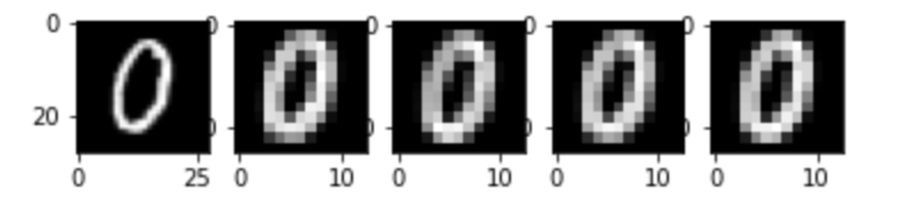

# MNIST CNN 구현

CNN으로 MNIST를 구현 후 accuracy를 구해보자.

### RAW DATA

```python
import numpy as np
import pandas as pd
import tensorflow as tf
import matplotlib.pyplot as plt
import matplotlib.image as img

fig = plt.figure()
fig_list = list() # 각각의 subplot 저장 용도

for i in range(5):
    fig_list.append(fig.add_subplot(1,5,i+1))

# Raw Data Loading
df = pd.read_csv('mnist/train.csv')
img_data = df.drop('label', axis=1, inplace=False).values # 이미지 데이터
print(img_data.shape) # (42000, 784)

# 샘플용 이미지
original_img = img_data[5:6].reshape(28,28) # 행 슬라이스: 1차원
fig_list[0].imshow(original_img, cmap='gray') # 2차원 데이터 + cmap = 흑백 이미지
```

### CONV 작업

```python
# 4차원 입력 이미지: (1: 이미지 개수, 28: 세로, 28: 가로, 1: 채널(컬러)수)
print(original_img.shape) # 2차원: (28, 28)

input_image = original_img.reshape((1,) + original_img.shape + (1,))
print(input_image.shape) # (1, 28, 28, 1)

# 실수 처리
input_image = input_image.astype(np.float32)

# filter(kernel): (3,3,1,4)
weight = np.random.rand(3,3,1,4) # 난수값
print(weight.shape) # (3, 3, 1, 4)

# stride: 1
# padding: VALID
sess = tf.Session()
conv2d = tf.nn.conv2d(input_image, weight,
                             strides=[1,1,1,1], padding='VALID')
conv2d_result = sess.run(conv2d)
print(conv2d_result.shape) # (1, 26, 26, 4): Feature Map
```

### RELU 처리

```python
# tensor node
relu_ = tf.nn.relu(conv2d_result) 

# numpy array
relu_result = sess.run(relu_)
print(relu_result.shape) # (1, 26, 26, 4): Activation Map
```

### POOLING 처리

```
(1: 전체 이미지 개수, 13, 13, **4: Pooling 처리된 이미지 개수**)
```

: 입력 이미지 1장에 대해서 필터 4개를 적용하므로 특징을 각각 뽑은 결과 이미지 4개가 나온다.

```python
# ksize: 2
# stride: 2
pooling = tf.nn.max_pool(relu_result, ksize=[1,2,2,1],
                         strides=[1,2,2,1], padding='VALID')

pooling_result = sess.run(pooling)
print(pooling_result.shape) # (1, 13, 13, 4: filter 개수)
```

### 이미지 출력

```python
# (4, 13, 13, 1): 맨 앞과 맨 뒤의 위치, 즉 축을 바꿈
# (이미지 개수, height, width, 차원 높임)
i = np.swapaxes(pooling_result, 0,3) 
print(i.shape) # (4: 필터에 개수에 따른 이미지(채널)의 개수, 13, 13, 1)

# enumerate: 인덱스, 데이터
# 맨 앞에 있는 인덱스를 기준으로 나머지 데이터를 나눔
for filter_idx, t_img in enumerate(i):
    fig_list[filter_idx+1].imshow(t_img, cmap='gray')
```



<br>

## **CNN 정리**

### **CNN의 작동원리**

1. 이미지 전처리: 이미지의 특징을 추출하여 새로운 이미지를 생성 (feature extraction)
   - filter를 사용하여 이미지 특징을 추출하고
   - max_pooling을 통해 뽑아낸 특징을 강화하고 이미지 사이즈를 줄임
2. DNN: 특징만 뽑아낸 이미지 데이터를 학습 후 분류 (classification)
   - 특징을 뽑아낸 데이터를 FC Layer에 입력하기 위해 Flatten시키고
   - Softmax 함수를 이용하여 이미지를 분류함

<br>

### **CNN의 특징**

CNN의 학습 대상은 이미지의 특징을 추출하는 filter 값이다.

(참고: DNN에서의 학습 대상은 로지스틱 노드의 W, b의 구하는 것이다.)

DNN과 비교했을 때, DNN 경우에는 레이어가 증가할 수록 로지스틱 노드가 증가하기 때문에 행렬 연산을 한다 할지라도 W, b 연산을 많이 수행해야 한다.

그러나 CNN은 이미지의 특징을 뽑아서 학습만 시켜주면 되므로 **연산할 파라미터의 개수가** DNN에 비해 **20%30% 정도**이기 때문에 CNN의 학습 속도가 DNN보다 빠르다.

<br>

------

Reference: [DL_0323_MNIST](https://github.com/sammitako/TIL/blob/master/Deep%20Learning/source-code/DL_0323_MNIST.ipynb)

