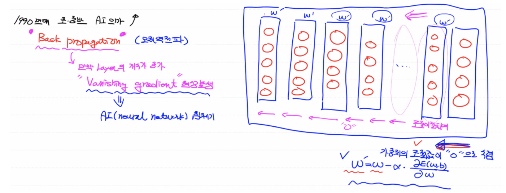

# MNIST DNN 구현

레이어 개념을 추가해서 구현해보자.

- 결측치, 이상치 존재 안함
- 정규화 필요

## Tensorflow 1.x

- Colab 환경

  ```python
  ! pip uninstall tensorflow
  ! pip install tensorflow==1.15
  
  # 런타임 런타임 다시 시작
  # 런타임 유형 변경 (GPU) 
  
  import tensorflow as tf
  print(tf.__version__) # 1.15.0
  ```

- Colab Connection 유지

  ```jsx
  function ClickConnect(){
      console.log("코랩 연결 끊김 방지 - 2020년 8월버전");
      document.querySelector("#top-toolbar > colab-connect-button").shadowRoot.querySelector("#connect").click();    
  }
  interval_result = setInterval(ClickConnect, 120 * 1000)
  
  console.log("코랩 연결 끊김 방지 Script 중지 - 2020년 8월버전");
  clearInterval(interval_result)
  ```


<br>

### 데이터 전처리 코드 구현

- `MiMaxScaler()`: 이상치만 없다면 편하고 쉽게 사용할 수 있는 정규화 라이브러리

- `sess.run(텐서 노드)`: 노드의 값이 ndarray로 출력

  (참고: Tensorflow 2.x부터는 세션이 사라지고 `numpy()`함수를 사용하여 바로 노드의 값을 출력한다.)

```python
import numpy as np
import pandas as pd
import tensorflow as tf
import matplotlib.pyplot as plt

from sklearn.preprocessing import MinMaxScaler
from sklearn.model_selection import train_test_split
from sklearn.model_selection import KFold

# Raw Data
df = pd.read_csv('/content/drive/MyDrive/ML Colab/data/mnist/train.csv')
display(df.head(), df.shape)

# Data Visualization
img_data = df.drop('label', axis=1, inplace=False).values # 2차원 ndarray

# 이미지는 최소 2차원 데이터로 표현
plt.imshow(img_data[0].reshape(28,28), cmap='Greys', interpolation='nearest') # 첫번째 이미지
plt.show()

# Data Split
x_data_train, x_data_test, t_data_train, t_data_test = \\
train_test_split(df.drop('label', axis=1, inplace=False), df['label'], test_size=0.3, random_state=0)

# 정규화
scaler = MinMaxScaler()
scaler.fit(x_data_train)
x_data_train_norm = scaler.transform(x_data_train)
x_data_test_norm = scaler.transform(x_data_test)

# One-hot Encoding
sess = tf.Session()
t_data_train_onehot = sess.run(tf.one_hot(t_data_train, depth=10)) # ndarray
t_data_test_onehot = sess.run(tf.one_hot(t_data_test, depth=10))
```

<br>

## Vanishing Gradient Problem


에폭수, 노드의 수, 레이어의 수를 늘려서 해결해보자.

- **Tensorflow Graph 코드 구현**

  **배치(데이터를 잘라서 학습)**는 **메모리 풀을 방지하게 위한 처리**로 모델의 정확도(성능)와는 상관이 없다.

  ```python
  # placeholder (input layer)
  X = tf.placeholder(shape=[None,784], dtype=tf.float32) 
  T = tf.placeholder(shape=[None,10], dtype=tf.float32)
  
  # hidden layer
  W2 = tf.Variable(tf.random.normal([784,512])) # 512: 현재 레이어 안에 들어있는 로지스틱 노드의 개수
  b2 = tf.Variable(tf.random.normal([512]))
  layer2 = tf.sigmoid(tf.matmul(X,W2) + b2)
  
  # hidden layer
  W3 = tf.Variable(tf.random.normal([512,256])) 
  b3 = tf.Variable(tf.random.normal([256]))
  layer3 = tf.sigmoid(tf.matmul(layer2,W3) + b3)
  
  # hidden layer
  W4 = tf.Variable(tf.random.normal([256,128])) 
  b4 = tf.Variable(tf.random.normal([128]))
  layer4 = tf.sigmoid(tf.matmul(layer3,W4) + b4)
  
  # output layer
  W5 = tf.Variable(tf.random.normal([128,10])) 
  b5 = tf.Variable(tf.random.normal([10]))
  
  logit = tf.matmul(layer4,W5) + b5
  H = tf.softmax(logit)
  
  # loss
  loss = tf.reduce_mean(tf.nn.softmax_cross_entropy_with_logits_v2(logits=logit, labels=T))
  
  # train
  train = tf.train.GradientDescentOptimizer(learning_rate=1e-1).minimize(loss)
  
  # 초기화
  sess.run(tf.global_variables_initializer())
  
  # learning (배치 처리, KFold 제외)
  for step in range(1000):
    _, loss_val = sess.run([train, loss], 
  												 feed_dict={X: x_data_train_norm, T: t_data_train_onehot})
  
    if step % 100 == 0:
      print('loss: {}'.format(loss_val))
  
  # accuracy - 76%
  predict = tf.argmax(H, axis=1)
  correct = tf.equal(predict, tf.argmax(T, axis=1))
  accuracy = tf.reduce_mean(tf.cast(correct, dtype=tf.float32))
  
  print('Accuracy: {}'.format(sess.run(accuracy, 
  												    feed_dict={X: x_data_test_norm, T: t_data_test_onehot})))
  ```

<br>

## **AI의 흥망성쇠**

- 1974년, 1982년 폴 웨어보스 박사: 획기적인 논문 발표했지만 계속 사장되었다.

- 1986년 제프리 힌튼 교수: **오차 역전파(Back-propagation)** 기법이 고안되면서 **AI가 다시 흥행하게 된다.**

  레이어와 노드의 수가 많아지면서 가중치를 구하기 위한 편미분 실행 횟수가 기하급수적으로 증가하게 되므로 학습 시간이 오래 걸린다. 따라서 학습이 진행되지 않는 문제가 생긴다.

  그러나, 오차 역전파는 앞에서 부터 차례대로 편미분 하는 대신, 뒤에서 부터 역방향으로 **행렬곱 연산**을 진행하면서 W, b를  개선하는 방식이다. 결국 W, b를 빠르게 갱신하면서 Neural Network 학습을 완성시키게 된다.

- 1992~1995년 AI Boom in Korea

- **오차 역전파의 문제점:** 레이어의 개수가 증가하면 **Vanishing Gradient Problem** 발생

  뒤에서부터 역방향으로 행렬 연산을 통해 W, b를 계산해 나가는데 레이어가 많을 경우 역방향으로 오면서 가중치의 조절값이 0으로 수렴하게된다.

  뒤쪽과 가까운 레이어일 수록 W의 조절이 잘되지만, 앞쪽으로 갈 수록 가중치(W)의 조절값이 0으로 수렴하기 때문에 W, b가 잘 갱신되지 않는 현상이 일어난다.

  결국, 복잡한 문제(레이어의 개수가 많은 경우)는 오차 역전파로 해결할 수 없게 된다.

  **이때 2차 AI 침체기를 맞게되면서 머신러닝의 여러가지 다른 기법들이 각광받게 된다. (머신러닝의 전성기)**

  

- 1990년대 제프리 힌튼 교수: CIFAR(Canadian Institute For Advanced Research)에서 미래 연구에 대한 펀딩을 받아 Neural Network 연구를 다시 시작했다.

- 2006~2007년 제프리 힌튼 교수

  1. **초기화**
  2. **Activation Function**

  : 시그모이드 함수가 Vanishing Gradient Problem을 발생시키는 원인이다. 즉 시그모이드는 S자 그래프 형태로 0과 1사이의 값을 가지므로 결국 시그모이드 함수을 계속 적용하면 값이 0으로 수렴하게 된다.

  **이 논문을 바탕으로 현재까지 AI가 흥하고 있으며 그동안 각광받던 머신러닝의 다양한 알고리즘들이 상대적으로 쇠하고 있다.**

- **현재: DNN → Deep Learning**

  Neural Network에 대한 흥망성쇠의 거듭 반복으로 인해 사람들의 불신도를 없애기 위해 Rebranding한 것일뿐이고 DNN에 알파(최신 연구)를 더해 CNN, RNN, LSD-Net, GAN 등과 같은 딥러닝 특유의 알고리즘들이 생성되고 있다.

<br>

## W, b Initialization


- bias: 랜덤으로 잡아도 상관없다.

- W: 각각의 입력값에 곱해지는 가중치를 랜덤으로 잡으면 성능이 떨어진다.

  ### 1. Xavier Initialization

     입력의 개수와 출력의 개수를 이용해서 가중치의 초기값을 결정하는 방식이다.

     ```python
     # python
     W = np.random.randn(num_of_input, num_of_output) / np.sqrt(num_of_input)
     ```

     ```python
     # tensorflow 1.x
     W2 = tf.get_variable('W2', shape=[784, 512], 
     										 initializer=tf.contrib.layers.xavier_initializer())
     ```
  
  ### 2. He's Initialization (2015)
  
  ​	Xavier Initialization 확장버전

  ```python
  # python
  W = np.random.randn(num_of_input, num_of_output) / np.sqrt(num_of_input / 2)
  ```
  
  
     ```python
  # tensorflow 1.x
  W2 = tf.get_variable('W2', shape=[784, 64], initializer=tf.contrib.layers.variance_scaling_initializer())
     ```

<br>

## ReLU(Rectified Linear Unit) Activation Function


**결론적으로 Vanishing Gradient 문제 때문에 Neural Network에서는 시그모이드 함수를 쓰지 않는다.**

```python
# layer2 = tf.sigmoid(tf.matmul(X,W2) + b2)
layer2 = tf.nn.relu(tf.matmul(X,W2) + b2)
```

<br>

## Dropout Layer


Training_data에 대해서 너무 적합하게 학습이 된 현상으로 실제 데이터 예측에서는 오히려 정확도가 저하되는 문제가 발생한다.

### 과적합(Overfitting) 방지 방법

1. 데이터 양이 많아야 한다.

2. 필요 없거나(종속변수에 영향을 미치지 않는) 중복되는 피쳐 제거

3. L2 정규화 기법 사용 (Regularization)

   : 코드에서 인위적으로 W의 값을 조절해주는 기법이다.

4. 2014년: **딥러닝(DNN)에서** dropout이라는 방법으로 오버피팅 현상을 줄일 수 있게 된다.

### **dropout이란?**

학습에 참여하는 로지스틱 노드들이 너무 많으므로 학습 데이터에 너무 잘 맞는 오버피팅 현상이 발생하는 것이다. 따라서 Neural Network 안에서 학습에 참여하는 노드의 수를 줄여준다.

다시 말해, 각 레이어 안에서 학습에 참여하는 일정 노드를 사용하지 않는 기법이다. 즉 학습에 참여하는 노드들의 수를 제한한다.

(질문? 애초에 은닉층에서 노드의 수를 줄이면 과적합이 발생할 확률이 적어지는데 왜 굳이 dropout을 써야되죠?

답! 행렬 연산을 위해 앞 레이어의 출력과 뒤 레이어의 W의 shape이 동일해야 하므로 뒤 레이어의 입력 노드를 줄이는 대신, 즉 노드 형태를 유지하되 dropout 방법을 사용하여 노드의 연산량을 줄이는 방법이다.)


- 여기서는 dropout의 비율만 설정한다.

- validation_accuracy와 training_accuracy의 비교를 통해 과적합(Overfitting)이 발생한 부분을 확인한 후, 필요한 곳에서만 dropout layer를 사용해야 한다.

  (참고: 일반적으로 전이학습에 사용되는 레이어의 개수가 30~160개이므로, 현재 구현 코드보다는 과적합이 발생될 확률이 더 높을 것이다.)

```python
# hidden layer
W2 = tf.get_variable('W2', shape=[784, 64], initializer=tf.contrib.layers.variance_scaling_initializer())
b2 = tf.Variable(tf.random.normal([64]))
_layer2 = tf.nn.relu(tf.matmul(X,W2) + b2)
layer2 = tf.nn.dropout(_layer2, rate=0.3) # 30% 노드가 연산에 참여하지 않을 것이다.
```

<details>
  <summary><b>Tensorflow 1.x 완성 코드</b></summary>
  Reference:
  <a href="https://github.com/sammitako/TIL/blob/master/Deep%20Learning/source-code/DL_0319(1).ipynb">DL_0319(1)</a>
</details>

<br>

## Tensorflow 2.x

Keras는 내부적으로 He's Initialization을 디폴트로 사용하고 있다.

손실함수의 값이 0으로 근접해가지 않게되면 `learning_rate`를 조절해볼 수 있다.

- Activation Function: Neural Network에서는 시그모이드 함수를 쓰지 않는다.

- Dropout: 레이어와 레이어 사이에 dropout layer가 들어가서 과적합 방지 기능을 수행한다.

  (참고: `history` 객체를 봤을 때 `loss`(0)와 `val_loss`(0.5)와의 차이가 크므로 과적합이 발생했음을 알 수 있기 때문에 그 지점을 찾아서 줄여줘야 한다.)

- Epochs: 과적합은 나중에 확인 후 모델을 개선할 수 있으므로 처음에 크게 잡아도 된다.

<details>
  <summary><b>Tensorflow 2.x 완성 코드</b></summary>
  Reference:
  <a href="https://github.com/sammitako/TIL/blob/master/Deep%20Learning/source-code/DL_0319(2).ipynb">DL_0319(2)</a>
</details>

