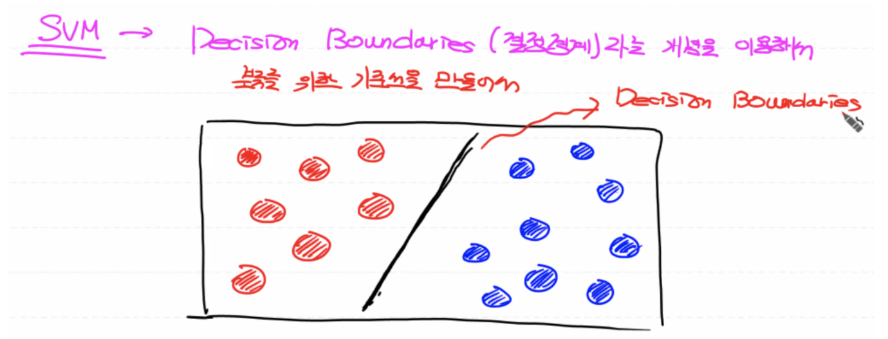
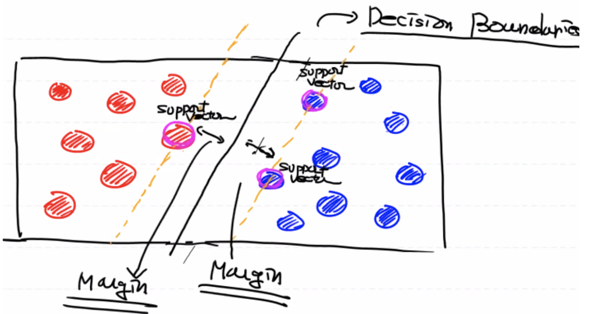
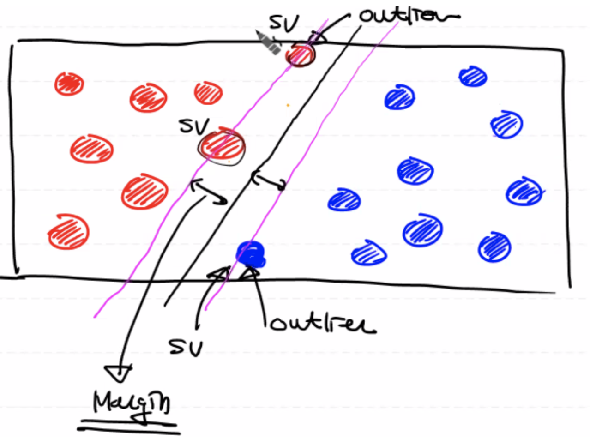
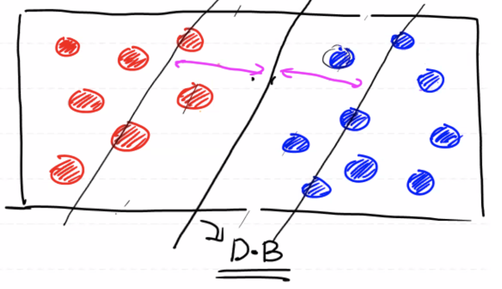
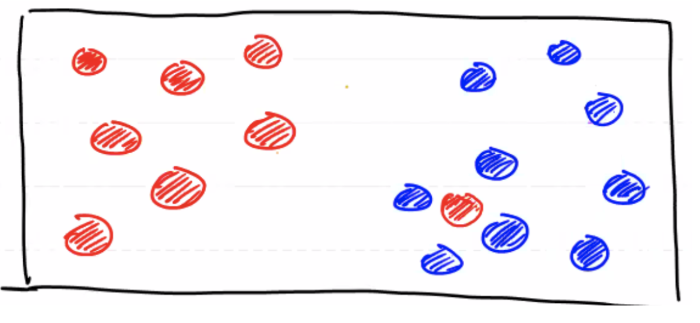
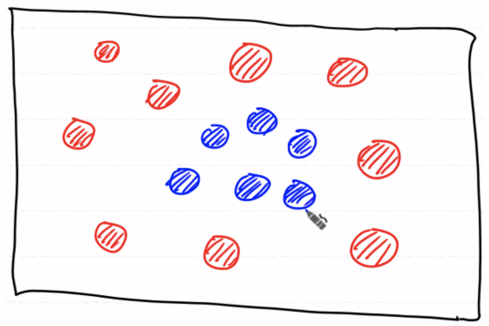
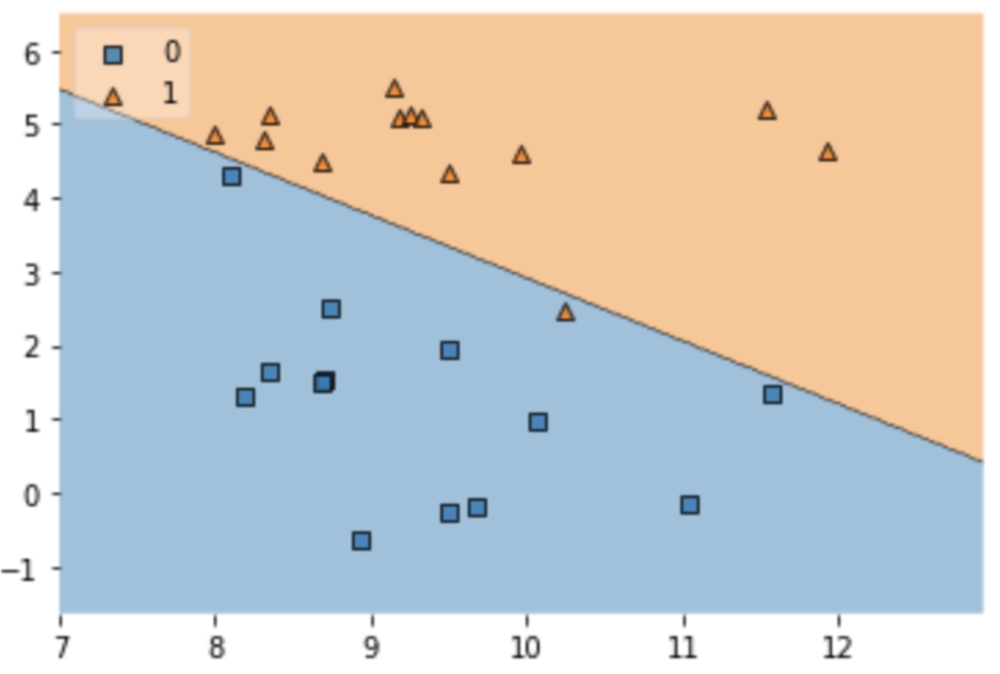
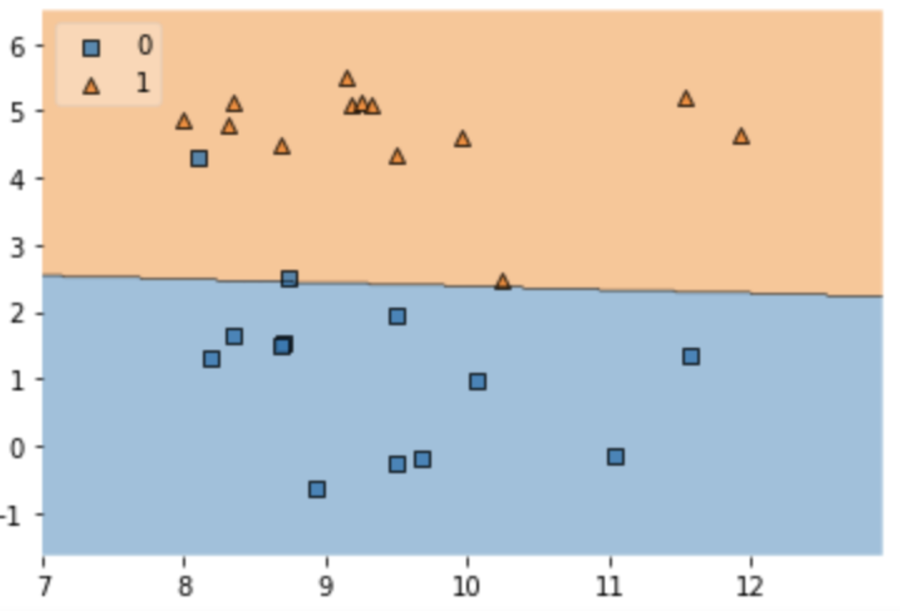

# Support Vector Machine(SVM)

Decision Boundaries라는 개념을 이용해서 분류를 하기 위한 기준선을 만들어서 머신러닝 작업을 진행한다. 다시 말해, SVM은 데이터를 선형으로 분리하는 최적의 결정 경계를 찾는 알고리즘이다.

(참고: 여러 개의 머신러닝 기법에서 만들어지는 구분선을 모두 decision boundaries라고 한다.)



결정 경계가 여러 개 생길 수 있지만 말단 데이터들과 기준선 간의 간격이 크면 클 수록 최적의 Decision Boundaries이다. 결국 중간쯤으로 결정 경계를 설정하는 것이 최적의 Decision Boundaries가 될 것이다.

<br>

## SVM 종류


- Regression (Regressor)

  Regression에서는 평균을 이용하여 decision boundaries를 찾지만, SVM에서 regression은 벡터 연산으로 decision boundaries를 찾는다.

  다시 말해, 나머지 데이터들의 레이블의 평균으로 새로운 데이터의 레이블(예측값)을 결정한다.

- Classification (Classifier)

  Decision Boundaries를 기준으로 어느 레이블 쪽에 있는 지에 대해 결정한다.
  
  <br>

## Support Vector


전체 데이터를 참조하는 Regression 기법과 다르게 Support Vector Machine은 구분선을 찾기 위해 주요한 몇 개의 데이터만을 이용하며 Decision Boundaries를 결정짓는 주요 몇 개의 데이터들을 Support Vector라고 한다.

따라서 Support Vector라는 특수한 데이터를 고려해서 Decision Boundaries를 결정하기 때문에 다른 머신러닝 기법에 비해 속도가 굉장히 빠르다.

- Support Vector를 통해 Decision Boundaries 결정하기

  서포트 벡터를 통과하는 가상의 직선을 긋고 반대쪽도 평행하게 가상의 직선을 긋는다. 이때 평행한 직선들과 margin(가상 직선과 decision boundaries간의 간격)이 최대가 되는 decision boundaries를 그린다.

  즉, margin값이 최대가 되는 선은 평행한 Support Vector의 직선들의 가운데 점에 해당된다.

  (참고: Support Vector를 찾기 위해서는 벡터 연산에 관한 논문을 참조해야 한다.)

  

<br>

## SVM에서 주의해야할 사항: 이상치 처리


**평균에서 많이 떨어진 데이터가 SVM에 크게 영향을 미치기 때문에 이상치 처리에 주의해야 한다.**

즉, 이상치가 Support Vector로 간주될 수 있기 때문에 margin값이 매우 작아지게 된다. 따라서 Decision Boundaries가 이상치를 포함한 모든 데이터를 고려하여 결정되었기 때문에 결국 과대 적합이 발생할 확률이 높아지게 된다.

### **Hard Margin**

Margin값이 작은 경우를 Hard Margin(하드 마진)이라 하고, 하드 마진이 발생한 경우 Overfitting이 발생한다.



### **Soft Margin**

이상치를 제거할 경우 Margin값이 커지게 되는데 이를 Soft Margin(소프트 마진)이라 한다. 소프트 마진이 발생할 경우 Underfitting 현상이 나타날 수 있다.



### **Regularization**

이상치가 극단적으로 존재할 경우 선형으로 데이터를 분리할 수 없다. 이를 해결하기 위해서 데이터 오류를 허용(무시)하는 규제(Regularization) 전략을 사용할 수 있다.



<br>

## Scikit-learn에서의 SVM에 대한 hyper-parameter

### **C**

Scikit-learn에서는 cost의 `c`라는 hyper parameter를 통해 규제에 대한 강도를 조절할 수 있다. 즉, `c`는 얼마나 많은 데이터 포인트가 다른 범주에 놓이는 것을 허용할 지에 대한 cost parameter이다.

기본값은 `1`이고 `c`값이 클 수록 다른 데이터 범주에 놓이는 데이터 포인트의 수를 적게 허용한다. 따라서 `**c`값이 클 수록 margin값이 작아지는 하드 마진(과대적합)**이 되고 `**c`값이 작을 수록 margin값이 커지는 소프트 마진(과소적합)**이 된다.

### **kernel**

2차원 평면에서 데이터의 분포가 아래처럼 되어 있을 경우, 데이터를 선형으로 구분지을 수 없으므로 SVM 방식을 사용할 수 없다고 생각할 수 있지만 Scikit-learn의 `kernel`이라는 hyper-parameter를 사용해서 `linear`대신 `poly`를 사용하면 3차원으로 사상(projection)시켜서 Decision Boundaries(평면)를 결정한다.

일반적으로 가우시안 커널인 `rbf`(Radial Bias Function: 방사 기저 함수)가 `kernel`의 기본값으로 설정되어 있다. 만약 데이터가 3차원으로 해결이 안될 경우, 상위 차원의 데이터로 사상시켜 SVM을 사용한다.



### **gamma**

`kernel`값을 `poly`와 `rbf` 둘 중 하나로 설정할 경우, `gamma`: Decision Boundaries를 얼마나 유연하게 그릴 지에 대한 hyper-parameter를 지정해주어야 한다.

`gamma`값이 낮을 경우, Decision Boundaries가 거의 직선에 가깝게 정해지고 `gamma`값이 높을 경우, Decision Boundaries가 구불구불하게(세밀하게) 정해진다.

결국 `gamma`값도 과대적합(높은 감마값)과 과소적합(낮은 감마값)과 연관된다.

(참고: 사실 감마값은 데이터 샘플이 Decision Boundaries에 미치는 영향력에 대한 값이다.)

<br>

## SVM 과적합에 대한 코드 구현

```python
# 과대적합
model = SVC(kernel='linear', C=300) 

# 과소적합
model = SVC(kernel='linear', C=0.001) 
```

<details>
  <summary>과대적합</summary>
  
</details>

<details>
  <summary>과소적합</summary>
  
</details>


## SVM 예제 코드 구현

👉🏼 [아래 예제들에 대한 코드 구현으로 이동]()

* SVM Example
* BMI Example
* Hyper-parameter 조절을 통한 SVM 모델 최적화