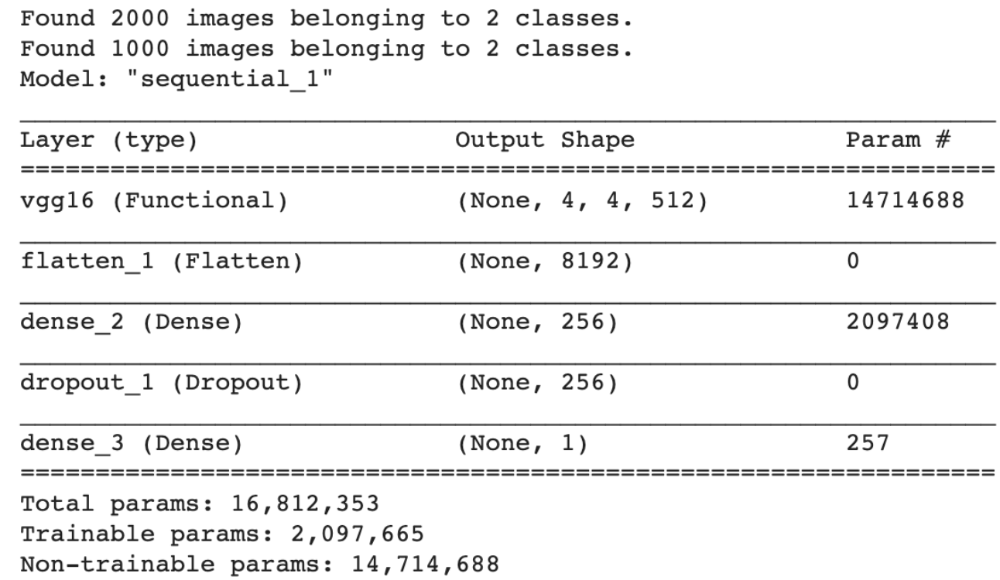

# Transfer Learning

`ImageDataGenerator`를 통한 데이터 증식은 사용하지 않고 VGG16 네트워크의 Convolution Layer와 Pooling Layer만 사용하여 이미지 특징을 추출한 후 직접 FC Layer를 만들어서 학습을 진행한다.

## Feature Extraction (90%)

- `input_shape`: Pretrained Network 모델의 종류마다 입력 이미지 데이터의 형태가 정해져 있다.
- `directory`: 어느 폴더에서 이미지 데이터를 가져올 지 설정
- `sample_count`: 전체 입력 데이터의 개수를 설정하여 ImageDataGenerator 무한 생성 방지

```python
from tensorflow.keras.applications import VGG16

# Pretrained Network 생성
model_base = VGG16(weights='imagenet', include_top=False, input_shape=(150,150,3))

model_base.summary() # Activation Map: (None, 4, 4, 512)

import os
import numpy as np
from tensorflow.keras.preprocessing.image import ImageDataGenerator

base_dir = '/content/drive/MyDrive/ML Colab/data/CAT_DOG/cat_dog_small'
train_dir = os.path.join(base_dir, 'train')
validation_dir = os.path.join(base_dir, 'validation')

# ImageDataGenerator 객체 생성 (데이터 정규화 및 증식 포함)
datagen = ImageDataGenerator(rescale=1/255)

# 배치 사이즈 설정 (ImageDataGenerator 무한 생성 방지용)
batch_size = 20

# Activation Map 추출 함수
def extract_feature(directory, sample_count): 
    # X: sample_count 수만큼 입력으로 들어가는 이미지에 대한 Feature Map 저장공간
    features = np.zeros(shape=(sample_count, 4,4,512)) # 4차원 행렬

    # T: Feature Map에 대한 Label
    labels = np.zeros(shape=(sample_count,)) # 1차원 벡터

		# 이미지를 읽어들이는 ImageDataGenerator 최종본 생성
    generator = datagen.flow_from_directory(
        directory,
        target_size=(150,150), # input_shape과 연관
        batch_size=batch_size,
        class_mode='binary'
    )

    i = 0
    for x_data_batch, t_data_batch in generator: # (X: 픽셀 데이터, T: label)
        # Activation Map 도출 (batch_size개)
        feature_batch = model_base.predict(x_data_batch) 
        # Activation Map 추가
        features[i*batch_size:(i+1)*batch_size] = feature_batch
        # Label 추가
        labels[i*batch_size:(i+1)*batch_size] = t_data_batch

        i += 1
        if i*batch_size >= sample_count:
          break
                
    return features, labels

# Activation Map 실행 (4차원 데이터)
# DNN에 입력할 데이터
train_features, train_labels = extract_feature(train_dir, 2000)
validation_features, validation_labels = extract_feature(validation_dir, 1000)
```

Hidden Layer(Dense)에 Input Layer(Flatten)를 포함해서 사용한다.

```python
# 4차원 데이터(Activation Map)를 2차원 데이터로 변경
# 4차원: (이미지 개수, 3차원: 이미지 형태)
# 4*4*512: Activation Map을 1차원으로 변경
# Numpy Array
train_features = np.reshape(train_features, (2000, 4*4*512))
validation_features = np.reshape(validation_features, (1000, 4*4*512))

# FC Layer
from tensorflow.keras.models import Sequential
from tensorflow.keras.layers import Dense, Dropout
from tensorflow.keras.optimizers import Adam, RMSprop

# 모델 생성
model = Sequential()

# Hidden Layer
# input_shape: input layer용 (07:30~08:00)
model.add(Dense(256, activation='relu', input_shape=(4*4*512,)))

# Dropout Layer
model.add(Dropout(0.5))

# Output Layer
model.add(Dense(1, activation='sigmoid'))

# Optimizer
model.compile(optimizer=RMSprop(learning_rate=2e-5), loss='binary_crossentropy', metrics=['accuracy'])

# Learning
history = model.fit(train_features, train_labels,
                    epochs=30, batch_size=29,
                    validation_data=(validation_features, validation_labels))
```

history 객체를 조사하여 그래프로 overfitting 확인해보자.

```python
import matplotlib.pyplot as plt

train_acc = history.history['accuracy']
train_loss = history.history['loss']

validation_acc = history.history['val_accuracy']
validation_loss = history.history['val_loss']

fig = plt.figure()
fig_1 = fig.add_subplot(1,2,1)
fig_2 = fig.add_subplot(1,2,2)

fig_1.plot(train_acc, color='b', label='training accuracy')
fig_1.plot(validation_acc, color='r', label='validation accuracy')
fig_1.set_title('Accuracy')
fig_1.legend()

fig_2.plot(train_loss, color='b', label='training loss')
fig_2.plot(validation_loss, color='r', label='validation loss')
fig_2.set_title('Loss')
fig_2.legend()

plt.tight_layout()
plt.show()
```

과대적합을 해결하기 위하여,

1. Hyper-parameter(epoch, learning_rate, optimizer 등)을 수정한다.
2. 데이터의 사이즈를 늘린다. (→ Accuracy와 직결)

<br>

## Data Augmentation (88%)

위보다 조금 더 나은 결과를 얻기 위해, 데이터의 사이즈를 늘리는 데이터 증식을 포함해보자.

- 위에서는 기학습된 네트워크와 DNN 모델을 완전히 분리 시켜서 학습을 진행했다.

- 여기서는 데이터 증식을 통해 기학습된 네트워크와 DNN 모델(Dense Layer)을 합쳐서 레이어를 쌓는 방식으로 학습할 것이다.

  Preatrained Network를 DNN 모델 앞에 붙여 전체 CNN 모델을 생성하여 학습하게 되므로 연산해야할 파라미터가 많아져서 학습 시간이 오래 걸리게 된다.

  따라서 학습 시간을 줄이기 위해 학습할때 마다 Pretrained Network의 필터값을 갱신하는 것을 막아야 한다. 그러기 위해서는 Convolution Layer에 대한 파라미터를 동결시킬 수 있다. `model_base.trainable=False`을 Pretrained Network 모델과 DNN 모델 사이에 입력한다.

  (참고: 필터값이 갱신되지 않아도 Pretrained Network를 학습하기 때문에 시간이 소요되기는 한다.)

```python
import os
import numpy as np
from tensorflow.keras.applications import VGG16
from tensorflow.keras.preprocessing.image import ImageDataGenerator
from tensorflow.keras.models import Sequential
from tensorflow.keras.layers import Flatten, Dense, Dropout
from tensorflow.keras.optimizer import RMSprop
import matplotlib.pyplot as plt

# 경로 설정
base_dir = '/content/drive/MyDrive/ML Colab/data/CAT_DOG/cat_dog_small'
train_dir = os.path.join(base_dir, 'train')
validation_dir = os.path.join(base_dir, 'validation')

# ImageDataGenerator 생성
# Training Data에 대해서는 데이터 증식 처리
train_datagen = ImageDataGenerator(rescale=1/255,
                                   rotation_range=40,      # 0~40도 사이의 랜덤한 각도로 이미지 회전
                                   width_shift_range=0.1,  # 10% 내외 랜덤한 비율로 좌우 이동
                                   height_shift_range=0.1, # 10% 내외 랜덤한 비율로 위아래 이동
                                   zoom_range=0.2,         # 20% 내외 랜덤한 비율로 확대 및 축소
                                   horizontal_flip=True,   # 좌우 반전
                                   vertical_flip=True)     # 위아래 반전

validation_datagen = ImageDataGenerator(rescale=1/255)

# generator: 4차원 이미지 데이터 생성
# (참고: for문으로 generator 돌리면 4차원 ndarray 생성)
train_generator = train_datagen.flow_from_directory(
    train_dir,
    classes=['cats', 'dogs'], # cats: 0, dogs: 1 (default: 오름차순인 폴더순으로 라벨 할당)
    target_size=(150,150),    # Pretrained Network의 입력 데이터
    batch_size=20,
    class_mode='binary'
)

validation_generator = validation_datagen.flow_from_directory(
    validation_dir,
    classes=['cats', 'dogs'],
    target_size=(150,150), 
    batch_size=20, 
    class_mode='binary'
)

# Pretrained Network
model_base = VGG16(weights='imagenet', include_top=False, input_shape=(150,150,3))

# Pretrained Network에 대한 파라미터 동결
model_base.trainable=False

# DNN 모델
model = Sequential()

# DNN 모델 앞에 추가
model.add(model_base) # Convolution Layer + Pooling Layer

# FC Layer
model.add(Flatten(input_shape=(4*4*512, )))      # Input Layer: (None, 3차원: 4, 4, 512) -> 1차원
model.add(Dense(units=256, activation='relu'))   # Hidden Layer

# Dropout Layer
model.add(Dropout(0.6))

# Output Layer
model.add(Dense(units=1, activation='sigmoid'))

model.summary()

# Optimizer
model.compile(optimizer=RMSprop(learning_rate=2e-5), loss='binary_crossentropy', metrics=['accuracy'])

# Learning
# Numpy Array가 아닌 generator 자체로 학습
history = model.fit(train_generator, 
										steps_per_epoch=100, # batch_size ⨉ steps_per_epoch = total(1 epoch)
                    epochs=50, 
										validation_data=validation_generator,
                    validation_steps=50) # batch_size ⨉ validation_step = total(1 epoch)
```

<details>
  <summary><b>Convolution Layer 동결</b></summary>
  
</details>

<br>

## Fine Tuning (91%)

Pretrained Network를 이용하는 또 다른 방법으로 Pretrained Network의 모든 파라미터를 동결시키는 대신에 몇몇 개 상위의 Convolution Layer에 대해 동결을 해제해서 학습을 진행한다. 즉 FC Layer를 학습할 때 filter weight를 같이 갱신한다.

(참고: 상위 레이어란 FC Layer와 가까운 레이어를 의미한다.)

따라서 Pretrained Network(Convolution Layer)의 파라미터(입력 데이터의 특징을 추출하여 이미지를 재생성)가 우리 데이터에 맞춰서 조절되기 때문에 정확도가 높아진다.


### **Fine Tuning 절차**

1. Pretrained Network 위에 새로운 네트워크(FC Layer)를 추가하여 전체 네트워크를 생성한다.
2. 전체 Pretrained Network를 동결한다.
3. 입력 데이터를 넣어 새로 추가한 FC Layer를 학습한다. 즉 Classifier만 학습하여 모델을 완성한다.

------

4. Pretrained Network의 일부 상위 Convolution Layer를 동결에서 해제한다.

5. 동결을 해제한 레이어와 학습이 끝난 FC Layer를 다시 학습하면 좀 더 나은 결과를 얻게 된다.

이때 일반적으로 weight, bias를 더 세밀하게 계산할 수 있도록 `learning_rate`를 작게 설정하여 미세 조절한다.

<br>

### **Fine Tuning 코드**


```python
# 전체 Convolution Layer와 Pooling Layer 레이어 동결 해제
model_base.trainable = True

# 상위 일부(3개) Convolution Layer 동결 해제
for layer in model_base.layers:
    if layer.name in ['block5_conv1','block5_conv2','block5_conv3']:
      layer.trainable = True
    else:
      layer.trainable = False

# Fine Tuning (learning_rate를 더 작게 설정)
model.compile(optimizer=RMSprop(learning_rate=1e-5), 
              loss='binary_crossentropy', 
              metrics=['accuracy'])

# 재학습
history = model.fit(train_generator, 
                    steps_per_epoch=100,
                    epochs=50, 
                    validation_data=validation_generator,
                    validation_steps=50)
```

<br>

-----

Reference: [DL_0330_Transfer_Learning_(Fine_Tuning)](https://github.com/sammitako/TIL/blob/master/Deep%20Learning/source-code/DL_0330_Transfer_Learning_(Fine_Tuning).ipynb)

