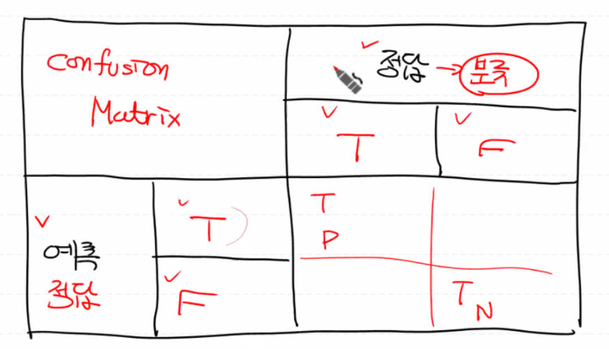
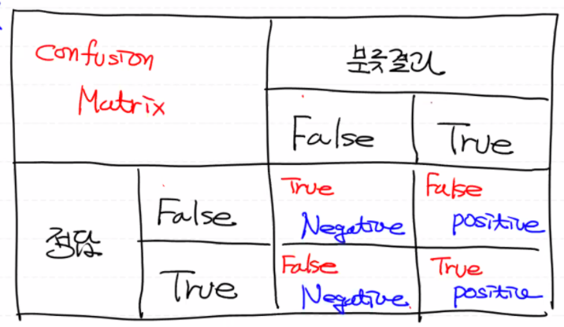
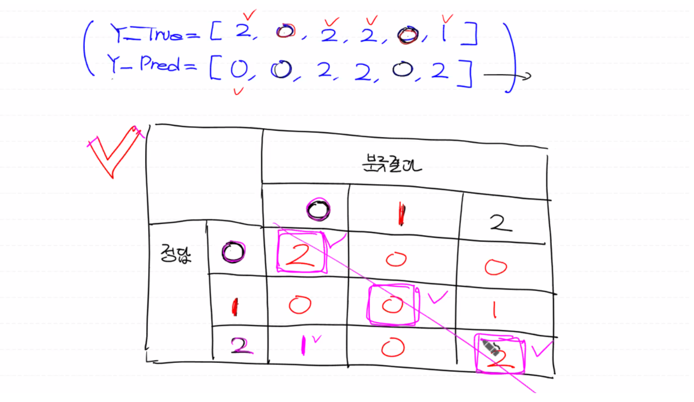
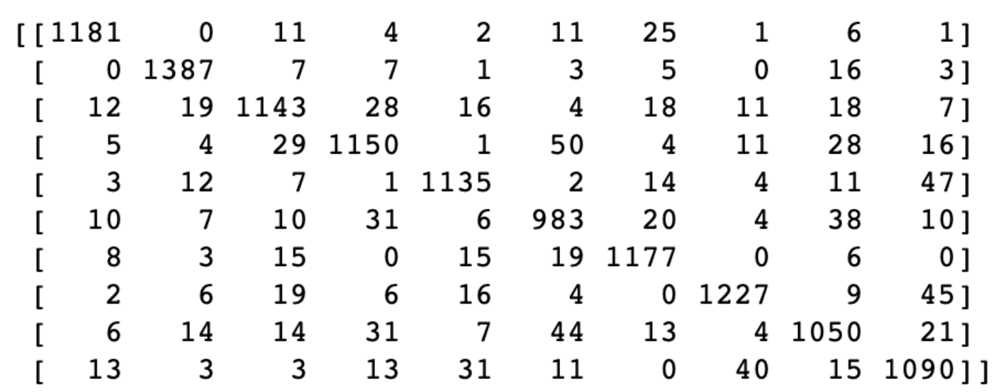
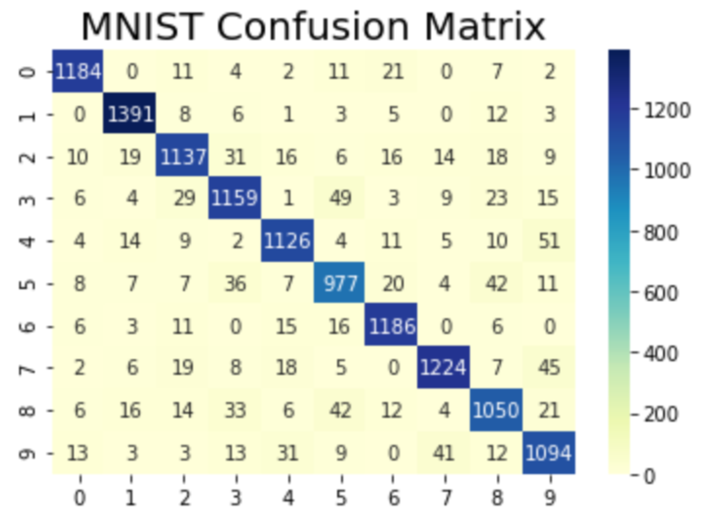

# **Confusion Matrix**

**이론상 Confusion Matrix versus Scikit-learn 함수**

- 이론상 Confusion Matrix

  

- Scikit-learn 함수

  **Binary Classification(이진분류)**에 대한 Scikit-learn의 Confusion Matrix

  

<br>

**[Multinomial Classification]**

3개의 label(정답)이 있는 multinomial classification(다중분류)에 대해 예측값을 넣어서 confusion matrix를 출력해보자.

실제 정답과 예측값이 같은 개수를 Confusion Matrix 칸에 입력하면 된다.

- **대각선의 수가 클 수록** 잘 만들어진 모델이다.
- 대각선 외 칸의 개수를 보면 어떤 케이스를 어떤 케이스로 잘못되게 많이 판단하고 있는 지에 대한 경향성을 알 수 있다.
- 따라서 잘못 예측하고 있는 케이스를 파악하여 모델을 개선하는 용도로 사용된다.

```python
from sklearn.metrics import confusion_matrix
y_true = [2, 0, 2, 2, 0, 1] # 정답
y_pred = [0, 0, 2, 2, 0, 2] # 예측값
print(confusion_matrix(y_true, y_pred)) # 2차원 ndarray
```



**[MNIST Confusion Matrix]**

```python
confusion_mtrx = confusion_matrix(t_data_test, sess.run(predict, feed_dict={X: x_data_test_norm}))
                     
print(confusion_mtrx) # 예) 50: 3을 5로 잘못 예측
```



```python
import seaborn as sns

sns.heatmap(confusion_mtrx, annot=True, fmt='d', cmap='YlGnBu')
plt.title('MNIST Confusion Matrix', fontsize=20)
plt.show()
```



