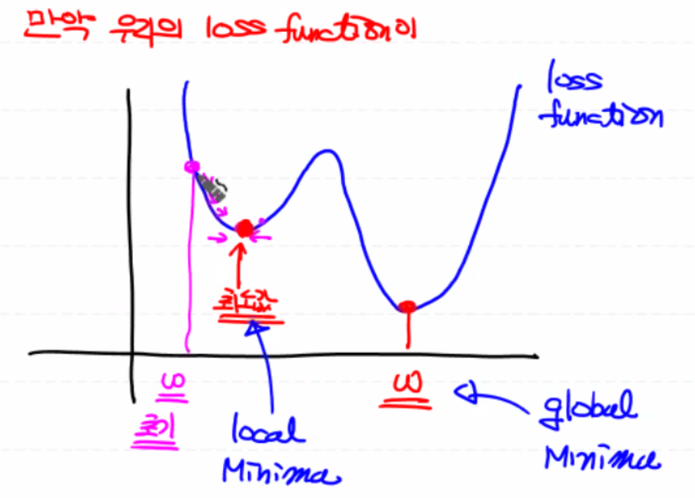
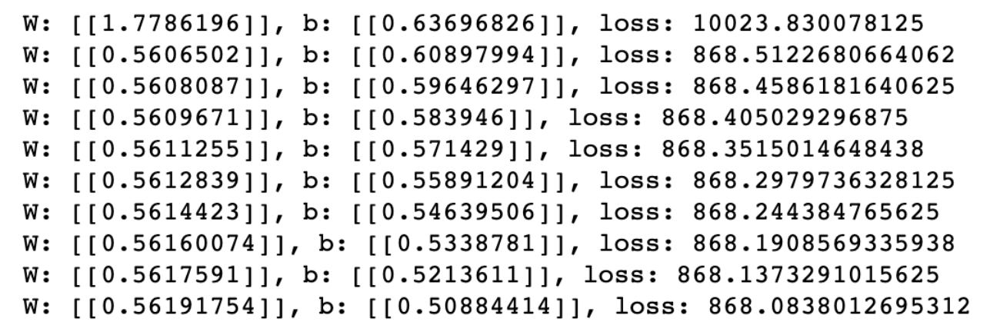
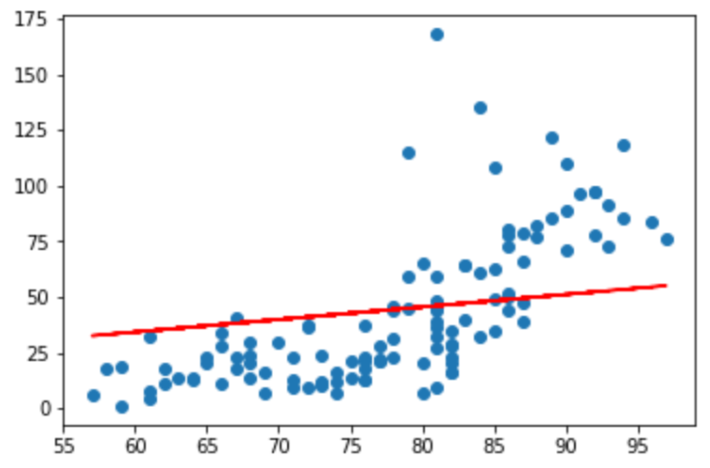
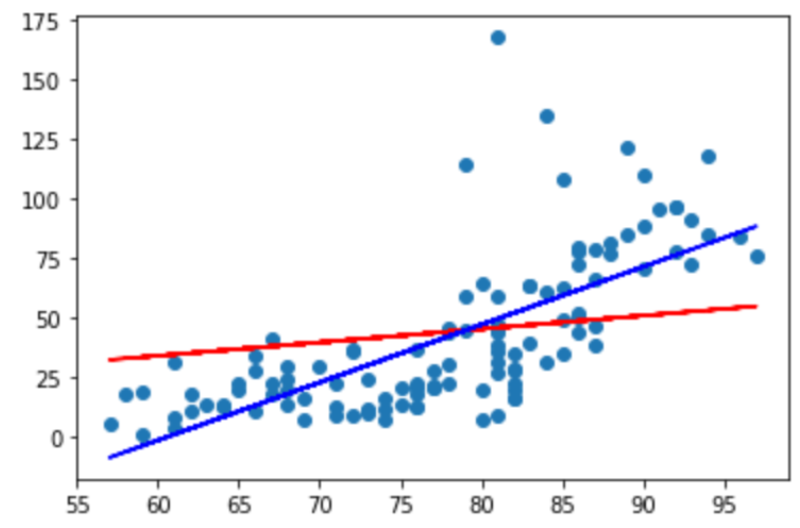

## 손실함수 그래프의 형태

**경사하강법이란,** 그래프를 따라 내려가면서 가장 낮은 지점을 찾는 알고리즘이다. 그래프의 모양이 아래로 볼록이 2개 이상일 경우 비교적 높은 아래로 볼록 모양의 꼭지점을 갖는 **local minima**를 최소값을 갖는 아래로 볼록 모양의 꼭지점인 **global minima**로 잘못 인식하게 된다.

따라서 경사하강법 알고리즘이 제대로 동작하지 못해서 모델이 잘못 만들어지게 된다.

<details>
  <summary>그래프로 이해</summary>
  
</details>

따라서 손실함수는,

- 초기 $W$가 어떤 값으로 설정이 되더라도 항상 손실함수의 최소값을 찾을 수 있도록 그래프가 그려져야 한다.
- 예를 들어, 2차원은 포물선 형태로, 3차원은 밥공기 형태의 그래프로 그려져야 한다.
- 즉, 항상 볼록함수 (**Convex Function**) 모양의 그래프여야 한다.

------

이제 **제공된** 오존 데이터를 이용하여 Tensorflow, Python, Sklearn을 통해 Simple Linear Regression을 구현해보자.

먼저 도메인(데이터) 분석을 해보자.

1. 결측치, 이상치 처리?
2. Feature?
   - 종속변수 - Ozone
   - 독립변수 - Solar.R, Wind, **Temp**
3. 데이터의 양?

이제, **온도**에 따른 **오존량**을 측정해보자.

# Simple Linear Regression with data preprocessing (1) - NaN

결측치 제거

## 0. Data Handling

- 어떤 Feature가 필요한지? Fancy Indexing!

- 결측치(NaN) 처리

  1. 제거 - 전체 데이터 양이 충분히 많을 경우 사용

       `dropna(how=?)`
       

       - any: NaN을 포함하는 모든 레코드(행) 줄을 지움
       - all: 행의 성분이 모두 NaN일 때만 레코드를 지움

  2. 집계함수를 통해 임의로 값을 채워주기 - **평균**(전체 데이터의 대표값), 최소값, 최소값

     `fillna(value=?)`: NaN 성분들에 일괄적으로 value값을 대입

  3. 다른 머신러닝 기법을 통해 Ozone의 NaN 값을 **예측한 값**으로 NaN을 채워주기

  

- 이상치(종속변수에서 이상한 값) 처리

  (참고) 지대점: 독립변수에서 이상한 값

  센서의 오류, 프로그램의 오류로 인해 데이터가 잘못 들어올 경우 학습의 결과가 왜곡될 수 있다.

  따라서 **[통계학적 방법을 통해 이상치를 판단]하여 이상치를 제거 또는 다른값으로 대체해야 한다.**

  혹은 이상치가 실제 데이터일 경우, 해당 이상치에 가중치를 더 주어서 처리할 수도 있다.

현재는 결측치만 처리하고 뒤에 가서 이상치를 처리할 것이다.

```python
import numpy as np
import pandas as pd

# 1. Training Data Set
df = pd.read_csv('data/ozone.csv')
display(df)

training_data = df[['Ozone', 'Temp']]
display(training_data.shape) # 2차원, (row 개수, column 개수)
```

## 1. Tensorflow

- 코드 이해

  - `values`: DataFrame안에 들어있는 numpy.array 데이터를 1차원 벡터로 가져옴

  - `training_data['Temp'].values.reshape(-1, 1)`

    : Series의 데이터를 values를 통해 1차원 벡터로 가져온 후, 2차원 행렬로 reshape 진행

- 손실함수는 양의 2차함수이기 때문에 최소값이 0이 되어야 한다. 학습 종료 후, 손실함수의 값이 0으로 떨어지지 않는다면?

  다음을 확인해 보자.

  1. epoch 늘리기
  2. learning rate 늘리기
  3. learning rate 줄이기
  4. 데이터에 문제? → Data Preprocessing

- 대체로 Regression 모델의 정확도 측정은 힘들지만, Logistic Regression부터는 모델의 정확도를 측정할 것이다.

  따라서 Sklearn의 Linear Model을 기준으로 Simple Linear Regression 모델의 정확도를 판단할 것이다.

**데이터 전처리 - 결측치 제거**

```python
# 데이터 전처리 - 결측치 처리
import numpy as np
import pandas as pd

df = pd.read_csv('data/ozone.csv')
display(df)

training_data = df[['Ozone', 'Temp']] # Fancy Indexing
display(training_data.shape) # 2차원, (row 개수, column 개수) => (153, 2)

# 결측치(NaN) 처리 -> 삭제
training_data = training_data.dropna(how='any')
print(training_data.shape) # (116,2), 너무 많이 삭제되서 좋지 않은 방법

# 이상치(종속변수에서 이상한 값) 처리 -> 일단은 이상치가 없다고 가정하여 진행

print(type(training_data)) # <class 'pandas.core.frame.DataFrame'>
print(type(training_data.values)) # <class 'numpy.ndarray'>
```

**Simple Linear Regression Model**

```python
import tensorflow as tf

# 1. Training Data Set
x_data = training_data['Temp'].values.reshape(-1, 1)
# print(x_data)
t_data = training_data['Ozone'].values.reshape(-1, 1)

# 2. Data Flow Graph

# (2-1). placeholder - 데이터를 입력받는 파라미터
X = tf.placeholder(shape=[None, 1], dtype=tf.float32) # ,1 - Simple Linear Regression
T = tf.placeholder(shape=[None, 1], dtype=tf.float32) # ,1 - 단변량 Linear Regression

# (2-2). Weight, bias
W = tf.Variable(tf.random.normal([1, 1]), name='weight')
b = tf.Variable(tf.random.normal([1, 1]), name='bias')

# (2-3). Hypothesis = Predict Model
H = tf.matmul(X, W) + b

# (2-4). Loss Function
loss = tf.reduce_mean(tf.square(H - T))

# (2-5). Gradient Descent Algorithm -> W, b?
train = tf.train.GradientDescentOptimizer(learning_rate=1e-4).minimize(loss)

## 여기까지 그래프 완성 ##

# 3. 반복 학습
sess = tf.Session() # session
sess.run(tf.global_variables_initializer()) # 초기화

for step in range(300000):
    _, W_val, b_val, loss_val = sess.run([train, W, b, loss], feed_dict={X: x_data, T: t_data})
    
    
    if step%30000 == 0:
        print('W: {}, b: {}, loss: {}'.format(W_val, b_val, loss_val))

# Visualization
import matplotlib.pyplot as plt

plt.scatter(x_data, t_data) # 온도, 오존량
plt.plot(x_data, x_data*W_val.ravel() + b_val, color='r')
plt.show()

# prediction
result = sess.run(H, feed_dict={X: [[82]]})
print(result) # [[46.586555]] -> 예측값이 맞는거야? 틀린거야?
```

<details>
  <summary>출력 형태</summary>
  
</details>

<details>
  <summary>Visualization</summary>
  <ul>
    <li>이상치 발견</li>
    <li>모델 적용</li>
  </ul>
  
</details>


## 2. Sklearn (정답)

Tensorflow의 모델과 예측값이 차이나는 이유?

1. 결측치?
2. 이상치?: [Data Preprocessing (2) - Outlier](https://github.com/sammitako/TIL/blob/master/Machine%20Learning/%5BML%5D%20Data%20Preprocessing%20(2)%20-%20Outlier.md)
3. 정규화!: [Data Preprocessing (3) - Normalization](https://github.com/sammitako/TIL/blob/master/Machine%20Learning/%5BML%5D%20Data%20Preprocessing%20(3)%20-%20Normalization.md)

```python
import numpy as np
import pandas as pd
import matplotlib.pyplot as plt
from sklearn import linear_model

# 1. Training Data Set
df = pd.read_csv('data/ozone.csv')
training_data = df[['Ozone', 'Temp']]
training_data = training_data.dropna(how='any')
x_data = training_data['Temp'].values.reshape(-1, 1)
t_data = training_data['Ozone'].values.reshape(-1, 1)

# 2. Linear Regression Model 생성
model = linear_model.LinearRegression()

# 3. 모델 학습
model.fit(x_data, t_data)

# 4. Weight, bias 출력
# (참고) tensorflow 구현 - W: [[0.56191754]], b: [[0.50884414]]
print('W: {}, b: {}'.format(model.coef_, model.intercept_)) # W: [[2.4287033]], b: [-146.99549097]

# 5. Prediction
print(model.predict([[82]])) # [[52.15818003]]

# 6. Visualization - Tensorflow vs. Sklearn
plt.scatter(x_data, t_data)
plt.plot(x_data, x_data*W_val.ravel() + b_val, color='r') 
plt.plot(x_data, x_data*model.coef_.ravel() + model.intercept_, color='b')
plt.show()
```

<details>
  <summary>Model visualization</summary>
  <ul>
    <li>빨간선 - tensorflow 모델</li>
    <li>파란선 - sklearn 모델</li>
  </ul>
  
</details>


-----

Reference: [ML_0225](https://github.com/sammitako/TIL/blob/master/Machine%20Learning/source-code/ML_0225.ipynb)

