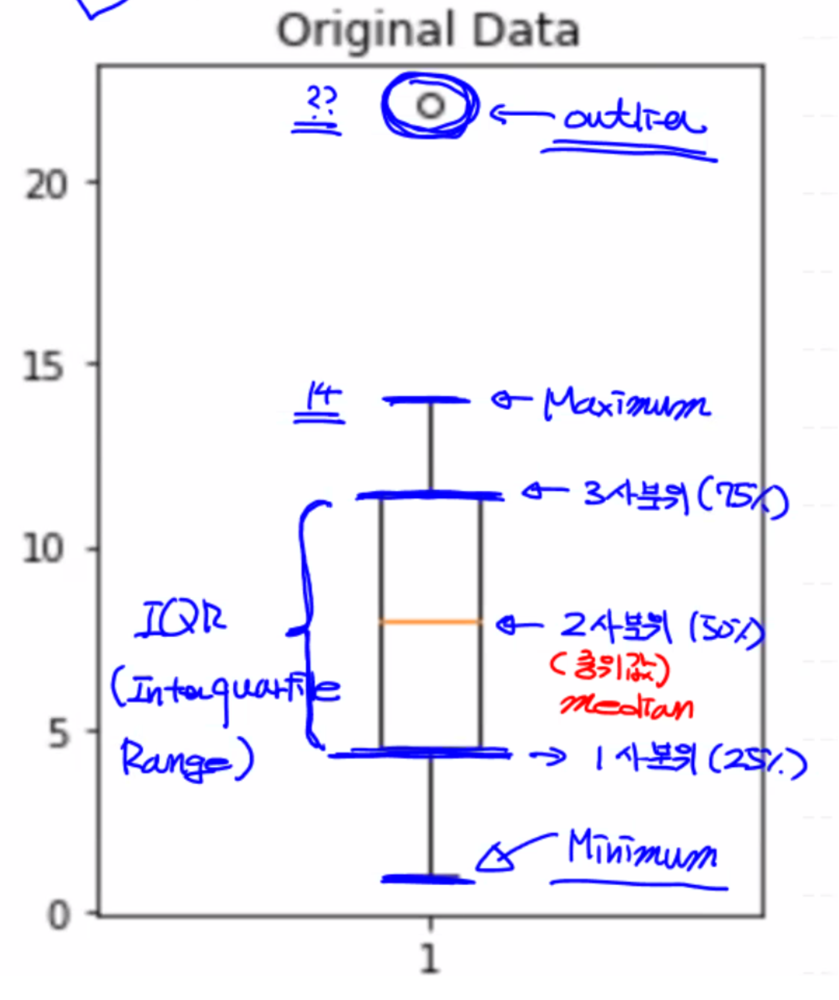

## 데이터 전처리(Data Preprocessing)

머신러닝에서 학습이 잘 되기 위해서는 양질의 데이터가 필요하다.

# 이상치(outlier) 처리

- 이상치: 속성(feature) 안에 들어있는 값이 속성 안에 있는 다른 일반적인 값에 비해 편차가 큰 값

- 머신러닝 특성상, 이상치에 가중치가 많이 부여될 수 있다.

  


일반적으로 독립변수(x) 혹은 Feature 측에 있는 이상치를 **지대점**이라 하고, 종속변수(t) 혹은 Lable 측에 있는 이상치를 **Outlier**라고 한다.

------

**[이상치 검출 및 처리 방법]**

- 이상치 검출

  **[다양한 이상치 검출 방법]**

  1. Variance: 정규분포의 분산을 이용
  2. Likelihood: 베이지 정리의 확률을 이용
  3. Nearest-Neighbor: 모든 데이터 쌍의 거리 이용
  4. Density: 카이제곱분포 이용
  5. **Tukey Fence:** 사분위 이용
  6. **Z-Score**: 정규분포와 표준편차 이용
- 이상치 처리 → boolean indexing 이용

## 1. Tukey Fence

Boxplot 그래프를 통해 시각적으로 이상치 판단이 가능하다.

- IQR(Inter Quartile Range): 1사분위와 3사분위 간격의 영역

- IQR Value: 3사분위 값 - 1사분위 값

  

<details>
  <summary>Boxplot 이해</summary>
  <ul> 
  	<li>맨 밑 선: 전체 데이터의 Minimum 값 (outlier 제외)</li>
    <li>박스의 맨 밑 선: 전체 데이터의 25%(1사분위)에 해당</li>
    <li>박스의 중간 선: 전체 데이터의 중위값, 즉 50%(2사분위)에 해당</li>
    <li>박스의 맨 윗 선: 전체 데이터의 75%(3사분위)에 해당</li>
    <li>맨 윗 선: 전체 데이터의 Maximum 값 (outlier 제외)</li>
    <li>위의 동그라미: outlier</li>
  </ul>
  
</details>


**[이상치 수식]**

- 하위 이상치(Lower Fence): 1사분위 - IQR_value t ⨉ 1.5 초과로 작은 값들

- 상위 이상치(Upper Fence): 3사분위 + IQR_value ⨉ 1.5 초과로 큰 값들

  

**[코드 이해]**

- `fig = plt.figure()`: 도화지 생성
- `fig.add_subplot(행, 열, 몇번째)`: 행과 열, 몇번째 칸 위치에 subplot을 더함
- `percentile()`: 사분위수를 계산하는 numpy 함수

```python
import numpy as np
import matplotlib.pyplot as plt

data = np.array([1,2,3,4,5,6,7,8,9,10,11,12,13,14,22.1])

# subplot
fig = plt.figure()  # 새로운 figure 생성 (도화지 준비)
fig_1 = fig.add_subplot(1,2, 1) # 영역_1: 1행 2열의, 첫번째 칸
fig_2 = fig.add_subplot(1,2, 2) # 영역_2: 1행 2열의, 두번째 칸

# percentile(): numpy를 이용해서 사분위수를 계산 
print(np.median(data)) # 중위값(2사분위): 8.0
print(np.percentile(data, 25)) # 1사분위: 4.5
print(np.percentile(data, 50)) # 2사분위: 8.0
print(np.percentile(data, 75)) # 3사분위: 11.5

# IQR value = 3사분위 값 - 1사분위 값
iqr_value = np.percentile(data, 75) - np.percentile(data, 25)
print(iqr_value) # 7.0

# 이상치
upper_fence = np.percentile(data, 75) + (iqr_value * 1.5)
lower_fence = np.percentile(data, 25) - (iqr_value * 1.5)

print(upper_fence) # 22.0
print(lower_fence) # -6.0

# 이상치 출력 - boolean indexing 이용
# (mask) | (mask)
print(data[(data > upper_fence) | (data < lower_fence)]) # [22.1]

# 이상치를 제거한 데이터
result = data[(data <= upper_fence) & (data >= lower_fence)]
print(result) 

# 비교
fig_1.set_title('Original Data')
fig_1.boxplot(data) 

fig_2.set_title('Remove Outlier')
fig_2.boxplot(result) 

# 출력
fig.tight_layout() # 레이아웃 예쁘게 잡아줌
plt.show() # 전체 figure 출력
```

<details>
  <summary>출력 형태</summary>
  
</details>

<details>
  <summary>Tukey Fence를 이용하여 이상치를 처리한 Tensorflow Simple Linear Regression Model</summary>
    <a href="https://github.com/sammitako/TIL/blob/master/Machine%20Learning/source-code/ML_0225.ipynb">👉🏼 여기 클릭</a>
</details>


## 2. Z-Score

데이터의 분포를 이용한 이상치 검출 방법으로 임계치가 정해져 있어서 이상치 판단이 편리하다.

- 이상치의 임계치(threshold)를 2.0 이하로 잡아서 이 임계치 안으로 데이터가 들어오면 이상치가 아니고(정상이고) 바깥으로 나가면 이상치인 것으로 판단한다.
- 임계치가 커질 수록 완전 극단의 데이터 값만을 이상치로 판단하겠다는 의미이다.

<details>
  <summary>정규분포도</summary>
  
</details>


```python
import numpy as np
from scipy import stats

# 2.0: optimal value
zscore_threshold = 1.8 # 상위 95% 이상, 하위 95% 이하인 값

data = np.array([1,2,3,4,5,6,7,8,9,10,11,12,13,14,22.1])

# data -> zscore
print(stats.zscore(data))

# oulier 출력
print(np.abs(stats.zscore(data)))  # 양수

outlier = data[np.abs(stats.zscore(data)) > zscore_threshold]
print(outlier)

# 이상치를 제거한 데이터 출력
np.isin(data, outlier) # data 안에 outlier 있니 -> Boolean Mask 반환
np.isin(data, outlier, invert=True) # not isin
print(data[np.isin(data, outlier, invert=True)])
```

<details>
  <summary>출력 형태</summary>
  
</details>

<details>
  <summary>Z-Score를 이용하여 이상치를 처리한 Tensorflow Simple Linear Regression Model</summary>
    <a href="https://github.com/sammitako/TIL/blob/master/Machine%20Learning/source-code/ML_0225.ipynb">👉🏼 여기 클릭</a>
</details>

