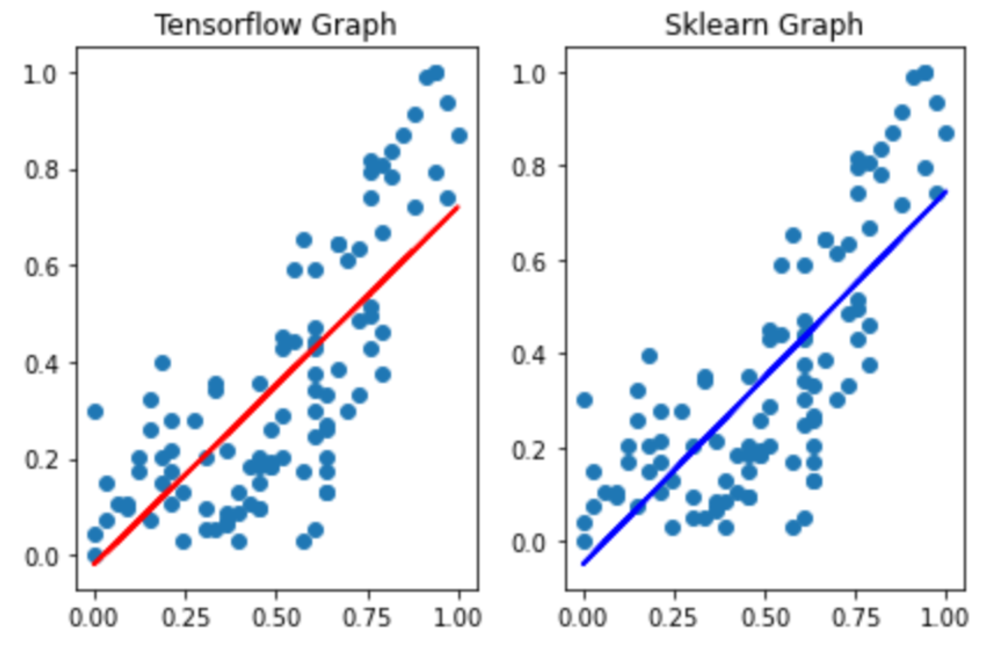

# 3. 정규화

데이터 feature의 스케일(단위) 차이가 심하게 나는 경우, 동일한 스케일로 맞춰주는 작업, 즉 각 feature의 단위 및 range 차이에 대해 데이터의 스케일을 0~1 실수값의 비율로 조정

따라서, 데이터의 중요도를 같은 비율로 맞춰줌

**[정규화 방법]**

일반적으로 Min-Max Normalization을 사용

- Min Max Normalization
- Z-score Normalization = Standardization

------

## 1. Min-Max Normalization

데이터 정규화에 가장 일반적인 방법으로 모든 feature에 대해 최소값 = 0, 최대값 = 1 사이로 변환

### 수식

.png)

### 문제점

이상치가 최대값 또는 최소값으로 인식될 경우 스케일링 자체가 취약해지기 때문에 이상치 처리가 반드시 선행돼야 한다.


## 2.   Z-score Normalization = Standardization


각 feature의 값을 분산과 평균을 통해 구한 z-score 값으로 변환

### 수식

.png)

### 장점

이상치에 상대적으로 크게 영향을 받지 않는다.

### 단점

각 feature들의 값, 즉 z-score값이 제 각각이므로 동일한 척도(스케일)를 적용할 수 없다.


## Simple Linear Regression 적용

온도에 따른 오존량 문제를 다시 구현

### 데이터 전처리

1. CSV 파일 로딩
2. 결측치(NaN) 제거
3. 이상치(Outlier) 제거: Tukey Fence, Z-score
4. 정규화 진행: Min-Max Scaling, Z-score

------

### 머신러닝

1. Training Data Set
2. Tensorflow를 이용한 머신러닝 진행
3. Python을 이용한 머신러닝 진행
4. Data Visualization(graph)을 통해 Sklearn 결과와 비교
5. Prediction을 Sklearn과 유사하게 나오는 지 확인


**[라이브러리]**

- `from scipy import stats`: Z-Score를 통한 이상치 제거

- `from sklearn.preprocessing import MinMaxScaler`

  : Min-Max Scaling을 통한 정규화(스케일링) 진행

**[코드이해]**

- `loc[행, 열]`: DataFrame의 행에 대해서 인덱싱

- `MinMaxScaler().fit(2차원)`: 독립변수가 여러 개인 경우를 고려하여 인자를 2차원 행렬 형태의 데이터 값으로 받음

- `transform()`: MinMaxScaler() 객체에 대해 데이터 값의 범위를 0부터 1사이로 변환시킴

  

**Library**

```python
import numpy as np
import pandas as pd
import matplotlib.pyplot as plt
from scipy import stats 
import tensorflow as tf
from sklearn import linear_model
from sklearn.preprocessing import MinMaxScaler
```

**Data Preprocessing**

1. Raw Data Loading

   ```python
   df = pd.read_csv('data/ozone.csv')
   display(df)
   
   training_data = df[['Temp','Ozone']]
   display(training_data) # 153 rows × 2 columns
   ```

2. 결측치 제거

   ```python
   training_data = training_data.dropna(how='any') 
   display(training_data) # 116 rows × 2 columns
   ```

3. 이상치 제거

   Z-Score 방식을 통해 아래의 이상치를 처리

   - 독립변수 (Temp) -> 지대점

   ```python
   zscore_threshold = 1.8 
   
   # Temp outlier
   print(type(training_data['Temp'])) # 1차원 Series
   
   # True => 이상치
   np.abs(stats.zscore(training_data['Temp'])) > zscore_threshold
   
   # 역처리: True <-> False
   tmp = ~(np.abs(stats.zscore(training_data['Temp'])) > zscore_threshold)
   
   # 해당 DataFrame에서 True의 값만 뽑음
   training_data = training_data.loc[tmp] 
   display(training_data) # 110 rows × 2 columns
   ```

   - 종속변수 (Ozone) -> 아웃라이어

   ```python
   zscore_threshold = 1.8 
   
   # True => 이상치
   np.abs(stats.zscore(training_data['Ozone'])) > zscore_threshold
   
   # 역처리: True <-> False
   tmp = ~(np.abs(stats.zscore(training_data['Ozone'])) > zscore_threshold)
   
   # 해당 DataFrame에서 True의 값만 뽑음
   training_data = training_data.loc[tmp] # loc[행, 열]: DataFrame의 행에 대해서 indexing
   display(training_data) # 103 rows × 2 columns
   ```

4. 정규화 작업

   sklearn 라이브러리를 통해 Min-Max Scaler 사용하여 정규화 처리를 진행

   값을 변환시키는 역할을 하는 Min-Max Scaler라고 불리는 객체를 독립변수, 종속변수 각각에 생성

   - 독립변수

   ```python
   scaler_x = MinMaxScaler() # 독립변수용 빈 객체 생성
   scaler_x.fit(training_data['Temp'].values.reshape(-1,1)) # 2차원 Matrix 형태를 인자로 받음
   print(scaler_x.n_samples_seen_, scaler_x.data_max_, scaler_x.data_min_, scaler_x.feature_range) 
   
   # Min-Max Scaling
   training_data['Temp'] = scaler_x.transform(training_data['Temp'].values.reshape(-1,1))
   ```

   - 종속변수

     ```python
     scaler_t = MinMaxScaler() # 종속변수용 빈 객체 생성
     scaler_t.fit(training_data['Ozone'].values.reshape(-1,1)) 
     
     # Min-Max Scaling
     training_data['Ozone'] = scaler_t.transform(training_data['Ozone'].values.reshape(-1,1))
     display(training_data)
     ```

**Tensorflow**

1. Training Data Set

   ```python
   x_data = training_data['Temp'].values.reshape(-1,1)
   t_data = training_data['Ozone'].values.reshape(-1,1)
   ```

2. Placeholder

   ```python
   X = tf.placeholder(shape=[None, 1], dtype=tf.float32)
   T = tf.placeholder(shape=[None, 1], dtype=tf.float32)
   ```

3. Weight & bias

   ```python
   W = tf.Variable(tf.random.normal([1,1]), name='weight')
   b = tf.Variable(tf.random.normal([1]), name='bias')
   ```

4. Hypothesis

   ```python
   H = tf.matmul(X, W) + b
   ```

5. Loss Function

   ```python
   loss = tf.reduce_mean(tf.square(H-T))
   ```

6. Gradient Descent Algorithm

   ```python
   train = tf.train.GradientDescentOptimizer(learning_rate=1e-4).minimize(loss)
   ```

7. Session, 초기화

   ```python
   sess = tf.Session()
   sess.run(tf.global_variables_initializer())
   ```

8. Learning

   ```python
   for step in range(300000):
       _, W_val, b_val, loss_val = sess.run([train, W, b, loss], feed_dict={X: x_data, T: t_data})
       
       if step % 30000 == 0:
           print('W: {}, b: {}, loss: {}'.format(W_val, b_val, loss_val))
   ```

**Sklearn**

1. Training Data Set

   ```python
   x_data = training_data['Temp'].values.reshape(-1,1)
   t_data = training_data['Ozone'].values.reshape(-1,1)
   ```

2. Model

   ```python
   model = linear_model.LinearRegression()
   ```

3. Learning

   ```python
   model.fit(x_data, t_data)
   print('W: {}, b: {}'.format(model.coef_, model.intercept_))
   ```

**Model Visualization - Tensorflow vs. Sklearn**

```python
fig = plt.figure()
fig_tensorflow = fig.add_subplot(1,2, 1)
fig_sklearn = fig.add_subplot(1,2, 2)

fig_tensorflow.set_title('Tensorflow Graph')
fig_sklearn.set_title('Sklearn Graph')

fig_tensorflow.scatter(x_data, t_data)
fig_tensorflow.plot(x_data, x_data*W_val.ravel() + b_val, color='r')

fig_sklearn.scatter(x_data, t_data)
fig_sklearn.plot(x_data, x_data*model.coef_.ravel() + model.intercept_, color='b')

fig.tight_layout()
plt.show()
```



**Prediction - Tensorflow vs. Sklearn**

온도가 62도일 때 오존량은 얼마일까?

```python
# Tensorflow
tensorflow_result = sess.run(H, feed_dict={X:[[62]]})
print(tensorflow_result) # [[45.870964]]

# Sklearn
sklearn_result = model.predict([[62]])
print(sklearn_result) # [[49.22229492]]
```

(주의) 정규화된 데이터로 모델을 생성하고 학습할 시에는 예측할 시에도 정규화된 데이터로 예측 후 다시 비정규화하여 결과값을 도출해야 한다.


