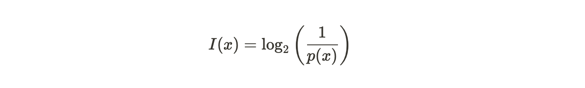
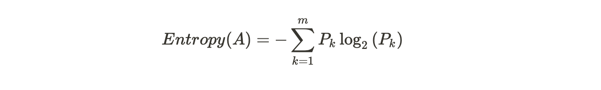
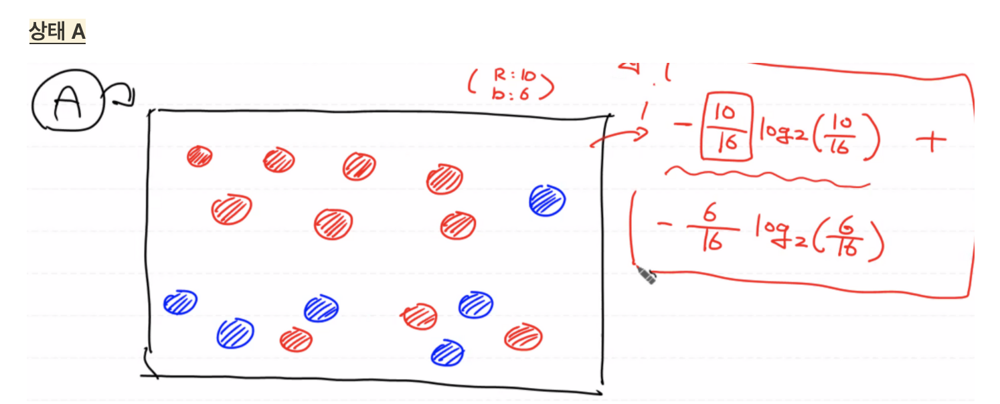
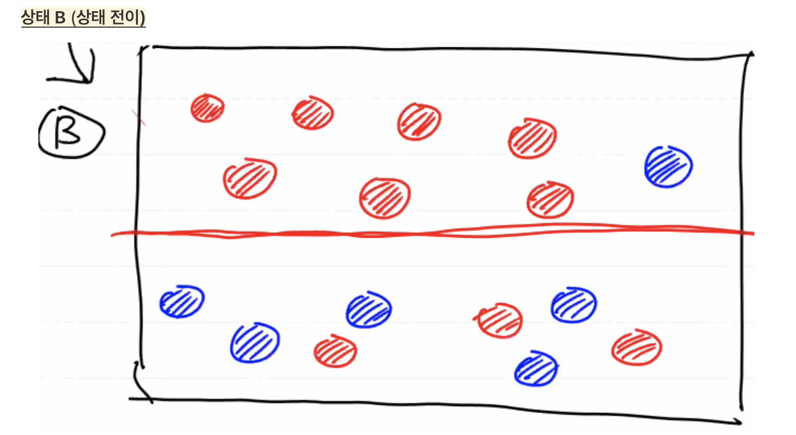
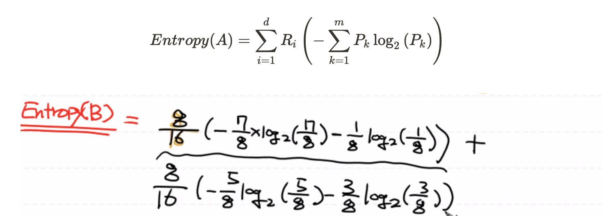
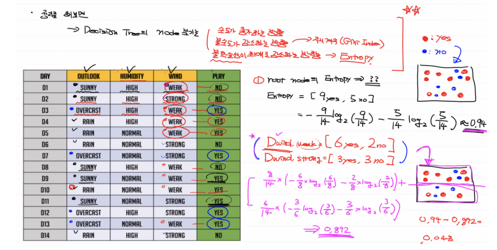

# Decision Tree (의사결정트리)

데이터를 분석해서 데이터 사이에 존재하는 패턴을 파악해서 예측 가능한 규칙들의 조합을 만드는 알고리즘이다.

쉽게 말해, 질문을 통해서 특정 범위로 내용을 좁혀나가 정의하게 되는 알고리즘이다.

- Root Node: 처음 분기하는 노드

- Intermediate Node: 중간에 분기하는 노드

- Terminal Node(=Leaf Node): 더이상 분기하지 않고 결정된 노드


<br>

## 의사결정트리의 특징


- 굉장히 직관적이고 이론상 이해하기 쉬운 방식이다.

- 다른 머신러닝 모델에 비해 구조가 단순하여 수행 속도가 빠르다.

- **데이터의 특성**에 따라서 다른 모델에 비해 더 좋은 성능을 내는 경우가 꽤 있다.

  1. 일반적으로 독립변수와 종속변수가 연속적인 실수값이 아닌 이산 데이터인 경우에 적합하다.
  2. Regression보다 Classification 문제에 더 적합하고 클래스 수(종속변수의 Label의 개수)가 적을 때 적합하다.
  3. 데이터의 개수가 많을 때 적합하다.

  따라서 거꾸로 생각하면 클래스 개수가 많을 때나 데이터 개수가 적을 때 데이터 증식을 한다고 할지라도 의사결정트리를 사용할 경우 성능이 안좋다.

<br>

## 의사결정트리 예제


의사결정트리는 분기 기준에 따라 여러개 만들어질 수 있다.

- 스포츠 경기가 열릴 수 있었던 날짜, 날씨, 습도, 바람에 대한 표
- 의사결정트리로 표현
- 새로운 입력 데이터에 대한 예측값

<br>

## 최적의 의사결정트리 결정하기


트리의 깊이가 얕고 트리의 사이즈가 작아야 메모리 효능 및 모델의 성능 속도면에서 좋고 정확도도 높아진다.

그렇다면 어떤 기준으로 노드를 분기(학습)해야 할까?

1. 순도(homogeneity)가 증가하는 방향으로 영역을 분기한다.
2. 불순도(Impurity)이 감소하는 방향으로 영역을 분기한다.
3. 불확실성(Entropy)이 감소하는 방향으로 영역을 분기한다.

순도가 증가하고 불순도 또는 불확실성이 감소하는 것을 정보이론(Information Theory)에서는 정보획득(Information Gain): 어떤 사건이 얼마만큼의 정보를 줄 수 있을 지를 수치화한 값이라 한다.

(참고: 순도와 불순도/불확실성은 역의 관계를 가진다.)

정보획득의 양이 크다는 것은 순도가 많이 증가하고 불확실성이 많이 감소한다는 것을 의미하며 정보획득량이 많아지는 방향으로 노드가 분기되는 식의 의사결정트리를 구성한다.

예) OUTLOOK이 분기의 기준으로 결정된 이유는 나눈 영역에 비해 전체 영역에 대해서 순도가 증가하고 불순도가 감소하기 때문이다.

### **Information Gain**

어떤 사건이 얼마만큼의 정보를 줄 수 있을 지를 수치화한 양을 의미한다.

- **정보함수 (Information Function)**

  확률의 역함수의 로그값으로 얼마나 정보량이 많은지, 즉 정보의 가치를 의미한다.

  정보함수의 값이 크다는 의미는 그 정보가 가치가 있다는 뜻이다. 확률이 적을 수록 정보의 가치가 크므로 확률과 정보의 가치는 반비례 관계를 가진다.

  

  <br>

- **엔트로피 (Entropy)**

  무질서도를 정량화한 값으로 확률 변수의 불확실성을 수치로 표현한 값이다. 따라서 **Entropy가 높으면 불확실성의 수치가 높다는 뜻이고 그 집단의 특징을 찾아내기가 어렵다.**

  따라서 하나의 상태에서 다른 상태로 전이할 때, 불확실한 상황에서 불확실하지 않은 상황으로 전이되는 경우 정보량이 많게 된다.

  "분류 전 전체 Entropy - 분류 후 Entropy = 정보획득량"이 최대가 되는 방향으로, Entropy를 줄여나가는 방향으로 학습을 진행한다.
  
  <br>

## Entropy 계산을 통해 의사결정트리 구조를 만들어보자.

### A **영역 하나**에 대한 Entropy는 다음의 수식으로 표현이 된다.

- P: A 영역에 속하는 데이터 중에 k 범주에 속하는 데이터의 비율
- k, m: 분류 개수





```python
import numpy as np

result = -(10/16 * np.log2(10/16) + 6/16 * np.log2(6/16))
print(result) # 0.9544340029249649
```

<br>

### 상태 A에 대해 두 개의 **영역으로 나눠서 또 다른 상태로 전이**시킨다. **두 개 이상의 영역**에 대한 Entropy는 다음의 수식으로 표현이 된다.




- R: 분할 전 데이터 중에 분할 후 $i$ 영역에 속하는 데이터의 비율
- d: 영역의 개수



```python
import numpy as np

result1 = (8/16) * -(7/8 * np.log2(7/8) + 1/8 * np.log2(1/8))
result2 = (8/16) * -(5/8 * np.log2(5/8) + 3/8 * np.log2(3/8))
print(result1 + result2) # 0.7489992230622806
```

분기 전보다 분기 후의 Entropy값이 감소했으므로 순도가 증가, 무질서도/불확실성이 감소하여 정보획득이 발생했다고 해석할 수 있다.

다시 말해, 분할 전보다 분할 후가 더 좋다고 판단하여 의사결정트리의 노드를 분기한다.

<br>

## 분할할 영역에 대한 판단은? 예제를 통해 알아보자.


Information Gain값이 최대가 되는, 즉 Entropy값이 최소가 되는 방향으로 분기 규칙을 찾아서 그 형태대로 노드를 분기시켜야 한다.

따라서 루트 노드의 Entropy 값에서 전이된 상태의 Entropy의 차가 최대가 되는 방향으로 노드를 분기시키면서 의사결정트리를 만든다.

**다시말해, 정보획득량이 가장 큰 노드를 기준으로 분할하는 것이 분할할 영역에 대한 판단 기준이 된다. 더이상 노드를 분할할 수 없을 때까지 계속 분할(학습)을 진행하는 것이 의사결정트리를 만드는 작업이다.**



<br>

## Decision Tree의 문제점


1. 미래를 고려하지 않고 현재 상황에서 정보획득량의 최대값만을 가지고 판단하는 Greedy 알고리즘을 이용하기 때문에 최적의 트리를 구성하지 못할 수 있다.

2. Training Data를 기준으로 트리가 만들어지므로 다른 모델에 비해 과대적합이 심하다.

   → Pruning이라는 가지치기 기법을 사용하면 과대적합의 정도를 줄일 수 있다.

<br>

## Scikit-learn을 통한 의사결정트리 모델을 구현해보자.

👉🏼 [ML_0402_Decision_Tree](https://github.com/sammitako/TIL/blob/master/Machine%20Learning/source-code/ML_0402_Decision_Tree.ipynb)