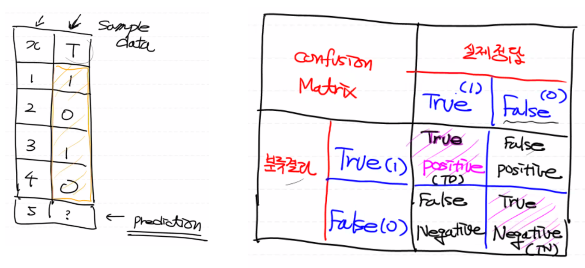
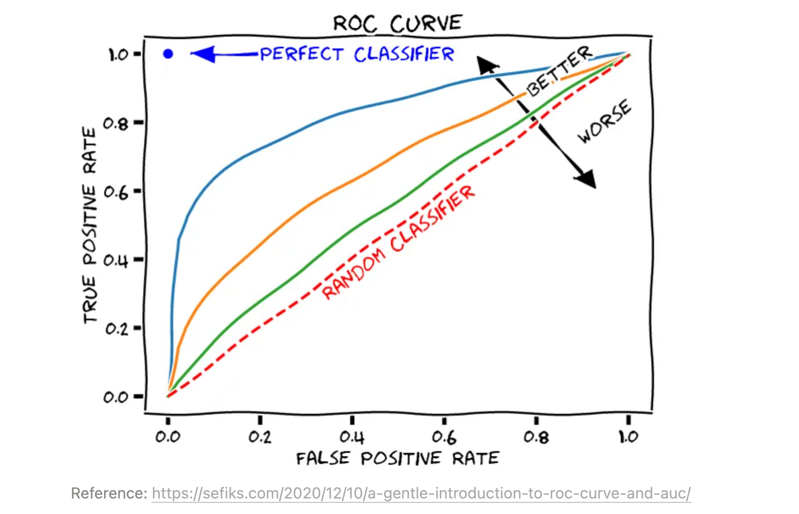
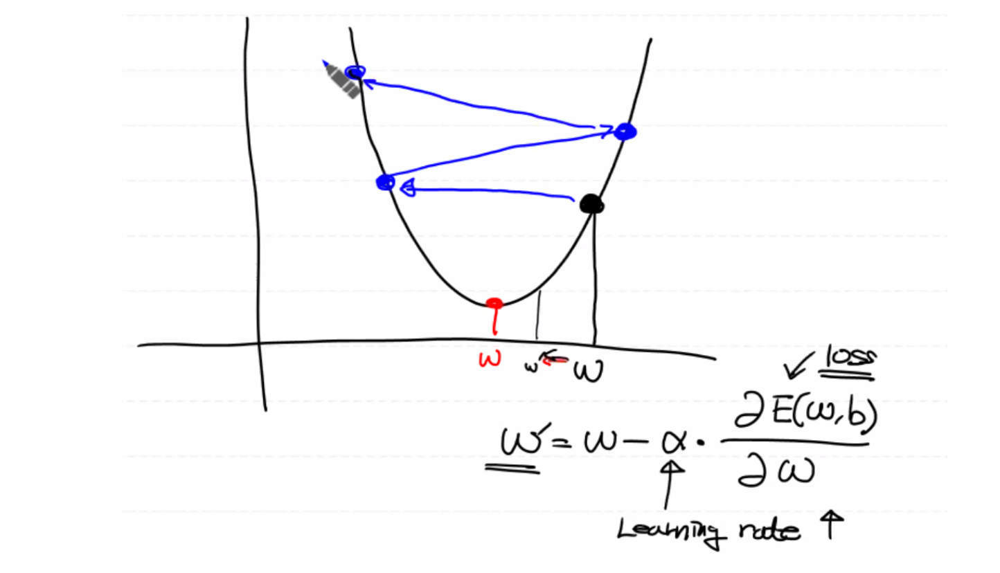
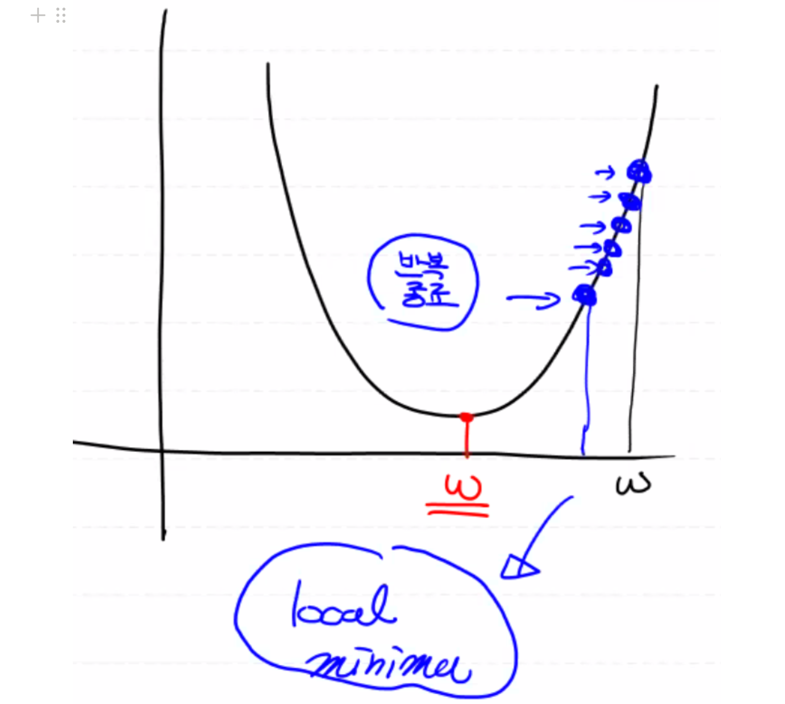
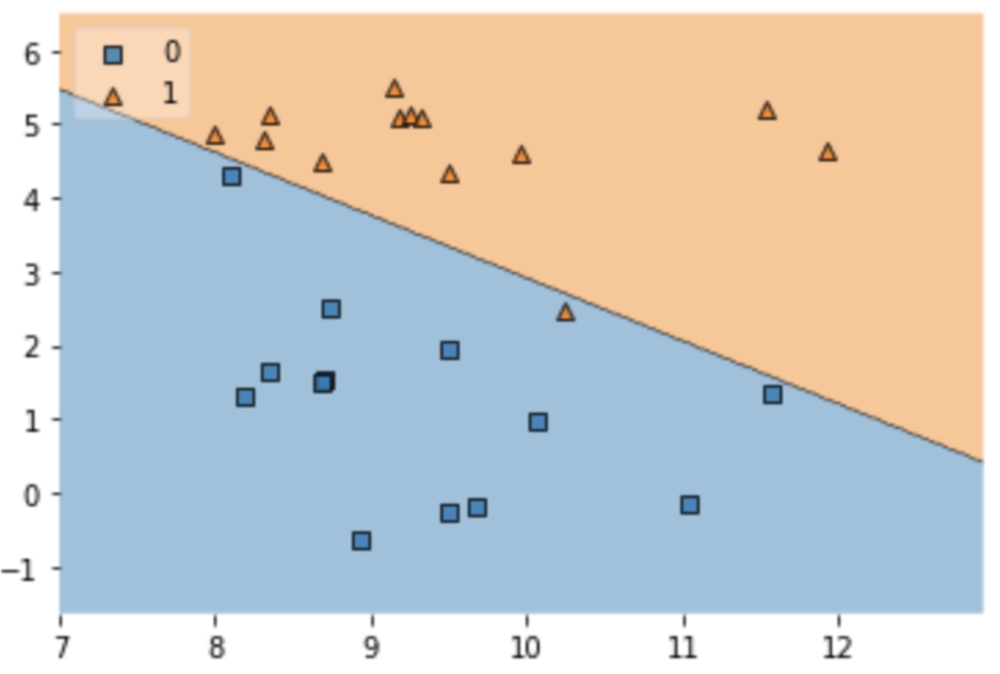

# 성능 평가 지표(Evaluation Metric)

이진 분류(Binary Classification)를 하기 위해 사용한 Logistic Regression 모델이 잘 만들어진 모델인지 확인하기 위한 기준

 

### **Confusion Metrix**

- True: 실제 레이블 데이터와 예측된 분류 결과가 일치 (잘 만들어진 모델)
- False: 실제 레이블 데이터와 예측된 분류 결과가 불일치 (잘못 예측한 모델)
- Positive: 예측된 분류 결과가 True (1)
- Negative: 예측된 분류 결과가 False (0)

-----

- True Positive(TP): 실제 레이블도 1이고 모델 예측값도 1일 경우
- True Negative(TN): 실제 레이블도 0이고 모델 예측값도 0일 경우
- False Positive(FP): 실제 레이블은 0인데 모델 예측값(분류 결과)가 1일 경우
- False Negative(FN): 실제 레이블은 1인데 모델 예측값(분류 결과)가 0일 경우

 

### **True를 True라고 옳게 예측한 경우에만 사용되는 성능 평가 지표**

## Precision(정밀도)

구현한 모델이 True로 분류한 것 중 실제 레이블 데이터가 True인 것의 비율

다시 말해, Positive 정답률 또는 PPV(Positive Predictive Value)라고 한다.

## Recall(재현율)

실제 레이블 데이터가 True인 것 중 구현한 모델이 True라고 예측한 데이터에 대한 비율

다시 말해, Sensitivity(민감도) 또는 Hit Rate(맞춘 비율)라고 한다.

## Precision과 Recall을 비교하는 예제

사진을 입력 받아서 그 안에 고양이가 있는 지를 검출하는 소프트웨어를 A라는 회사가 개발했다.

1. 이 소프트웨어의 고양이 검출율은 99.9%라고 홍보를 했다.
2. 이 소프트웨어의 고양이 검출율을 63.7% 라고 홍보를 했다.

이때, 이 홍보에 대해서 사람들은 이 기술은 오검출을 절대로 하지 않는다고 전제 하에 생각한다.

사실, "A"라는 기술은 99.9%의 검출율 + 그림 1장 당 평균 5건의 오검출 발생 시키는 반면, "B"라는 기술은 63.7%의 검출율 + 오검출이 거의 발생하지 않는다.

- Recall: 고양이를 한 마리도 빠뜨리지 않고 찾는 비율 = 검출율 (오검출이 있는 경우)

  예를 들어 틀려도 좋으니 암환자는 무조건 다 찾아야되는 경우 재현율이 중요하다.

- Precision: 검출된 결과 중 고양이를 제대로, 정확하게 찾는 비율 (오검출이 없는 경우)

  예를 들어 일반 메일을 스팸 메일로 분류할 경우, 즉 잘못 찾으면 타격이 큰 경우 정밀도가 중요하다.

일반적으로 Recall과 Precision은 **반비례** 관계가 있다. 즉 정확도가 높으면 재현율이 낮아질 수 밖에 없다. 반대로 재현율이 높아지면 정확도가 낮아진다.

따라서 Recall 값과 Precision 값을 적절히 조절하여 파라미터 값을 설정해야 한다.

 

### **좀 더 범용적이고 직관적인 성능 평가 지표**

## ✔️ Accuracy(정확도)

True를 True로, False를 False로 예측한 비율

**단점**

도메인의 bias를 반드시 고려해야 한다.

예를 들어, CT 사진(입력)을 통해 희귀병을 검출하는 모델을 개발했다고 하자.

해당 희귀병은 천만 분의 일로 발생하는 확률이다. 다시 말해, 희귀병 데이터 자체가 편향(bias)되어 있으므로 모델 자체를 어떤 사진(입력)이 들어와도 무조건 희귀병이 아니라고 판단하는 모델을 만들었다.

이 경우에 모델의 Accuracy는 99.9%가 나온다. 즉 데이터의 편향(bias) 문제 때문에 엉터리 결과를 얻게 된다.

 

## F1 Score

Precision과 Recall의 평균을 구해서 모델의 성능 평가를 진행하면 어떨까?

일반적으로 산술평균은 극단의 값에 영향을 받기 때문에 조화평균을 사용하게 된다.

## Fall-out

실제값은 False인데 모델이 True라고 잘못 예측한 비율

## ROC Curve

Recall과 Fall-out을 그래프로 표현

 

# 추가 정보

### 1. Learning Rate

   : W, b를 갱신할 때 미분계수에 곱해주는 상수값

   - 초기: 1e-4

   - **Over Shooting**

     : Learning Rate 상수를 필요 이상으로 크게 할 경우, W'이 그래프 밖으로 발산하는 현상 발생

     

       
Over Shooting 그래프

       
     

      

   - **Local Minima**

     : Learning Rate 상수를 필요 이상으로 작게 할 경우, W'이 아주 작게 계산되어 설정된 학습 epoch이 끝나도 최적의 W에 도달하지 못하는 현상 발생

     

       
Local Minima 그래프

       
     

     

      

     **[해결책] 반복횟수를 늘리면 최적의 w에 도달하지 않을까?**

     그런데 반복횟수가 늘어나게 되면,

     - 학습 시간 소요
     - Overfitting 문제 발생

       : 모델이 데이터에 맞게 생성됨

   Learning Rate를 찾는 이상적인 방법이 존재하지 않기 때문에 데이터에 맞게 커스터마이징해야 한다.

    

### 2. 정규화

: 0과 1 사이로 데이터가 분포되어 학습이 잘 이뤄지게 된다.

- **Min-Max Scaling**
- Z-score(=Standardization)
- Student T-분포

아래 두개 현상을 합쳐서 학습된 결과에 대한 과적합이라 하기도 한다. 그러나, 일반적으로 과적합은 과대적합을 뜻한다.

즉, 데이터를 이용해 학습이 끝난 후 생성된 모델의 상태를 지칭한다.

 

### 3. 과대 적합(Overfitting)

학습 데이터에 피팅된 모델이 만들어져 실제 데이터의 예측값이 잘못 도출된다.

따라서 모델의 정확도가 떨어지게 된다.

(생성된 모델이 Training Data Set에 너무 집착해서 Training Data Set에 딱 맞는 형태로 만들어짐)

  
과대 적합 모델

  

 

**Overfitting이 발생되는 요인**

* epoch 수 (많은 경우)

* Feature의 개수 (많은 경우)

​		독립변수의 개수를 줄여야 한다. 

​		그리고 중복되는 독립변수와 종속변수에 연관성이 없는 독립변수는 상관분석을 통해 제외시켜야 한다.     

* 데이터의 양 (적은 경우)

  따라서 무조건 많은 데이터의 양이 필요하다. (다다익선)

  **그런데 데이터의 양이 없는데 어떡하지?**

  ​	⬩  데이터 증식

  ​	⬩  증식으로도 안되면 답이 없다

   

### 4. **과소 적합(Underfitting)**

학습이 충분히 이루어지지 않아 모델이 제대로 생성되지 않는 현상

(충분한 학습을 하지 않아서 모델 자체가 미완성됨)

정리하면 보통 학습량에 따라 위의 두 현상으로 나눠진다. (→적절한 epoch수의 기준은 나중에 설명) 

 

# 모델 평가(Evaluation)

- Training Data Set으로 성능평가를 하면 안된다. 거의 100%의 Accuracy가 도출된다.

  (평가 문제로 학습하고 평가 문제로 시험을 볼 경우 당연히 만점)

- 따라서 Test Data Set을 따로 만들어야 한다.

  Original Data Set 중 70% 또는 80%는 Training Data Set으로 사용하고 30% 또는 20%는 Test Data Set으로 사용해야 한다.

   

  

  ### **Original Data Set**

  * Training Data Set

    * 70% - Training Data Set

    ​	   : 반복 학습에 사용되는 데이터
    * 30% - Validation Data Set

      : 학습 데이터가 1 epoch을 돌면서 도출한 결과를 Validation Data Set을 통해 내부 평가를 한 후 모델을 반복적으로 수정하기 위한 평가 용도 (여러 번 사용)

  * Test Data Set

    : 모델이 완성된 후 최종적으로 모델의 성능을 평가하기 위한 용도 (한 번 사용)
  
     

  ### **문제점**
  
  Original Data Set의 갯수가 많아야 한다. 즉 전체 데이터의 양이 많아야 한다.
  
   

## Validation

Epoch 당 모델이 갱신될 때, Training Data Set으로 평가를 하고 Validation Data Set으로 평가를 진행

- Training Data Set으로 평가하는 경우,

  모델의 성능 평가가 좋아지고, 어느 선(epoch) 이상으로 넘어갈 경우 Overfitting 현상이 발생하는데 Overfitting 정의가 Training Data Set에 딱 맞는 모델이 생성되는 것이므로 이 후 아무리 성능 평가를 해도 모델의 성능은 계속해서 좋아지게 된다.

  (Overfitting: Training Data Set에 딱 맞는 모델)

- Validation Data Set으로 평가하는 경우,

  모델의 정확도는 좋아지지만, 과대적합이 발생하는 순간 모델의 정확도가 더이상 올라가지 않게 되고 결국 떨어지게 된다.

이 Overfitting이 발생하기 전의 경계가 최적의 epoch 수이다. 즉 이 경계를 알기 위해 Validation Data Set을 사용하는 것이다.

 

### CV(K-fold Cross Validation)

------

총 데이터의 양이 작은 경우 교차검증하는 방법 (→나중에 설명)