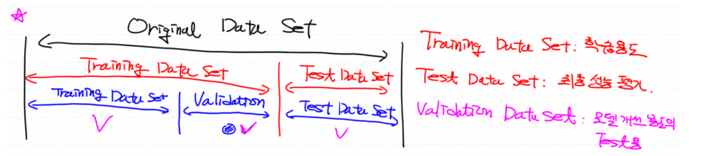
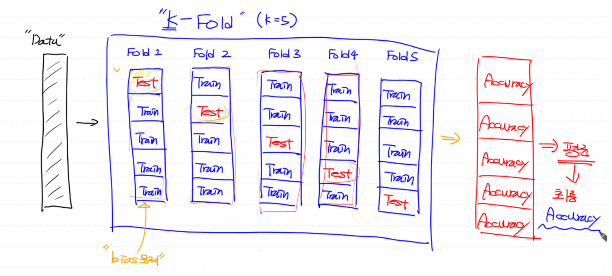

# Evaluation

  
Original Data Set

  

 

## 문제: 데이터 셋이 충분히 많지 않은 경우,

Training Data Set이 상대적으로 적을 때, Training Data Set과 Validation Data Set - 이렇게 두 부분으로 나눌 수 없게 되므로 필연적으로 Underfitting 현상이 발생하게 된다. 즉 학습 자체가 이뤄지지 않게 된다.

반복이라도 많이 하기 위해 epoch을 늘려서 학습하게 되는데, 이 경우 **Overfitting** 현상이 발생하게 된다.

즉, 우리 모델이 해당 데이터만 잘 표현하고 일반적인 데이터에 대해서는 잘 적용이 안되는 현상이 발생하게 된다.

 

## 해결책: K-fold Cross Validation (CV)

위와 같은 문제를 해결하기 위한 방법인 교차검증을 통해 조금 더 나은 성능의 모델을 만들 수 있다.

Training Data Set을 Validation Data Set으로 나누지 않는다고 가정하고 최종 Accuracy를 구해보자.

(Validation Data Set: 학습 과정 중간에 Overfitting이 어느 시점에서 발생하는 지 확인하는 테스트 용도)

1. `K=5` 라고 할 때, 폴드값: `K`개로 전체 데이터를 나눈 후, 각 폴드 안에서 분배된 데이터를 다시 `K`개로 나눈다.

2. 그 후, 첫 번째 폴드 안에서의 첫 번째 칸을 Test용으로 사용하고 나머지 칸을 학습용으로 사용하고, 두 번째 폴드 안에서는 두 번째 칸을 Test용으로 사용하고 나머지 칸을 학습용으로 사용한다. 이렇게 각 K개의 폴더 안에서 모델에 대한 성능 평가를 진행한다.

   다시 말해, 각 폴드 안에서 데이터를 학습하고 테스트하여 만들어진 모델을 다시 다른 폴드에서 데이터를 학습하고 테스트하기 위해 사용하는 방법으로 K개 만큼 모델이 생성되고 학습되어 진다.

   - 이때 Training Data Set은 Training Data Set/Validation Data Set으로 나누어 졌지 만 지금은 내부 평가 용도인 Validation Data Set을 사용하고 있지 않는다고 가정한다.
   - 그리고 Training Data Set을 통해 학습하여 만들어진 모델을 바로 Test Data Set을 통해 최종 모델 평가를 진행하여 Accuracy를 도출한다.

사실 지금까지 해온 Accuracy 측정은, 폴드 한 개만 진행한 것이다. 이 경우에 학습용 데이터에서 편향(bias) 문제가 발생하게 된다.

따라서 K-fold Cross Validation을 통해 학습을 진행 시, Training Data Set을 바꿔가면서 학습이 진행되므로 데이터의 편향 문제를 해결하게 되고 모델의 정확도가 높아지게 된다.

따라서 `K`번의 성능 평가를 통해 나온 모델들의 최종 Accuracy를 평균을 내어 우리의 최종 Accuracy 값으로 사용한다.

(참고: 예전에 진행한 Accuracy 진행 시간의 K배가 소요되지만 상대적으로 더 나은 Accuracy 값이 도출된다.)

