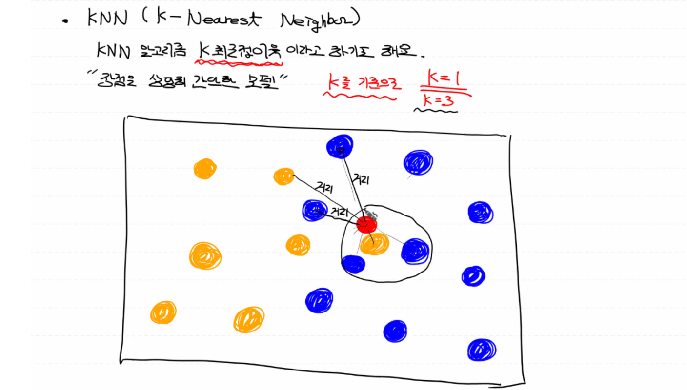

# KNN (K-Nearest Neighbor)

K-최근접 이웃 알고리즘은 상당히 간단하게 구현할 수 있는 모델이다.

<br>

## Classification 기반의 KNN

  최근접 이웃인 `K=n`를 포함하는 동심원을 그려서 새로운 입력값이 K(종류)라고 분류되는 확률값을 예측값으로 지정한다.

  - 만약 `n`이 1개 이상인 경우, 새로운 입력값을 기준으로 가장 가까운 이웃간의 거리를 비교해서 거리가 가장 짧은 `n`개의 이웃을 찾는다.
  - (아래의 그림을 참고한다면) `K=3`일 경우, 빨간색의 원은 파랑이 되고, `K=1`일 경우 빨간색 원은 노란색이 된다.



## Regression 기반의 KNN

동그라미들(label)이 연속적인 값을 가질 때, `K`를 기준으로 가장 가까운 이웃들의 label(종속변수) 평균값을 입력값에 대한 예측값으로 지정한다.

<br>

## KNN 특징

- KNN은 딱히 학습이라는 절차가 필요 없기 때문에 소요시간이 적다.

- 새로운 입력 데이터와 기존 데이터들 간의 거리를 계산해서 최근접 이웃을 기준으로 예측을 수행하는 기법

  (Instance based learning = lazy model: 학습 절차가 필요 없는, 값을 기준으로 예측하는 머신러닝)

- 별도의 모델 생성 없이 관측(이웃들 간의 거리)만을 이용해서 회귀와 분류 작업이 가능하다.

<br>

## Hyper parameter

### 1. 이웃의 수 (K)
   - K가 작을 경우, 최근접 이웃들의 지역적인 특성을 너무 많이 반영해서 Overfitting 현상이 발생
   - K가 클 경우, 판단할 수 있는 조건 자체가 성립되지 않아서 Underfitting 현상이 발생
   - 그러면, 적절한 *K*값을 어떻게 구하지? (→KNN의 문제점)
### 2. 거리 측정 방식
   - **유클리디안 거리:** 두 관측치 사이의 최단 직선거리 (원의 중심을 잇는 직선을 직각삼각형의 빗변으로 설정)
   - 맨하탄 거리: 도시에는 건물이 있어서 좌표축 방향으로만 이동 (>유클리디안 거리)
   - 마할라노비스 거리: 분산과 공분산을 거리 계산에 반영하여 거리를 측정

<br>

## KNN은 반드시 데이터에 대한 정규화 작업이 선행되어야 한다

- 데이터 수가 많을 경우 이상치(noise)에 크게 영향을 받지 않으면서 상당히 정확한 예측 결과를 도출한다.
- 데이터 수가 많을 경우 각 관측치 마다 거리를 계산해야 되므로 예측할 때마다 시간이 오래 걸린다.
- `K=1`인 경우, 수학적으로 `1-NN`의 오차 범위(오차가 나올 확률)가 가장 이상적인 오차범위의 2배보다 작거나 같다. 다시 말해, 어느 정도 성능이 보장된다.
- 그러나 `K`값을 결정할 기준이 없다.

<br>

## Multinomial Classification - BMI

원래 scikit-learn을 사용할 시에는 데이터를 정규화하지 않아도 된다.

- **Multinomial Logistic Regression**

  ```python
  import numpy as np
  import pandas as pd
  from sklearn.preprocessing import MinMaxScaler
  from sklearn.model_selection import train_test_split
  from sklearn.linear_model import LogisticRegression
  from sklearn.neighbors import KNeighborsClassifier # classification (KNN)
  
  # Raw Data Loading
  df = pd.read_csv('data/bmi.csv', skiprows=3)
  display(df.head())
  
  # Data split
  x_data_train, x_data_test, t_data_train, t_data_test = \\
  train_test_split(df[['height', 'weight']], df['label'], test_size=0.3, random_state=0)
  
  # 정규화
  scaler = MinMaxScaler()
  scaler.fit(x_data_train)
  x_data_train_norm = scaler.transform(x_data_train)
  x_data_test_norm = scaler.transform(x_data_test)
  
  # Multinomial Logistic Regression
  model = LogisticRegression()
  model.fit(x_data_train_norm, t_data_train) # 원핫인코딩을 내부적으로 처리함
  print(model.score(x_data_test_norm, t_data_test)) # accuracy = 0.9845
  ```

- **KNN**

  ```python
  # 모델 생성
  knn_classifier = KNeighborsClassifier(n_neighbors=3) # 유킬리드거리가 디폴트
  
  # 학습
  knn_classifier.fit(x_data_train_norm, t_data_train)
  print(knn_classifier.score(x_data_test_norm, t_data_test)) # accuracy = 0.998
  ```

Reference: [ML_0311](https://github.com/sammitako/TIL/blob/master/Machine%20Learning/source-code/ML_0311.ipynb)

