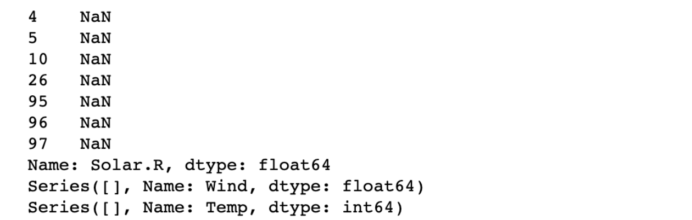
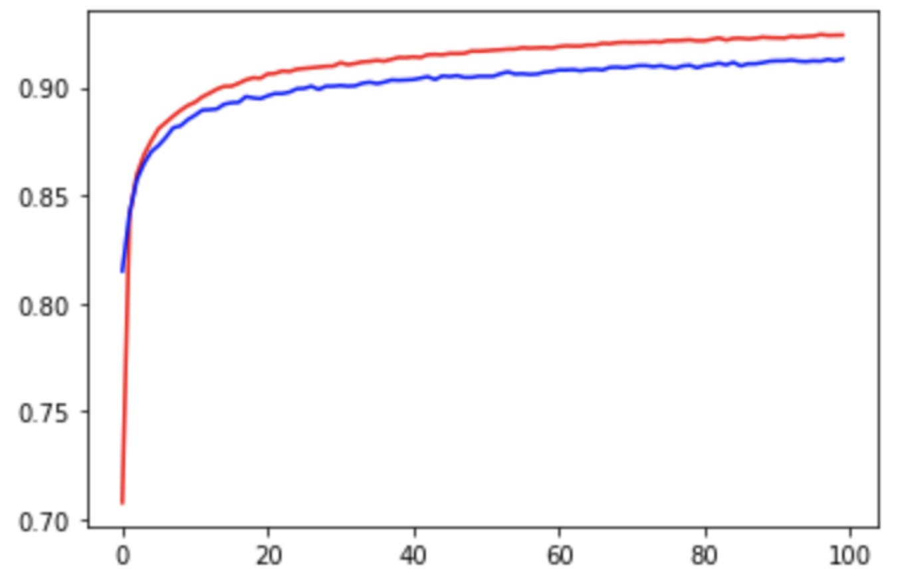

# Tensorflow 2.x - Linear Regression

## Raw Data (Ozone 데이터)

- 독립변수: fancy indexing 사용, **DataFrame** 형태

- 종속변수: 특정 컬럼 하나만 가져오므로 **Series** 형태

  (참고: Series에 `values`를 하면 1차원 벡터 형태인 ndarray로 변함)

```python
import numpy as np
import pandas as pd
import tensorflow as tf
import matplotlib.pyplot as plt
import warnings

from scipy import stats
from sklearn.preprocessing import MinMaxScaler
from sklearn.model_selection import train_test_split
from sklearn.linear_model import LinearRegression
from sklearn.neighbors import KNeighborsRegressor

from tensorflow.keras.models import Sequential
from tensorflow.keras.layers import Flatten, Dense
from tensorflow.keras.optimizers import SGD, Adam

warnings.filterwarnings(action='ignore')

df = pd.read_csv('data/ozone.csv')
display(df.head(), df.shape)

x_data = df[['Solar.R', 'Wind', 'Temp']] # 독립변수
t_data = df['Ozone'] # 종속변수

display(x_data.head())
display(t_data.head())
```

<br>

## 데이터 전처리


1. **독립변수에 대한 결측치 보간 (평균화 기법: median)**

   (참고: 평균은 이상치에 큰 영향을 받으므로 중앙값으로 사용하지만, 이상치 처리가 된 후에는 평균 써도 무방)

   - `np.nanmedian(x_data[col])`: 결측치를 제외한 남은 데이터에 대해서만 중앙값을 계산

   - `x_data[col].loc[x_data[col].isnull()]`

     : 행단위로 NaN을 boolean mask로 추출(Series 형태)해서 중앙값으로 대체(broadcasting)

     

   ```python
   # 결측치 확인
   print(x_data.isnull().sum())
   
   # 중앙값으로 대체
   for col in x_data.columns: # Solar, Wind, Temp
       col_median = np.nanmedian(x_data[col]) # 해당 컬럼의 중앙값
       x_data[col].loc[x_data[col].isnull()] = col_median # broadcasting 발생
   
   display(x_data.isnull().sum())
   ```

2. **독립변수에 대한 이상치 처리 (평균값)**

   ```python
    # 이상치 확인
   fig = plt.figure()
   fig_1 = fig.add_subplot(1,3,1)
   fig_2 = fig.add_subplot(1,3,2)
   fig_3 = fig.add_subplot(1,3,3)
   
   fig_1.set_title('Solar')
   fig_1.boxplot(x_data['Solar.R'])
   fig_2.set_title('Wind')
   fig_2.boxplot(x_data['Wind'])
   fig_3.set_title('Temp')
   fig_3.boxplot(x_data['Temp'])
   
   fig.tight_layout()
   plt.show()
   
   # 평균값으로 대체
   zscore_threshold = 1.8 # z-score outlier 임계값
   
   for col in x_data.columns:
       outlier = x_data[col][(np.abs(stats.zscore(x_data[col])) > zscore_threshold)] 
       col_mean = np.mean(x_data.loc[~x_data[col].isin(outlier), col]) 
       print(col_mean) # 이상치를 제외한 각 컬# 이상치 확인
   plt.boxplot(t_data.dropna())
   plt.title('Ozone')
   plt.show()럼에 대한 평균값
       
       # 이상치 대체
       x_data.loc[x_data[col].isin(outlier), col] = col_mean
   ```

3. **종속변수에 대한 이상치 처리 (평균값)**

   ```python
   # 이상치 확인
   plt.boxplot(t_data.dropna())
   plt.title('Ozone')
   plt.show()
   
   # 평균값으로 대체
   zscore_threshold = 1.8
   outlier = t_data[(np.abs(stats.zscore(t_data)) > zscore_threshold)] 
   col_mean = np.mean(t_data[~t_data.isin(outlier)]) 
   print(col_mean)
   
   t_data[t_data.isin(outlier)] = col_mean
   ```

4. **정규화 진행**

   - `transform()`: 함수의 인자로 2차원 행렬을 받는다.

   - `scaler_t.fit(t_data.values.reshape(-1,1))`

     : (나중에 행렬곱 연산을 위해) 1차원 벡터를 2차원 행렬로 변환

   - `scaler_t.transform(t_data.values.reshape(-1,1)).ravel()`

     : (sklearn 인자로 사용하기 위해) 다시 1차원 벡터로 변환

   ```python
   # 독립변수 정규화
   scaler_x = MinMaxScaler()
   scaler_x.fit(x_data.values) # ndarray 2차원 행렬
   x_data_norm = scaler_x.transform(x_data.values)
   
   # 종속변수 정규화
   scaler_t = MinMaxScaler()
   scaler_t.fit(t_data.values.reshape(-1,1))
   t_data_norm = scaler_t.transform(t_data.values.reshape(-1,1)).ravel() 
   ```

5. **종속변수에 대한 결측치 보간 (머신러닝: KNN)**

   (참고: KNN은 데이터의 정규화 작업이 선행되어야 한다.)

   - `KNeighborsRegressor`: Regression에서 연속적인 숫자값 형태의 예측값 도출
   - `KNeighborsClassifier`: Classification에서 분류 형태의 예측값 도출

   ------

   KNN 알고리즘은 내부적으로 학습이 존재하지 않지만, 종속변수에 대한 예측값을 도출하기 위해 일단, 결측치를 제외한 나머지 데이터로 학습을 진행해야 한다.

   따라서, 먼저 KNN 학습에 사용될 `x_data`와 `t_data`를 추려내야 한다.

   - `~np.isnan(t_data_norm)`: 종속변수의 결측치를 제외한 독립변수의 Boolean Mask

   ```python
   # KNN 학습에 사용될 데이터
   x_data_train_norm = x_data_norm[~np.isnan(t_data_norm)] 
   t_data_train_norm = t_data_norm[~np.isnan(t_data_norm)]
   
   # Model
   knn_regressor = KNeighborsRegressor(n_neighbors=2)
   knn_regressor.fit(x_data_train_norm, t_data_train_norm)
   
   # Prediction
   # 종속변수가 NaN인 독립변수에 대한 종속변수 예측
   knn_predict = knn_regressor.predict(x_data_norm[np.isnan(t_data_norm)])
   
   # 종속변수의 결측치를 예측값으로 대체
   t_data_norm[np.isnan(t_data_norm)] = knn_predict
   ```

여기까지가 전처리가 다 된 최종 데이터

- 독립변수: x_data_norm
- 종속변수: t_data_norm

<br>

## 모델 생성 및 예측

- **Prediction**

  ```python
  test_data = [[310, 15, 80]]
  
  # test_data 정규화
  result = scaler_x.transform(test_data)
  ```

- **Scikit-learn**

  ```python
  from sklearn.linear_model import LinearRegression
  
  model = LinearRegression()
  model.fit(x_data_norm, t_data_norm)
  
  # prediction
  sk_result = model.predict(result) # 1차원
  print('sklearn 예측값: {}'.format(scaler_t.inverse_transform(sk_result.reshape(-1,1)))) # inverse_transform(2차원)
  ```

- **Keras (Tensorflow 2.x)**

  - `Sequential()`: 레이어의 계층구조가 순차적으로 배치되어있는 모델을 지칭

    (참고: 모델을 생성하면 W와 내부적으로 b를 포함하는 레이어가 함께 생성됨)

    - `model.add()`: 레이어라는 계층을 모델 안에 **순차적으로** 쌓아주는 함수

      1. Input Layer

         * 데이터를 받아서 그 다음 레이어로 전달해주는 역할

         * 입력 데이터를 1차원 형태로 Flatten시켜주는 역할 (Flatten layer)

           입력으로 들어오는 각각의 다차원 데이터를 1차원 형태로 Flatten시켜야 입력이 여러개 들어왔을 때 2차원 형태가 되어 행렬곱 연산을 수행하는 머신러닝의 입력으로 사용될 수 있게 된다.

           예) 흑백 이미지가 2차원`(28,28)`으로 표현되었다고 하자. 흑백 이미지가 여러개 들어올 경우 입력 데이터는 3차원이 된다. 기본적으로 이미지는 3차원 데이터이므로 한 장 이상의 이미지가 있다면 4차원이 된다.

         * 입력으로 들어오는 데이터의 형태를 `input_shape`에 넣어준다.

      2. ~~Hidden Layers: 계산을 정확하게 하기 위한 용도 (딥러닝: 은닉층을 여러개 생성)~~

      3. Output Layer

         * 레이어 안에서 머신러닝 알고리즘 작업을 통해 결과를 도출

         * Fully Connected Network를 지칭하는 Dense layer의 역할

         * 인자로 몇 개의 뉴런(노드)이 필요한 지 숫자로 넣어준다.

  ```python
  from tensorflow.keras.models import Sequential
  from tensorflow.keras.layers import Flatten, Dense
  from tensorflow.keras.optimizers import SGD
  
  # Keras Model
  keras_model = Sequential()
  
  # Layers(W, b)
  keras_model.add(Flatten(input_shape=(3,))) # 데이터 1개의 shape, 입력으로 들어오는 데이터를 1차원으로 변경
  keras_model.add(Dense(1, activation='linear')) # Linear Regression
  
  # Optimizer
  keras_model.compile(optimizer=SGD(learning_rate=1e-2), loss='mse')
  
  # Learning
  keras_model.fit(x_data_norm, t_data_norm,
                  epochs=5000, verbose=0)
  
  # Prediction
  keras_result = keras_model.predict(scaler_x.transform(test_data))
  print('keras 예측값: {}'.format(scaler_t.inverse_transform(keras_result.reshape(-1,1)))) # inverse_transform(2차원)
  ```

<br>

# Tensorflow 2.x - Logistic Regression (Binary Classification)

## Raw Data (Titanic 데이터)

- **Libraries**

  ```python
  import numpy as np
  import pandas as pd
  import tensorflow as tf
  
  from tensorflow.keras.models import Sequential
  from tensorflow.keras.layers import Flatten, Dense
  from tensorflow.keras.optimizers import SGD
  
  from scipy import stats
  from sklearn.preprocessing import MinMaxScaler
  from sklearn.model_selection import train_test_split
  
  from sklearn.linear_model import LogisticRegression
  ```

- **Feature Engineering**

  ```python
  # 1. 필요없는 column 삭제
  df = df.drop(df['PassengerId', 'Name', 'Ticket', 'Fare', 'Cabin'], 
               axis=1, inplace=False)
  
  # 2. 새로운 column 생성
  df['Family'] = df['SibSp'] + df['Parch']
  df.drop(['SibSp', 'Parch'], axis=1, inplace=True)
  
  # 3. 문자 -> 숫자
  sex_dict = {'male': 0, 'female': 1}
  df['Sex'] = df['Sex'].map(sex_dict) # Series.map()
  
  embarked_dict = {'S': 0, 'C': 1, 'Q': 2}
  df['Embarked'] = df['Embarked'].map(embarked_dict)
  
  # 4. binning 처리 (연속적인 숫자값 -> Categorical value)
  def age_category(age):
      if (age >= 0) & (age < 25):
          return 0
      elif (age >= 25) & (age < 50):
          return 1
      else:
          return 2
  
  df['Age'] = df['Age'].map(age_category)
  display(df)
  ```

<br>

## 데이터 전처리


Titanic 데이터는 실 데이터이므로 이상치 처리는 안할 것이다.

- 결측치 처리

  - `Age`는 중앙값으로 대체
  - `Embarked`는 최빈값으로 대체

  ```python
  # Age(중앙값)
  df.loc[df['Age'].isnull(), 'Age'] = np.nanmedian(df['Age'].values) # Series = Series
  
  # Embarked(최빈값)
  df.loc[df['Embarked'].isnull(), 'Embarked'] = 0
  ```

- 데이터 분리

  ```python
  x_data_train, x_data_test, t_data_train, t_data_test = \\
  train_test_split(df.drop('Survived', axis=1, inplace=False),
                   df['Survived'], test_size=0.3, random_state=0)
  ```

- 정규화 처리

  ```python
  scaler = MinMaxScaler()
  scaler.fit(x_data_train)
  x_data_train_norm = scaler.transform(x_data_train)
  
  scaler.fit(x_data_test)
  x_data_test_norm = scaler.transform(x_data_test)
  ```

<br>

## 모델 생성 및 예측


- **Scikit-learn**

  ```python
  model = LogisticRegression()
  model.fit(x_data_train_norm, t_data_train)
  
  # accuracy
  result = model.**score**(x_data_test_norm, t_data_test)
  print('sklearn의 accuracy: {}'.format(result)) # 0.8097014925373134
  ```

- **Keras**

  ```python
  # model
  keras_model = Sequential()
  
  # layers
  keras_model.add(Flatten(input_shape=(x_data_train_norm.shape[1],))) # shape = (행,열)
  keras_model.add(Dense(1, activation='sigmoid')) # Logistic (Binary Classification)
  
  # optimizer
  keras_model.compile(optimizer=SGD(learning_rate=1e-2),
                      loss='binary_crossentropy', metrics=['accuracy'])
  
  # learning
  keras_model.fit(x_data_train_norm, t_data_train, epochs=1000, verbose=0)
  
  # accuracy (성능평가)
  keras_result = keras_model.**evaluate**(x_data_test_norm, t_data_test)
  print('keras의 accuracy: {}'.format(keras_result)) # binary - 0 or 1 # 0.8097
  ```


# Tensorflow 2.x - Multinomial Classification

## Raw Data (MNIST 데이터)

- **Libraries**

  ```python
  import numpy as np
  import pandas as pd
  import tensorflow as tf
  import matplotlib.pyplot as plt
  
  from tensorflow.keras.models import Sequential
  from tensorflow.keras.layers import Flatten, Dense
  from tensorflow.keras.optimizers import SGD
  
  from sklearn.preprocessing import MinMaxScaler
  from sklearn.linear_model import LogisticRegression
  from sklearn.model_selection import train_test_split
  from sklearn.metrics import classification_report
  
  import warnings
  warnings.filterwarnings(action='ignore')
  ```

- **Feature Engineering**

  : 학습에 필요 없는 feature 삭제, 기존 feature들을 이용해서 새로운 컬럼 생성, binning 처리 등

  ```python
  x_data = df.drop('label', axis=1, inplace=False) # DataFrame
  t_data = df['label'] # DataFrame, one-hot(X)
  ```

<br>

## 데이터 전처리


MNIST 데이터는 픽셀 데이터이므로 결측치와 이상치 처리는 안할 것이다.

- 정규화 처리

  `scaler.fit(2차원 ndarray)`

  : `DataFrame.values`를 하지 않아도 Scikit-learn에서 내부적으로 2차원 ndarray로 변경하여 수행한다.

  ```python
  scaler = MinMaxScaler()
  scaler.fit(x_data) # x_data: DataFrame
  x_data_norm = scaler.transform(x_data)
  ```

- 데이터 분리

  ```python
  x_data_train, x_data_test, t_data_train, t_data_test = \\
  train_test_split(x_data_norm, t_data, test_size=0.3, random_state=0)
  ```

<br>

## 모델 생성 및 예측


- **Scikit-learn**

  Scikit-learn을 통해 학습할 경우, 종속변수의 One-hot Encoding 처리는 필요없다.

  ￮   `from sklearn.linear_model import LogisticRegression`

  ​		1.  Binary Classification

  ​		2.  Multinomial Classification

  ￮   `LogisticRegression`은 내부적으로 데이터의 양에 따라 모델을 생성하는 방식인 `solver`를 지정해 줘야 한다. 

  ​	 데이터 양과 맞지 않는 `solver`를 사용할 경우, 로지스틱 모델의 성능(performance)이 떨어지게 된다.

  ​	1.  데이터의 양이 적을 경우 **(default)**

  ​		 → **lbfgs** (Limited-memory Broyden-Fletcher-Goldfarb-Shanno) 사용

  ​	2.  데이터의 양이 많을 경우

  ​	 	→ **saga** (Stochastic Average Gradient-Descent **확장판**) 사용

  ```python
  sklearn_model = LogisticRegression(solver='saga')
  sklearn_model.fit(x_data_train, t_data_train)
  
  predict_data = sklearn_model.predict(x_data_test)
  
  result = classification_report(t_data_test, predict_data) # (정답, 예측값)
  print(result)
  ```

- **Keras**

  ￮    설정(손실함수 부분)만 바꿔주면 종속변수의 One-hot Encoding 처리를 해줄 필요가 없다.

  ￮    레이어는 순서가 있으므로 먼저 처리되어야 하는 레이어를 먼저 써줘야 한다.

  ￮    W는 모델 안에 레이어와 레이어 사이에 존재하고 b는 레이어 안 로지스틱 노드(뉴런)에 존재한다.

  ￮    **history 객체**: validation 데이터를 통해 학습이 제대로 되고 있는 지 확인하는 용도

  학습 과정에서 나온 결과 데이터에 대한 역사로 `history`라는 딕셔너리 형태의 속성을 가진다.

  (학습 과정 시 도출되는 데이터를 저장하고 있으므로 적절한 하이퍼-파라미터를 찾을 수 있다.)

  ​		1.  에폭수 (x)

  ​		2.  정확도 (y)

  ￮    한 번에 학습하는 데이터 양인 배치 사이즈는 메모리가 허용하는 선에서 가장 크게 잡는 것이 좋다.

  ​	  (참고: 데이터를 읽어들이는 IO Latency를 줄일 수 있기 때문에 학습 시간이 줄어들게 된다.)

  ```python
  # model
  keras_model = Sequential()
  
  # layers
  keras_model.add(Flatten(input_shape=(x_data_train.shape[1],))) # 1차원
  keras_model.add(Dense(10, activation='softmax')) # multinomial classification
  
  # optimizer
  keras_model.compile(optimizer=SGD(learning_rate=1e-1), 
                      loss='sparse_categorical_crossentropy', # one-hot(X)
                      metrics=['sparse_categorical_accuracy']) 
  
  # learning
  history = keras_model.fit(x_data_train, t_data_train, 
                            epochs=100, batch_size=512, 
                            verbose=0, validation_split=0.2) 
  
  # evaluation
  result = keras_model.evaluate(x_data_test, t_data_test)
  print(result)
  ```

  ```python
  print(type(history.history)) # <class 'dict'>
  print(history.history.keys()) # 'loss', 'sparse_categorical_accuracy', 'val_loss', 'val_sparse_categorical_accuracy'
  
  # 에폭당 accuracy 값에 대한 그래프
  plt.plot(history.history['sparse_categorical_accuracy'], color='r') # training_data를 이용한 정확도
  
  plt.plot(history.history['val_sparse_categorical_accuracy'], color='b') # validation_data를 이용한 정확도
  plt.show()
  ```

  

- 그래프 해석

  - `sparse_categorical_accuracy`: 에폭이 진행될 수록 지속적으로 우상향을 그리고 있다.
  - `sparse_categorical_accuracy`과 `val_sparse_categorical_accuracy`의 차이는 Overfitting을 의미한다.
  - 다시말해, 과대적합이 발생해서 학습용 데이터의 정확도는 높아지지만 평가용 데이터는 과대적합 현상으로 인해 정확도가 떨어지는 것이다.
  - 즉, 차이가 벌어지기 시작한 지점이 과대적합이 시작되는 점이므로 그래프를 보고 에폭수를 조절할 수 있다.


-----

Reference: [ML_0312](https://github.com/sammitako/TIL/blob/master/Machine%20Learning/source-code/ML_0312.ipynb)

