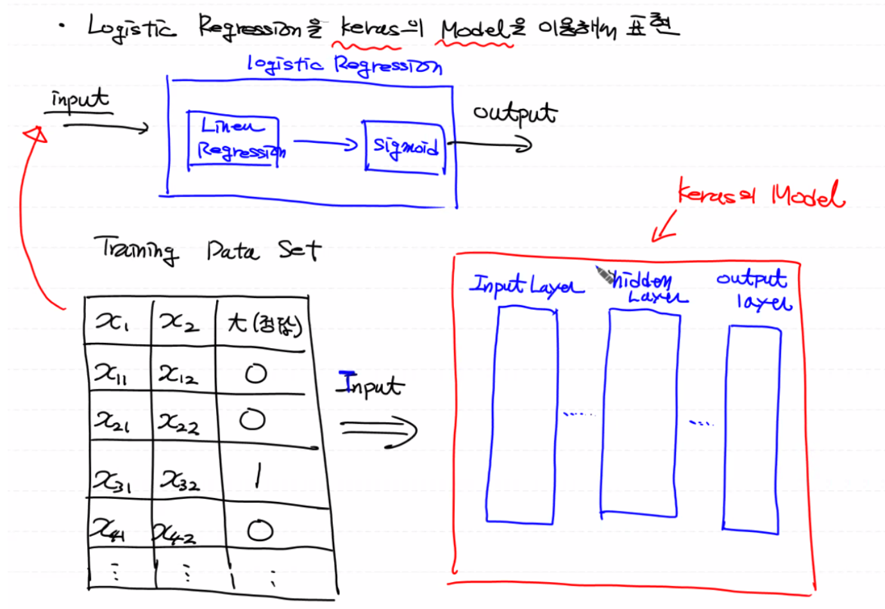
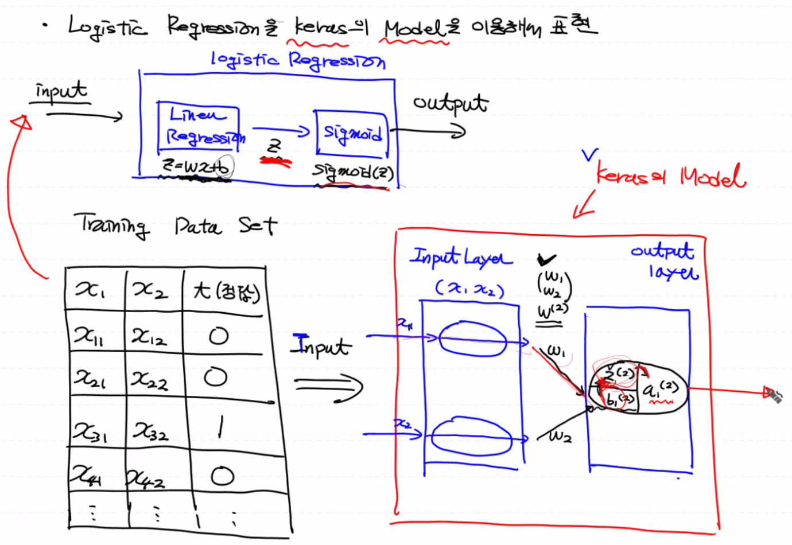
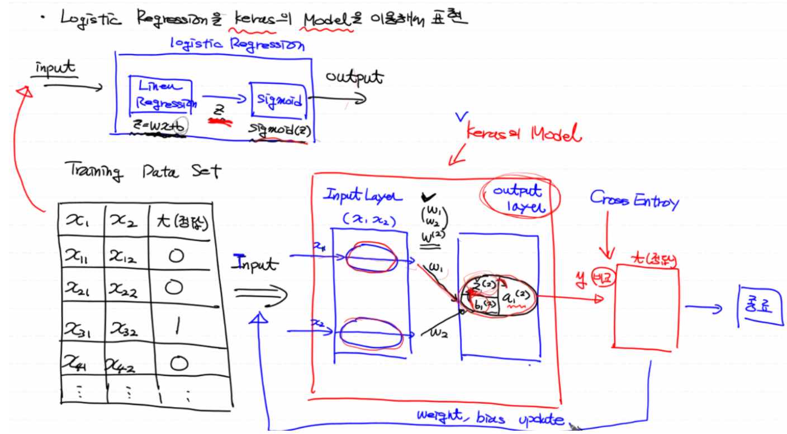
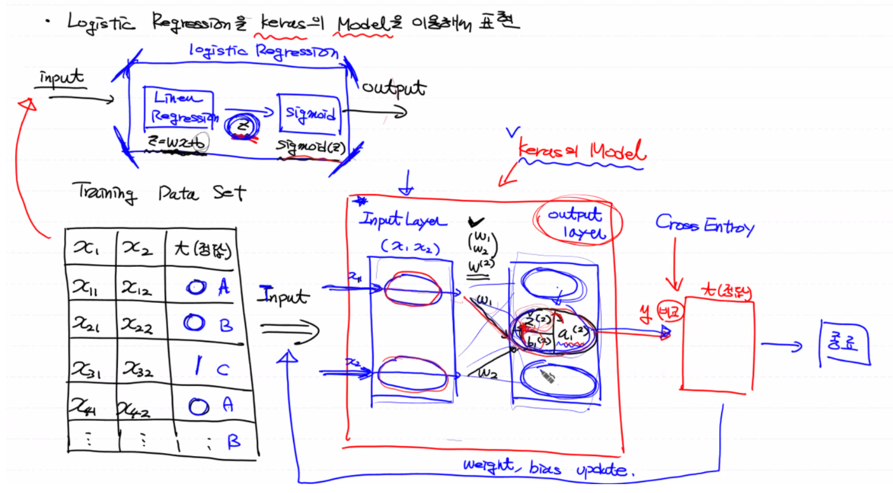

# Tensorflow 2.x

머신러닝의 뉴럴 네트워크 중 하나인 딥러닝을 수행하기 위해 구글이 만든 라이브러리

(참고: Tensorflow, Pytorch, Keras, MXNet)

- 새로운 아나콘다 가상환경 설치: data_env_tf2

  ```bash
  conda create -n data_env_tf2 python=3.7 openssl
  conda activate data_env_tf2
  
  conda install numpy
  conda install pandas
  conda install tensorflow 
  conda install matplotlib
  conda install scikit-learn
  pip install sklearn
  pip3 install sklearn
  conda install nb_conda
  
  jupyter notebook
  ```

## 하위레벨 (1.x 버전)

모듈과 함수를 통해 세부 구현을 할 수 있다.

- 구현 자체가 어렵다.
- 하지만 머신러닝 이론을 이해하기가 수월하다.

```python
# Weight & bias
W = tf.Variable(tf.random.normal([2,2]), dtype=tf.float32)

# 1. session
# 2. sess.run(tf.global_variables_initializer())
```

## 상위레벨 (2.x 버전)

구현할 기능이 이미 라이브러리 안에 포함되어 있어서 세부 구현이 불가하다.

### 히스토리

- 2019년 9월 30일에 릴리즈되었고, 현재 최신 버전은 2.4.1이다.
- 쉽게 구현하기 위해 keras API 도입
- Keras란? 프랑소와 숄레가 기존의 라이브러리의 장점을 취해서 만든 딥러닝 라이브러리 (딥러닝의 표준 라이브러리)
- 프랑소와 숄레가 구글에 입사하면서 Keras를 텐서플로우 2.x 버전에 포함시킨다. (이제는 Keras를 독립적으로 사용하지 않게 된다)

### 특징

파이썬 코딩 스타일로 변경되면서 코드의 직관성이 높아졌다.

- **즉시 실행 모드(Eager Execution Mode)**가 적용되어 코드의 직관성이 높아졌다.

  1. 그래프의 노드에 입력값을 주입해서 실행시키는 input parameter와 같은 역할을 하는 placeholder를 사용하는 방식이 아니라 직접 노드에 값을 넣어 변수처럼 사용한다.

     ```python
     a = 50
     b = 70
     
     def my_sum(x, y): 
         # 실제 입력값을 텐서로 바꿔서 노드를 생성
         t1 = tf.convert_to_tensor(x) 
         t2 = tf.convert_to_tensor(y)
         
         return t1 + t2 # 텐서 노드의 합
     
     result = my_sum(a, b) # 텐서노드
     print('결과: {}'.format(result.numpy())) # 결과출력
     ```

  2. `numpy()`: 세션과 초기화가 사라지고 넘파이 배열로 리턴해주는 함수를 즉시 실행시킨다.

     ⬩  세션: 노드 실행

     ⬩  초기화: 특정 노드의 초기화

     ```python
     # Weight & bias
     W = tf.Variable(tf.random.normal([2,2]), dtype=tf.float32)
     
     print(W.numpy()) # 넘파이 배열로 리턴
     ```

- **Keras**가 High-level API로 공식적으로 지원된다.

<br>

# Keras

Logistic Regression을 케라스의 **모델**을 이용해서 표현해보자.

<br>

## Logistic Regression

**x축 데이터(input 데이터)가 들어오면,** 아래의 로지스틱 회귀를 거쳐 **결과(output 데이터)**가 도출된다.

1. Linear
2. Sigmoid



## Keras Model

레이어라고 표현되는 계층들을 포함하는 **큰 박스**로 Training Data Set이 input(입력)으로 들어가게 된다.

(참고: 옛날에 언급한 모델은 식으로 표현되는 Hypothesis, predict model이었다.)

케라스의 모델 안에는 기본적으로 N개의 **레이어**가 들어가 있다.

- Input Layer: 케라스 모델에 input으로 들어오는 데이터를 받아주는 역할

- Output Layer: 계산된 결과값을 모델 밖으로 뽑아낼 때 사용

- Hidden Layer: 그 외 나머지 레이어로 0개 이상 존재하며 다계층 구조로 Hidden Layers가 존재할 경우, Keras 입장에서 Deep Learning이라 부른다.

  현재는 머신러닝을 구현하고 있으므로 Hidden Layer가 존재하지 않는다. 즉 Keras Model 안에는 Input Layer과 Output Layer 밖에 없다.

## Input Layer, Output Layer



### Input Layer
외부에서 들어오는 입력 데이터를 받아서 그 다음 레이어로 넘겨주는 역할만 한다.
- 독립변수(입력피쳐)의 개수만큼 로지스틱(동그라미 노드) 개수가 생긴다.
- 모델 안에 내부적으로 W가 존재해서(모델을 생성하고 레이어를 지정하면 W가 내부적으로 포함됨) 입력값(x)과 W와의 행렬곱 연산이 행해진다.

### Output Layer
로지스틱 로직을 수행하는 로지스틱 노드가 결과값을 만들고 모델 밖으로 출력한다.
- 로지스틱 노드 안에서 b가 더해져서 Linear Regression 식(Z)이 완성된다.
- 마지막으로 그 결과에 시그모이드 함수가 취해져서 Logistic Regression 하나로 표현되게 된다.



마지막으로 Output Layer로 나온 결과값이 최적인 지를 판단하기 위해 Cross Entropy 손실함수를 사용하여 정답(t)과 비교한다. 만약 모델이 적절하면 종료되고 아닐 경우 W와 b를 업데이트 한 후 다시 Input으로 들어가 재학습 하게 된다.

## Multinomial Classification

여러개의 로지스틱이 합쳐져 있는 것이므로 계산하기 위한 로지스틱 노드(동그라미)가  Output Layer에 여러개 생기게 되는 것이다.

- 동그라미가 One-hot의 depth 만큼 생기고 각각의 노드가 로지스틱의 결과를 도출한다.
- 즉, 동그라미 하나가 하나의 Logistic Regression 역할을 한다.



<br>

## Keras Sudo Code 구현


모델과 레이어라는 구조 내에서 함수의 속성으로 Tensorflow 1.x의 코드를 해결

1. **모델(박스) 생성**

   `model = tenseorflow.keras.models.Sequential()`

   Sequential: 레이어가 순차적으로 나열이 된 모델

2. **모델 안에 레이어를 순차적으로 배치**

   `model.add(추가할 레이어의 종류)`

   - Flatten: 다차원의 입력 데이터를 일차원으로 변경, 다시 말해 **Input Layer**으로 사용.

     (1차원인 데이터를 2차원인 Dense Layer로 넘기는 역할)

   - Dense: 이전 레이어와 이후 레이어의 모든 로지스틱이 완벽하게 연결되어 있는 상태, 다시 말해 **Output Layer**으로 사용.

     - 숫자: 로지스틱 노드의 개수(즉, 레이블의 종류)로, 1일 경우 Binary Classification을 의미한다.
     - `activation`: 활성화 함수 지정

3. **loss 값이 최소가 되도록 반복학습을 진행 (W,b 업데이트)**

   `model.compile(optimizer, loss)`

   - `optimizer`: 알고리즘 종류와 `learning_rate`를 설정한다.
     - SGD(Stochastic Gradient Descent): Gradient Descent Algorithm을 발전시킨 알고리즘
     - **Adam: 범용적으로 평균 이상의 성능을 내는 알고리즘**
   - `loss`:  mse(최소제곱법), cross_entropy, categorical_cross_entropy

4. **모델에 대해 fit 함수로 학습 종료**

   `model.fit()`

   - epochs
   - batch_size
   - validation_split

5. **모델 평가:** `model.evaluate()`

6. **예측값 도출:** `model.predict()`

7. **학습이 끝난 모델(최종 W,b)을 파일로 저장하여 후에 로드해서 바로 예측에 사용**

   - `model.save('모델이름.h5')`
   - `tensorflow.keras.models.load_model('모델이름.h5')`

```python
import tensorflow as tf
from tensorflow.keras.models import Sequential
from tensorflow.keras.layers import Flatten, Dense
from tensorflow.keras.optimizers import SGD, Adam

model = Sequential() # 모델(박스)생성: W, b가 포함된 객체
model.add(Flatten(input_shape=(1,))) # input layer (입력 데이터를 1차원으로 만들어서 레이어에 집어넣음)
model.add(Dense(2, activation='sigmoid')) # output layer, 숫자: 로지스틱(동그라미) n개

model.compile(optimizers=SGD(learning_rate=1e-3), loss='mse') # mse: 평균제곱오차

model.fit(x_data_train, t_data_train, epochs=10, batch_size=200, validation_split=0.2) # 학습 진행

model.evaluate(x_data_test, t_data_test)
model.predict(x_data_predict)
model.save('./myModel.h5') # 최종적인 W, b를 h5 파일로 저장

model = tf.keras.models.load_model('./myModel.h5') # 학습이 끝난 해당 모델을 가져옴
```


-----

Reference: [ML_0311](https://github.com/sammitako/TIL/blob/master/Machine%20Learning/source-code/ML_0311.ipynb)

