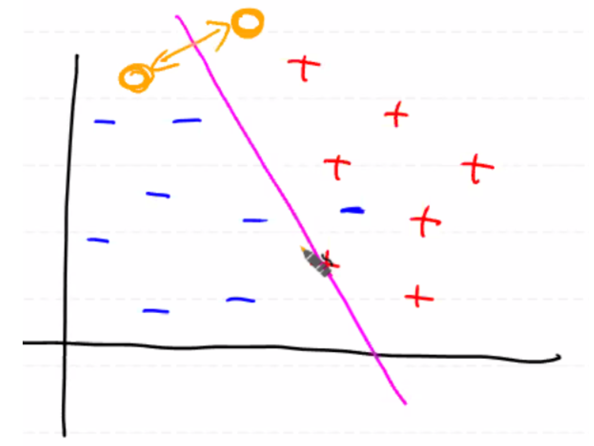
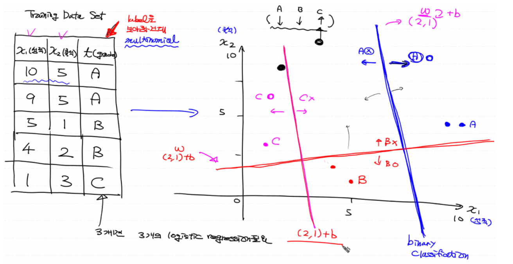
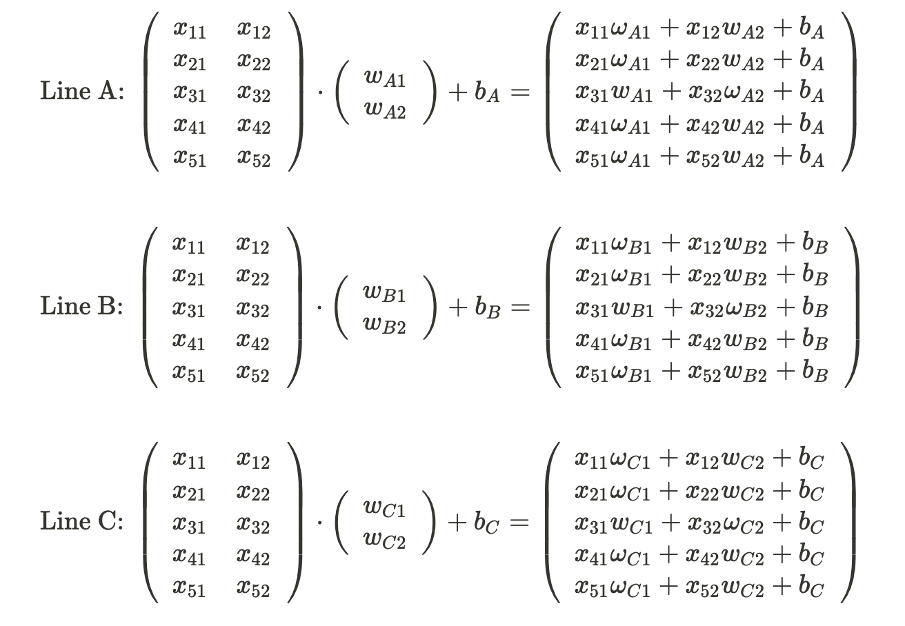
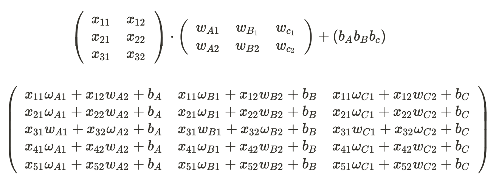
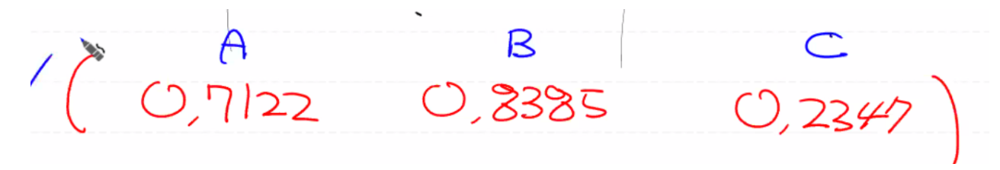
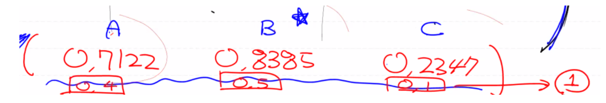
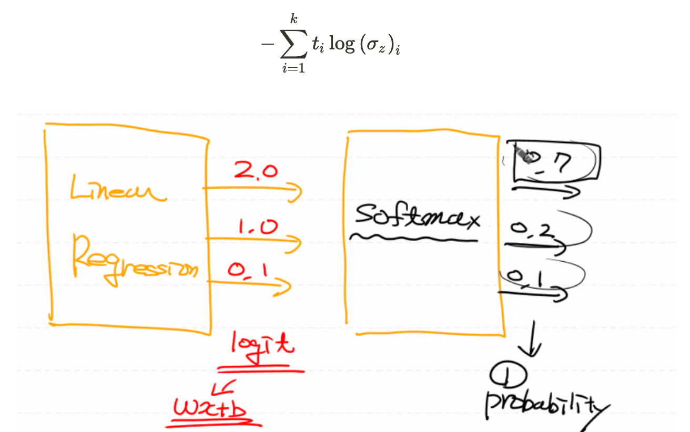
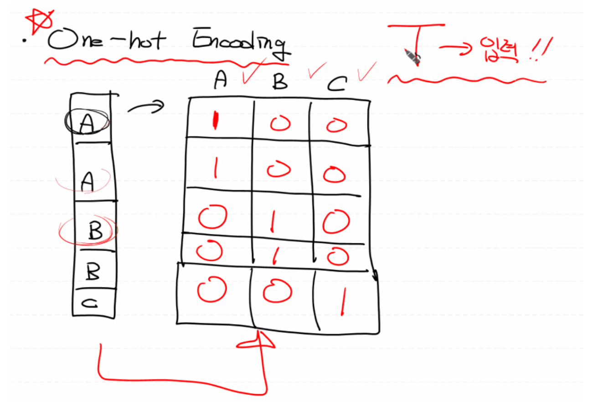
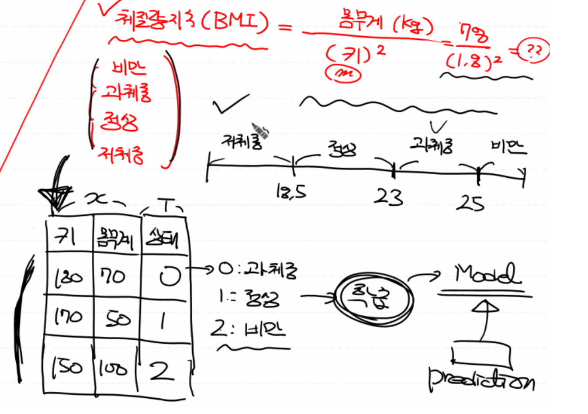

# Multinomial Classification

## Classification 정의

초평면(hyperplane)을 구해서, 이를 기준으로 어느 영역에 예측할 데이터가 들어가는 지 판단한다.

초평면은 독립변수의 개수, 즉 차원에 따라 선, 면, 공간이 될 수 있다.

- **Binary Classification**

  : 0(False) 또는 1(True)을 예측하는 기법

  - 
    Logistic Regression

  : 데이터를 가장 잘 표현하는 직선을 찾은 후, 이 구분선을 기준으로 내가 예측하려는 데이터가 어느 쪽 영역에 들어가는 지를 판단

  <details>
    <summary>Logistic Regression Graph</summary>
    
  </details>

  <br>

- **Multinomial Classification**

  : 여러 개의 분류(독립변수) 중에 어떤 분류에 속하는 지를 예측하는 기법

  여러 개의 독립변수를 그래프로 표현할 시 3차원 공간에 데이터(점)가 찍히게 된다.

  따라서, 데이터를 가장 잘 표현하는 평면을 먼저 찾은 후 그 평면을 기준으로 점이 어디에 위치하는 지를 판단한다.
  
  <br>

**지금까지 배운 머신러닝 기법 중 어느 것을 사용해야 할까?**

Label의 형태를 보면 알 수 있다.

- 연속적인 숫자값 - Linear Regression

- 둘 중의 하나 - Binary Classification

- 여러 개 중의 하나 - Multinomial Classification 

  <br>

## Multinomial Classification


Binary Classification을 여러 개 모은 후 그 중 확률값이 가장 높은 영역으로 분류하면 된다.

다시 말해, 이진 분류를 여러 번할 경우 각각의 확률들이 구해지는 데, 그 중 확률값이 가장 높은 것으로 채택하면 된다. <br>


**예) 시험성적과 출석점수에 따른 성적등급**

이진 분류 3개를 모아서 Multinomial Classification을 표현



이 예제에서는 Label의 종류가 총 3개 이므로 Logistic Regression은 총 3개를 만들어야 한다.

이제, 각각의 Logistic Regression을 행렬로 표현해 보자. <br>


학습용 데이터의 독립변수가 2개 이므로 선 A, B, C 모두 W는 2개, b는 1개가 필요하다.

따라서, 각 선의 W는 2행 1열이 되야 한다.



프로그램은 선 A, B, C를 행렬 연산을 통해 하나의 행렬식으로 표현할 것이다. 여기까지가 Linear Regression에 대한 행렬연산이다.



이렇게 구한 Linear Regression 직선을 Logistic Regression으로 변환시키기 위해 위의 행렬식을 Sigmoid 함수에 넣어 Cross-Entropy, 즉 손실함수를 만든다.

(참고: Sigmoid 함수는 각 데이터에 대해 0~1 사이의 개별적 확률값으로 반환한다.) <br>


Sigmoid 함수를 이용하여 나온 Cross Entropy, 즉 log loss(손실함수)의 값을 줄이면서 Gradient Descent Algorithm(경사하강법)을 통해 최적의 W, b를 찾아 모델을 완성시킨 후 예측값(확률값)을 찾는다.

최종적으로 예측을 위한 행렬 연산의 결과로, 각 선에 대한 확률값이 도출될 것이다.



이 중, 가장 큰 값의 확률을 가지는 B가 예측 결과값으로 채택될 것이다.

<br>

### **사실! Multinomial Classification에서는**

**활성화 함수(Activation Function)**로 Sigmoid 함수를 사용하지 않고, **Softmax 함수**를 사용한다.

(참고: Binary Classification에서는 Logistic Regression을 통해 예측 결과값 **1개**를 구할 때는 활성화 함수로 시그모이드 함수를 사용했다.) <br>


활성화 함수가 바뀌므로 Convex 함수로 바꿔주는 손실함수도 또한 바뀌게 되고 우리가 학습을 통해 최종적으로 만들어야 하도 모델 자체도 바뀌게 된다.

따라서 t_table에 들어있는 각 분류 종류에 대한 확률값이 아니라, 전체 label에 대해 확률값을 1로 두고, 그 안에서의 각 label에 대한 확률값이 도출된다.

즉, 전체 확률값 `1` 안에서 각 label 종류에 대한 확률값이 나뉘게 된다.



<br>

**Softmax function**


**Cross Entropy function**




결과적으로 행렬식 변경 및 소프트맥스 함수를 통한 손실함수로 모델을 만들면 각 분류에 대한 확률값이 나온다.

**✋🏻 WAIT,WAIT,**

**손실함수가 t_label을 가지고 행렬(y) 연산을 통해 데이터를 학습시켜야 하는데 어떡하지?**

<br>

## One-Hot Encoding


1차원 범주형 데이터를 2차원 수치 행렬로 표현하는 방법.

즉, 레이블(t)을 컬럼으로 놓고 해당 컬럼에 해당되는 종류일 경우 1을, 아닌 종류에는 0으로 표현.

위의 예에 따르면,

학습용 데이터(5행 3열)에 대해 One-Hot Encoding을 해주면 학습용 데이터의 레이블(t) 종류의 개수(3개)와 동일하게 3열로 만들어준다.



<br>

## Softmax Regression - BMI 코드 구현

저체중, 정상, 과체중, 비만



## Data Preprocessing


- 결측치, 이상치

- One-Hot Encoding

  Tensorflow 기능을 이용해서 One-Hot Encoding을 생성, 이 때 Tensorflow의 노드(`tf.one_hot()`)를 생성해서 실행하는 방법이므로 세션이 필요하다.

  Tensorflow 노드를 실행하면 ndarray 형태로 출력이 되므로 세션을 이용해서 실행 후 원핫인코딩 형태의 데이터를 반환 받으면 된다.

  파라미터 값으로 넘겨지는 `depth`는 레이블 종류의 갯수이다.

- 정규화

```python
import numpy as np
import pandas as pd
import tensorflow as tf
import matplotlib.pyplot as plt

from scipy import stats
from sklearn.preprocessing import MinMaxScaler

df = pd.read_csv('data/bmi.csv', skiprows=3)
display(df.head(), df.shape)

# 결측치 확인
df.isnull().sum()

# 이상치 확인
fig = plt.figure()
fig_1 = fig.add_subplot(1,3,1)
fig_2 = fig.add_subplot(1,3,2)
fig_3 = fig.add_subplot(1,3,3)

fig_1.boxplot(df['label'])
fig_2.boxplot(df['height'])
fig_3.boxplot(df['weight'])

fig.tight_layout()
plt.show()

# Training Data Set
x_data = df[['height', 'weight']].values 
t_data = df['label'].values

# 정규화
scaler_x = MinMaxScaler()
scaler_x.fit(x_data)
norm_x_data = scaler_x.transform(x_data)
print(norm_x_data)

# One-Hot Encoding
sess = tf.Session()
norm_t_data = sess.run(tf.one_hot(t_data, depth=3))
print(norm_t_data)
```
<br>

## Tensorflow


- Data Split for Learning and Validation

```python
print(norm_x_data.shape)
train_x_data = norm_x_data[:int(norm_x_data.shape[0] * 0.7)]
val_x_data = norm_x_data[int(norm_x_data.shape[0] * 0.7):]
print(train_x_data.shape)
print(val_x_data.shape)

train_t_data = norm_t_data[:int(norm_t_data.shape[0] * 0.7)]
val_t_data = norm_t_data[int(norm_t_data.shape[0] * 0.7):]
print(train_t_data.shape)
print(val_t_data.shape)
```

- Softmax Function
- Cross Entropy Function

```python
# X, T
X = tf.placeholder(shape=[None, 2], dtype=tf.float32) # 2: height, weight
T = tf.placeholder(shape=[None, 3], dtype=tf.float32) # one hot encoding 형태

# W, b
W = tf.Variable(tf.random.normal([2,3]), name='weight')
b = tf.Variable(tf.random.normal([3]), name='bias')

# Hypothesis
logit = tf.matmul(X, W) + b
H = tf.nn.softmax(logit) # Softmax Activation Function 이용

# loss
loss = tf.reduce_mean(tf.nn.softmax_cross_entropy_with_logits_v2(logits=logit, labels=T))

# gradient descent algorithm
train = tf.train.GradientDescentOptimizer(learning_rate=1e-4).minimize(loss)

# learning
sess.run(tf.global_variables_initializer())

for step in range(300000):
    _, W_val, b_val, loss_val = sess.run([train, W, b, loss], feed_dict={X: train_x_data, T: train_t_data})
    
    if step % 30000 == 0:
        print('W: {}, b: {}, loss: {}'.format(W_val, b_val, loss_val))
```

<br>
## Model Accuracy


예측한 확률에서 가장 높은 확률값

```python
predict = tf.argmax(H, axis=1)
correct = tf.equal(predict, tf.argmax(T, axis=1)) 
for_acc = tf.cast(correct, dtype=tf.float32) 

# Accuracy
accuracy = tf.reduce_mean(for_acc)
accuracy_val = sess.run(accuracy, feed_dict={X: val_x_data, T: val_t_data})

print('모델의 정확도: {}'.format(accuracy_val)) # 80%
```
<br>
## Prediction


각 Label 종류에 대한 예측 확률값 중 가장 큰 값으로 분류

```python
height = 187
weight = 78
my_state = [[height, weight]]

result = sess.run(H, feed_dict={X: scaler_x.transform(my_state)})
print(result) # 정상, [0: 저체중, 1: 정상, 2: 과체중]
```


<br>
-----


Reference: [ML_0305](https://github.com/sammitako/TIL/blob/master/Machine%20Learning/source-code/ML_0305.ipynb)

