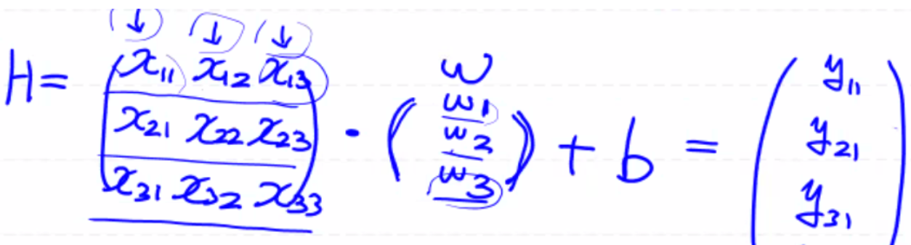

# 다중 선형 회귀(Multiple Linear Regression)

독립변수가 여러 개인 고전적 선형 회귀 모델로 Simple Linear Regression에서 행렬의 크기만 조절해서 똑같이 코드 구현하면 된다.

독립변수 마다 W값을 따로 구해주기 때문에 직선이 될 수가 없다.

H = X • W + b

- X: 2차원 행렬

- W: 2차원 행렬


<details>
  <summary>예를 들어, 독립변수가 3개인 경우</summary>
  
</details>


## Tensorflow를 이용한 오존량 예측 다중 선형 회귀 모델

### 코드 이해

- `%reset`: 모든 커널 메모리 삭제 (초기상태)

- `from sklearn.preprocessing import StandardScaler`: z-score 값 구해서 정규화 처리

- `training_data.columns`

  Index(['Temp', 'Wind', 'Solar.R', 'Ozone'], dtype='object')

  DataFrame인 `training_data`의 인덱스이지만 리스트 처럼 사용

**[Data Preprocessing]**

```python
# Import Libraries
import numpy as np
import pandas as pd
import tensorflow as tf
from scipy import stats 
from sklearn.preprocessing import MinMaxScaler
from sklearn import linear_model

# Data Preprocessing
# 1. Raw Data Loading
df = pd.read_csv('data/ozone.csv')
training_data = df[['Temp', 'Wind', 'Solar.R', 'Ozone']]
display(training_data) # 153 rows × 4 columns

# 2. 결측치 제거
training_data = training_data.dropna(how='any')
display(training_data) # 111 rows × 4 columns

# 3. 이상치 제거
zscore_threshold = 1.8

# 독립변수가 여러 개, 종속변수 1개
# 독립변수와 종속변수에 대한 이상치를 한꺼번에 처리
print(training_data.columns)
for col in training_data.columns:
    tmp = ~(np.abs(stats.zscore(training_data[col])) > zscore_threshold)
    training_data = training_data.loc[tmp]
    
print(training_data.shape) # (86, 4)
display(training_data)

# 4. 정규화 처리
# 독립변수
scaler_x = MinMaxScaler()
scaler_x.fit(training_data[['Temp', 'Wind', 'Solar.R']].values) # DataFrame -> value 값: 2차원 형태

# Min-Max Scaling
training_data_x = scaler_x.transform(training_data[['Temp', 'Wind', 'Solar.R']].values)
display(training_data_x)

# 종속변수
scaler_t = MinMaxScaler() 
scaler_t.fit(training_data['Ozone'].values.reshape(-1,1)) # Series -> value 값: 1차원 벡터 형태

# Min-Max Scaling
training_data_t = scaler_t.transform(training_data['Ozone'].values.reshape(-1,1))
display(training_data_t)
```

**[Tensorflow]**

```python
# 1. Training Data Set
training_data_x = scaler_x.transform(training_data[['Temp', 'Wind', 'Solar.R']].values)
training_data_t = scaler_t.transform(training_data['Ozone'].values.reshape(-1,1))

# 2. Placeholder
X = tf.placeholder(shape=[None, 3], dtype=tf.float32)
T = tf.placeholder(shape=[None, 1], dtype=tf.float32)

# 3. Weight & bias
W = tf.Variable(tf.random.normal([3,1]), name='weight')
b = tf.Variable(tf.random.normal([1]), name='bias')

# 4. Hypothesis
H = tf.matmul(X, W) + b

# 5. Loss function
loss = tf.reduce_mean(tf.square(H-T))

# 6. train - Gradient Descent Algorithm
train = tf.train.GradientDescentOptimizer(learning_rate=1e-4).minimize(loss)

# 7. session, 초기화
sess = tf.Session()
sess.run(tf.global_variables_initializer())

# 8. learning
for step in range(300000):
    _, W_val, b_val, loss_val = sess.run([train, W, b, loss], feed_dict={X: training_data_x, T: training_data_t})
    
    if step % 30000 == 0:
        print('W: {}, b: {}, loss: {}'.format(W_val, b_val, loss_val))
```

**[Sklearn]**

```python
# 1. Training Data Set
training_data_x = training_data[['Temp', 'Wind', 'Solar.R']].values
training_data_t = training_data['Ozone'].values.reshape(-1,1)

# 2. Model
model = linear_model.LinearRegression()

# WRONG DATA for Learning
# model.fit(training_data_x, training_data_t) # 결측치, 이상치, 정규화 처리가 다 된 데이터

# 3. Learning
# 결측치만 처리되고 이상치, 정규화는 처리 되지 않은 데이터로 학습 
model.fit(training_data_x, training_data_t) 
print('W: {}, b: {}'.format(model.coef_, model.intercept_))
```


### Prediction - Tensorflow vs. Sklearn

**[Scikit-learn]**

sklearn 라이브러리를 사용할 시, 결측치만 처리되고 이상치와 정규화는 처리되지 않은 데이터로 모델을 학습시켜야 한다.

즉, 이상치와 정규화는 sklearn 내부에서 처리되므로 학습 데이터로 raw data를 모델에 넣어주어야 한다.

```python
sklearn_result = model.predict([[80, 10, 150]])
print(sklearn_result) # [[38.8035437]]
```


**[Tensorflow]**

Tensorflow를 통해 모델을 만들 시에 정규화된 데이터를 사용했고, 모델 학습 시에도 정규화된 데이터를 사용했기 때문에 데이터를 예측할 시에도 정규화된 데이터를 사용해야 한다.

즉, 데이터 형태를 바꿔서 모델 학습을 시켰으면 예측할 데이터도 바뀐 데이터 형태로 맞춰서 예측을 진행해야 한다.

- 예측 시, 예측할 데이터를 정규화 시킨 후 예측값을 도출해야 한다.
- 그리고 결과값 도출 시, 정규화된 결과값을 다시 원래 스케일로 바꿔주는 작업을 통해 결과값을 도출해야 한다.

결론적으로, 정규화를 통해 모델을 생성 시에는 반드시 위의 작업을 진행해야 한다.

```python
# WRONG CODE
# tensorflow_result = sess.run(H, feed_dict={X:[[80.0, 10.0, 150.0]]}) # [[97.68829]]

# Proper Prediction Method
# Normalization
predict_data = np.array([[80.0, 10.0, 150.0]])
scaled_predict_data = scaler_x.transform(predict_data) # scaler_x: 스케일 기준
tensorflow_result = sess.run(H, feed_dict={X: scaled_predict_data}) 
print(tensorflow_result) #[[0.34895673]]

# Denormalization
tensorflow_result = scaler_t.inverse_transform(tensorflow_result) # scaler_t: 디스케일 기준
print(tensorflow_result) # [[38.406105]]
```

-----

Reference: [ML_0226](https://github.com/sammitako/TIL/blob/master/Machine%20Learning/source-code/ML_0226.ipynb)

