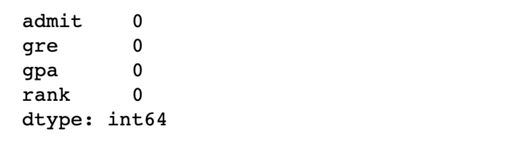

# Multiple Logistic Regression 구현

- 독립변수 3개: GRE, GPA, RANK
- Python, Tensorflow, Scikit-learn

## Data Preprocessing

- **결측치 처리**

```python
# 결측치 확인
print(df.isnull().sum())
```

<details>
  <summary>결측치 확인</summary>
  
</details>


- **이상치 처리**

  - Z-score
  - 연습용이니까 그냥 삭제

  (threshold = 2.0 이하로 설정)

```python
# Boxplot을 이용하여 이상치 확인
fig = plt.figure()
fig_gre = fig.add_subplot(1,3, 1)
fig_gpa = fig.add_subplot(1,3, 2)
fig_rank = fig.add_subplot(1,3, 3)

fig_gre.boxplot(df['gre'])
fig_gre.set_title('gre')

fig_gpa.boxplot(df['gpa'])
fig_gpa.set_title('gpa')

fig_rank.boxplot(df['rank'])
fig_rank.set_title('rank')

fig.tight_layout()

# 이상치 제거
zscore_threshold = 2.0 # 2.0 이하로 설정하는 것이 optimal 하다.

for col in df.columns:
    outlier = df[col][np.abs(stats.zscore(df[col])) > zscore_threshold]
    print(outlier)
    
    df = df.loc[~df[col].isin(outlier)]

display(df) # 382 rows × 4 columns
```

- **Training Data Set**
  - Scikit-learn 용도
  - 결측치, 이상치만 처리된 데이터

```python
x_data = df.drop('admit', axis=1, inplace=False).values # 2차원 ndarray 복사본 
t_data = df['admit'].values.reshape(-1,1) # Series -> 1차원 ndarray 벡터 -> 2차원 행렬

print(x_data)
print(t_data)
```

- **정규화 진행**
  - Min-Max
  - 독립변수(feature)에 대해서만 정규화 진행
  - Python, Tensorflow 용도

```python
scaler_x = MinMaxScaler()
scaler_x.fit(x_data)
norm_x_data = scaler_x.transform(x_data)

display(norm_x_data)
```

## Python

- 다변수 수치미분 함수

- `W`의 shape 주의

  예) `W = np.random.rand(3,1)`

  - `3`: 행렬곱을 위해 입력 데이터 x의 열의 수
  - `1`: 예측값이 t_data와 연산되므로 t_data의 column수와 동일

```python
def numerical_derivative(f, x):
    # f: cross entropy, x: [W1, W2, W3, b]
    delta_x = 1e-4
    derivative_x = np.zeros_like(x)
    
    it = np.nditer(x, flags=['multi_index'])
    
    while not it.finished:
        idx = it.multi_index
        tmp = x[idx]
        
        x[idx] = tmp + delta_x
        fx_plus_delta = f(x)
        
        x[idx] = tmp - delta_x
        fx_minus_delta = f(x)
        
        derivative_x[idx] = (fx_plus_delta - fx_minus_delta) / (2 * delta_x)
        
        x[idx] = tmp
        it.iternext()
    
    return derivative_x

# training data set: norm_x_data, t_data

# W, b
W = np.random.rand(3,1)
b = np.random.rand(1)

# loss function
def loss_func(input_obj): # [W1 W2 W3 b]
    input_W = input_obj[:-1].reshape(-1,1) # 3행 1열
    input_b = input_obj[-1:]
    
    # linear regression model
    z = np.dot(norm_x_data, input_W) + input_b
    
    # logistic regression model
    y = 1 / (1 + np.exp(-1 * z))
    
    # cross entropy
    delta = 1e-7
    log_loss = -np.sum(t_data*np.log(y+delta) + (1 - t_data)*np.log(1 - y+delta))
    
    return log_loss

# learning rate
learning_rate = 1e-4

# learning - gradient descent algorithm
for step in range(300000):
    # [W1 W2 W3 b]
    input_param = np.concatenate((W.ravel(), b.ravel()), axis=0)
    
    # learning_rate * 편미분
    derivative_result = learning_rate * numerical_derivative(loss_func, input_param)
    
    # W, b 갱신
    W = W - derivative_result[:-1].reshape(-1,1) # 3행 1열
    b = b - derivative_result[-1:]
    
    if step % 30000 == 0:
        input_param = np.concatenate((W.ravel(), b.ravel()), axis=0)
        print('W: {}, b: {}, loss: {}'.format(W.ravel(), b, loss_func(input_param)))
# prediction
def logistic_predict(x):
    z = np.dot(x, W) + b
    y = 1 / (1 + np.exp(-1 * z))
    
    if y < 0.5:
        result = 0
    else:
        result = 1
        
    return result, y

predict_data = np.array([[600, 3.8, 1]])
scaled_predict_data = scaler_x.transform(predict_data)

result_python = logistic_predict(scaled_predict_data)
print(result_python) # (합격여부: 1, 합격확률: 0.57333869) 
```


## Tensorflow

```python
# training data set: norm_x_data, t_data

# X, T
X = tf.placeholder(shape=[None, 3], dtype=tf.float32)
T = tf.placeholder(shape=[None, 1], dtype=tf.float32)

# W, b
W = tf.Variable(tf.random.normal([3,1]), name='weight')
b = tf.Variable(tf.random.normal([1]), name='bias')

# model
linear_model = tf.matmul(X, W) + b
H = tf.sigmoid(linear_model)

# log loss
loss = tf.reduce_mean(tf.nn.sigmoid_cross_entropy_with_logits(logits=linear_model, labels=T))

# gradient descent algorithm
train = tf.train.GradientDescentOptimizer(learning_rate=1e-4).minimize(loss)

# learning
sess = tf.Session()
sess.run(tf.global_variables_initializer())

for step in range(300000):
    _, W_val, b_val, loss_val = sess.run([train, W, b, loss], feed_dict={X: norm_x_data, T: t_data})
    
    if step % 30000 == 0:
        print('W: {}, b: {}, loss: {}'.format(W_val, b_val, loss_val))
# prediction
predict_data = np.array([[600, 3.8, 1]])
scaled_predict_data = scaler_x.transform(predict_data)
result_tensorflow = sess.run(H, feed_dict={X: scaled_predict_data})

print(result_tensorflow) # [[0.54632527]] 확률로 합격
```

## Scikit-learn

```python
# training datat set: x_data, t_data
# model
model = linear_model.LogisticRegression()

# learning
model.fit(x_data, t_data.ravel())

# prediction
result = model.predict(predict_data)
result_proba = model.predict_proba(predict_data)

print('W: {}, b: {}, 확률: {}'.format(model.coef_, model.intercept_, result_proba))
print(result) # 1: 합격
```

------

**[Logistic Regression 총정리]**

모델과 손실함수, 그리고 레이블 데이터는 정규화할 필요 없는 것만 제외하고 Linear Regression과 동일하다.

**[문제점]**

- 초기에 W, b가 랜덤으로 잡혀서 시작하는데, 초기의 랜덤한 W, b의 값이 머신러닝 학습의 수행 속도와 예측 결과값에 영향을 미친다.

  (해결책: W, b의 초기화에 대한 논문 → 딥러닝에서 다룸)

- 예측 결과에 대한 정확도를 알 수 없다.

  (해결책: 모델 성능에 대한 평가 필요)


-----

Reference: [ML_0303](https://github.com/sammitako/TIL/blob/master/Machine%20Learning/source-code/ML_0303.ipynb)

