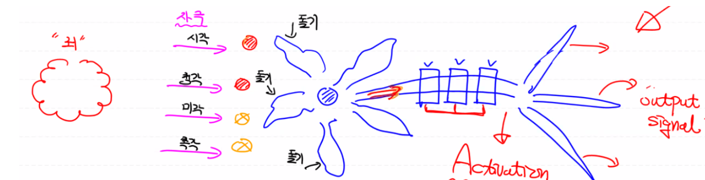
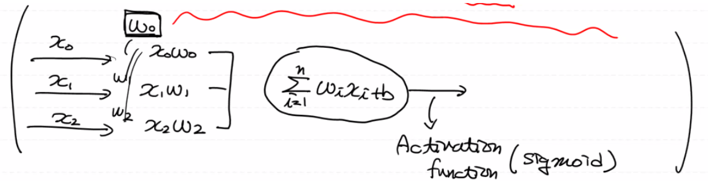
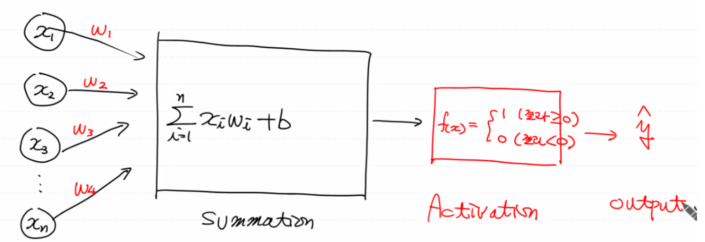
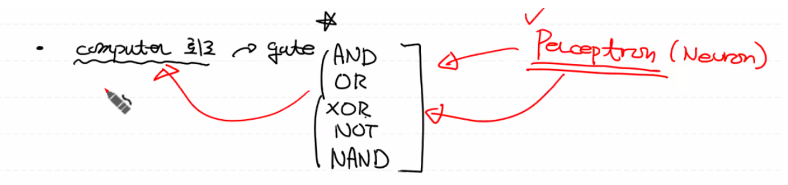
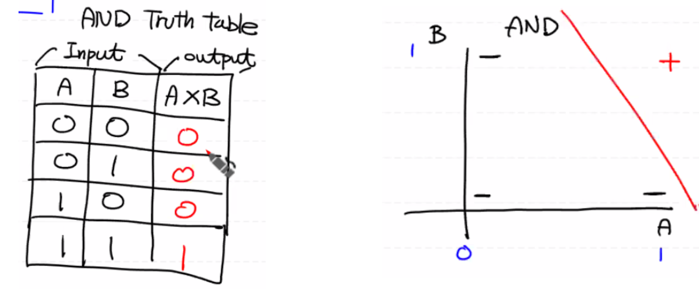
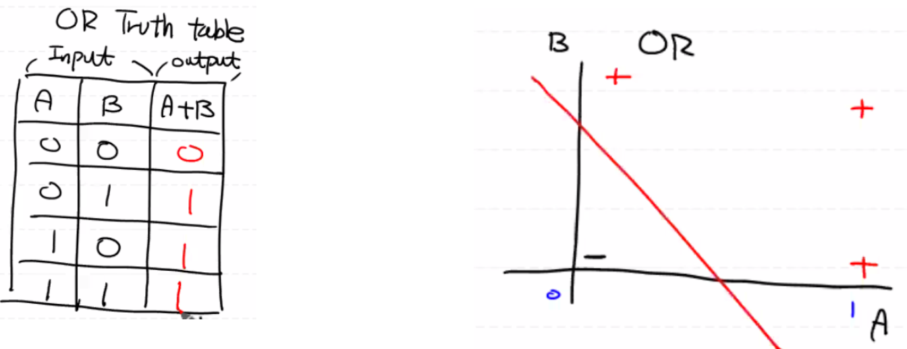
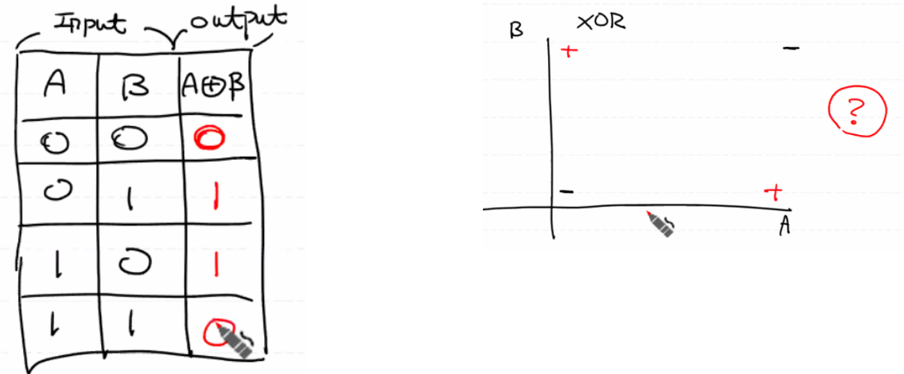

# Neural Network

## 뇌공학

초창기(1960년대)에 **사람의 뇌를 연구**하기 시작했는데, *뉴런* 이라고 불리는 뇌의 신경세포의 동작으로 *사고* 라는 동작이 일어나는 것을 알게되었다.

뉴련(뇌세포)의 돌기들을 통해 자극이 들어오는 경우, 각각의 정보(자극)에 대해서 가중치를 부여하게 된다. 그 후 신호들이 전달이 될 때, 기타 다른 정보들이 합해져서 Activation(다음 뉴런으로 전달할 지에 대해)을 결정하게 된다. 만약 해당 자극이 activation 인덱스를 넘길 경우, 다음 뉴런으로 output signal을 전파한다.

 

## 로지스틱 회귀

로지스틱 회귀에서는 입력값(X)에 대해 가중치(W)를 곱해서 모두 더한 후 Activation 함수인 시그모이드 함수를 이용하여 0.5보다 값이 클경우 1로, 0.5보다 작을 경우 0으로 정해서 데이터의 지속 가능성을 판단한다.

다시말해, 뇌(뉴런)의 동작 방식과 로지스틱의 동작 방식이 동일하다. 즉, 뉴런 하나가 로지스틱 한 개인 것이다.

------

1960년도에 로버트 로젠플렛이 뇌가 동작하는 방식에 기인한 Perceptron(인공 신경망 모델)을 만들게 된다.

즉, 퍼셉트론은 로지스틱과 유사하게 **다수의 신호를 입력받아서 각 입력에 가중치를 곱한 다음 모두 더해(Linear Regression) 하나의 신호로 출력**하는 구조이다. (뉴런이 전기신호를 내보내는 과정과 유사)

1. Linear Regression
2. Activation (함수)
3. Output 값: 0 또는 1

따라서, Single-layer Perceptron Network는 Logistic Regression 하나의 모델이다.

로지스틱은 머신러닝의 회귀 방법론이고 퍼셉트론은 네트워크 모델 자체이다. 다시 말해, Single-layer로 구성된 퍼셉트론 네트워크가 구현될 때 로지스틱과 같아지는 것이고 Multi-layers로도 퍼셉트론을 구성할 수 있다. 즉, 아래와 같이 생긴 퍼셉트론을 여러개 만들어서 사용할 수 있다.

그렇기 때문에, 로지스틱과 퍼셉트론이 완전히 같다고 할 수는 없지만, **하나의 퍼셉트론이 로지스틱과 동일한 역할을 수행**한다고는 할 수 있다.

그러면, 퍼셉트론이 여러개의 신호를 받아들여서 하나의 신호를 내보내는 로지스틱과 같은 역할을 하므로 퍼셉트론을 여러개 모아놓으면 사람이 사고하는 방식과 유사하게 동작하지 않을까?

즉 퍼셉트론 하나 = 뉴런 하나 이므로 사람의 뇌가 뉴런 여러개로 구성되어 있으니까 퍼셉트론을 여러개로 구성해서 결과를 도출하면 사람의 뇌가 생각하는 것과 유사한 형태로 결과가 도출되지 않을까?

 

## 논리회로

퍼셉트론이라고 불리는 (학습)기계가 논리회로(AND, OR, XOR, NOT, NAND)를 학습해서 결과를 제대로 도출할 수 있으면 사람이 생각하는 것처럼 생각하는 컴퓨터를 만들 수 있지 않을까?

다시말해, 퍼셉트론이 뉴런과 동일하게 동작하므로 여러개의 **퍼셉트론으로 게이트의 동작방식을 구현(게이트화)**해내면 실제 사람처럼 생각하는 컴퓨터 칩을 만들 수 있겠네?

(참고: 게이트는 컴퓨터 회로(칩)를 만드는 기본적인 단위이고 게이트의 종류는 다양하다. 즉 게이트들의 집합 = 컴퓨터의 회로. 그리고 컴퓨터의 칩으로 연산한다.)

그렇다면, Logistic Regression(퍼셉트론)으로 게이트들의 Truth Table(진리표)을 학습한 후 퍼셉트론이 입력 데이터에 대한 결과값을 0 또는 1으로 예측할 수 있는 지 확인해보자. (퍼셉트론으로 게이트를 구현할 수 있는지?)

(참고: 회로도는 5볼트 이상의 전기 신호가 들어오면 1로 그 이하면 0으로 판단한다.)

 

### AND GATE

 

### OR GATE

 

### XOR GATE

두개가 같으면 0으로 다르면 1로 판단한다. XOR Gate의 경우 로지스틱으로는 데이터들을 나누는 구분선(Decision Boundary)을 그릴 수 없기 때문에 학습과 예측을 할 수 없다. 다시 말해, 로지스틱으로 XOR 게이트를 구현할 수 없기 때문에 모델의 정확도는 0이 나올 수 밖에 없다.

어떻게 하면 XOR 게이트를 학습시켜서 예측시킬 수 있을까?

 

[**예측 결과 해석] 진리표 학습과 예측이 잘 안된다.**

1969년에 MIT AI LAB 창시자인 민스키 교수가 *Perceptrons* 라는 책을 발간하게 된다.

Single-layer perceptron(로지스틱 하나)으로는 해결이 안되므로 **M**ulti-**L**ayer **P**erceptron(: Single Layer Perceptron을 여러개 배치)으로 레이어들을 배치하면 해결할 수 있다고 수학적으로 증명하게 된다.

그러나, 여기서 문제는 Multi-Layer Perceptron으로 가능은 하지만 잘 학습하기 위한 방법은 잘 모른다. 학습 자체가 너무 오래 걸리고 쉽지 않다.

**이때부터 인공지능의 1차 침체기가 시작되었다.**

-----

Reference: [ML_0315](https://github.com/sammitako/TIL/blob/master/Machine%20Learning/source-code/ML_0315.ipynb)