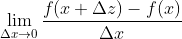
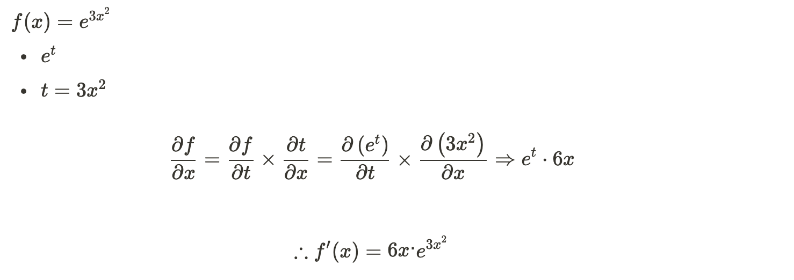
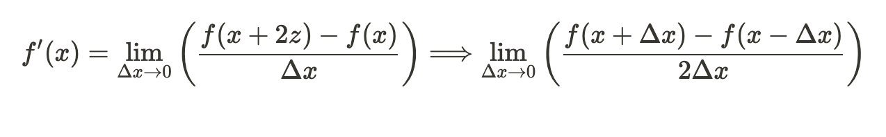
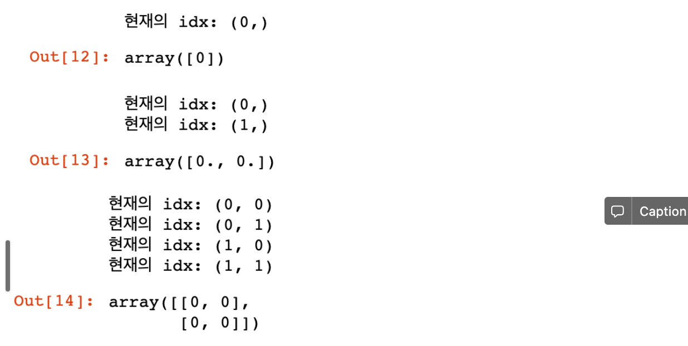
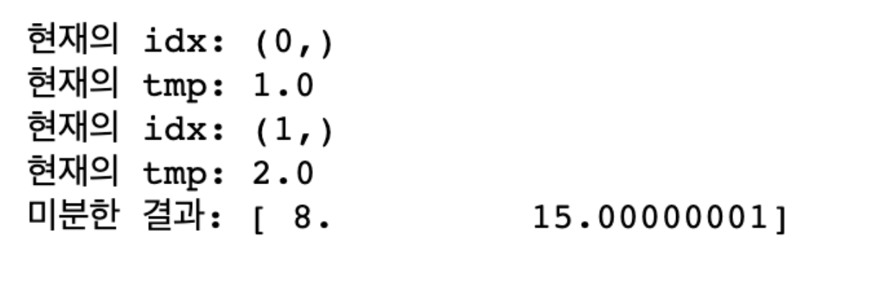

## 수치미분(Numerical Differentiation)

- **해석미분:** 이론에 입각하여 논리적으로 미분 수행
- **수치미분:** 프로그램적으로 값을 대입하여 알고리즘 계산을 통해 미분 수행 (소수점에 대한 오차 발생)

------

### 미분(derivative)

: 어떤 함수의 정의역 상 각 점에서 독립변수의 변화량과 해당 함수값의 변화량의 비율에 대한 극한으로 구성된 집합으로 치역이 구성되는 함수(=도함수)

- 함수에 대한 특정 순간의 **변화량**

- x의 변화: Δx가 f(x)를 얼마만큼 변화시키는 지: f(x+Δx) - f(x)를 나타냄

- 미분 공식
  
  

<details>
  <summary>그래프 - 특정점에 대한 접선의 기울기</summary>
  	
</details>


### ✔️ 미분법(differentiation)

: 미분을 수행하는 행위 자체를 지칭, 즉 도함수를 구하는 작업을 뜻함


### 수치미분의 3가지 방법

1. 전향차분
2. **중앙차분 (가장 정확도가 높음)**
3. 후향차분

------

- **중앙차분**

  : x를 기준으로 Δx를 앞과 뒤, 2개 잡으면 함수값이 3개가 생기게 된다.

  .png)
  
  <details>
  <summary>중앙차분 그래프</summary>
    	
  </details>


### 기본적인 미분 공식 5개


* 예
  
  


### 편미분(partial derivative)

: 입력변수(독립변수)가 2개 이상인 다변수함수에서 미분하고자 하는 변수를 제외한 나머지 변수들을 상수 처리해서 미분 진행


f(x,y)를 x에 대해서 partial derivative(편미분)하는 경우


* 예

  


### 연쇄법칙(Chain Rule)

: 여러 함수로 구성된 함수인 합성함수(composite function)를 미분하기 위한 방법

합성함수를 구성하는 각 함수를 각각 미분해서 그 결과의 곱으로 계산

* 예

  


## 프로그램으로 수치미분 구현

극한에 해당하는 값(Δx)대한 프로그램적 표현방법?

Δx: 0.00001 = e-6 정도로 정의 (floating point 오류 고려)

------

- **중앙차분 이용**




### 일변수 함수에 대한 수치미분 코드 구현

- `conda activate data_env`
- `jupyter notebook`

------

- 일변수함수 예제
  - `my_func(x)`: f(x) = x^2
  - f'(3) = 6

```python
# 입력으로 들어오는 x에서 아주 미세하게 변화할 때
# 함수 f가 얼마나 변하는지에 대해 수치적으로 계산해보자.

# 인자 2개 - 미분하려는 함수, 특정 점에서 미분값을 구하기 위한 x값
# f: 미분하려는 함수
# x: 미분값을 알고자하는 입력값
# delta_x => 극한에 해당하는 값으로 아주 작은값을 이용; 
#						1e-8이하로 지정하면 소수점 연산 오류가 발생하므로 일반적으로 1e-5정도로 설정      

def numerical_derivative(f, x):
 
    delta_x = 1e-5
    
    return (f(x+delta_x) - f(x-delta_x)) / (2 * delta_x)

# 미분하려는 단변수 함수
def my_func(x):
    
    return x ** 2
    
result = numerical_derivative(my_func, 3) # 다른 함수에 코드(함수)자체를 넘김, 일급함수
print('미분한 결과값은: {}'.format(result)) # 6.000000000039306 (근사값)
```


### 다변수 함수에 대한 수치미분 코드 구현

- **다변수함수 예제**

  


입력변수가 2개이기 때문에 x와 y에 대해 각각 편미분 시행

```python
# 입력변수가 2개 이상인 다변수 함수의 수치미분
# 입력변수는 서로 독립이기 때문에 수치미분 역시 변수의 개수만큼 개별적으로 진행

import numpy as np

def numerical_derivative(f, x):
    # f: 미분하려는 다변수함수
    # x: 모든 값을 포함하는 numpy array ex) f'(1.0, 2.0) = (8.0, 15.0)
    delta_x = 1e-4
    derivative_x = np.zeros_like(x) # x의 형태(shape)에 값만 0으로 채움 => (0, 0)

    it = np.nditer(x, flags=['multi_index']) # x에 대해서 멀티 인덱스 적용
    
    while not it.finished: # it가 끝나지 않으면 돌아라.
        idx = it.multi_index # 현재 iterator의 index 추출 => tuple 형태로 나옴
        print('현재의 idx: {}'.format(idx)) # (0, ); 1차원
        
        it.iternext() # 다음 iterator, 다음 칸으로 넘어감
    
    return derivative_x

# 미분하려는 다변수함수
def my_func(x):
    
    return x ** 2

# 아래 스크린샷 코드
# numerical_derivative(my_func, np.array([3])) # derivative_x = [0]

# numerical_derivative(my_func, np.array([1.0, 2.0])) # derivative_x = [0, 0]

param = np.array([[1,2], [3,4]]) # 2차원 Matrix
numerical_derivative(my_func, param) # derivative_x = [[0, 0],
#																											 [0,0]]
```




------

[**완성본] iterator - 반복문을 쉽게 돌리기 위한 순환자**

- for문의 index 값 = `it.multi_index`

- `multi_index`: **tuple** 형태로 반환되므로 행, 열 또는 배열의 n차원 형태를 반복하여 돌리기 쉬움

- **iterator를 쓰는 이유?**

  `it.finished`, `it.iternext()`와 같은 iterator만의 속성을 쓸 수 있으므로 for문과 달리, 배열의 사이즈 혹은 `np.array`의 길이에 상관없이 사용 가능하므로 프로그래밍이 편하다.

```python
# 입력변수가 2개 이상인 다변수 함수의 수치미분
# 입력변수는 서로 독립이기 때문에 수치미분 역시 변수의 개수만큼 개별적으로 진행

import numpy as np

def numerical_derivative(f, x):
    # f: 미분하려는 다변수함수
    # x: 모든 값을 포함하는 numpy array ex) f'(1.0, 2.0) = (8.0, 15.0)
    # 만약 x가 4개일 경우 1차원 벡터가 아닌 2x2 Matrix로 들어올 수 있음
    
    delta_x = 1e-4
    derivative_x = np.zeros_like(x) # x의 형태에 값만 0으로 채움 => [0, 0]
    
    it = np.nditer(x, flags=['multi_index']) # x에 대해서 멀티 인덱스 적용
    
    while not it.finished: # it가 끝나지 않으면 돌아라.
        idx = it.multi_index # 현재 iterator의 index 추출 => tuple 형태로 나옴
        print('현재의 idx: {}'.format(idx)) # (0, ); 1차원

        
        tmp = x[idx] # 현재 인덱스에 있는 값을 잠시 저장
                     # delta_x를 이용한 값으로 ndarray를 수정한 후 편미분을 계산
                     # 함수값을 계산한 후 원상복구를 해줘야 다음 독립변수에 대한 편미분을 정상적으로 수행
                        
        print('현재의 tmp: {}'.format(tmp)) # 1.0 # 2.0
        
        # x에 대한 편미분
        x[idx] = tmp + delta_x # 1.00001
        fx_plus_delta = f(x) # f([1.00001, 2.0]) => f(x + delta_x)
        
        # 중앙차분 미분 준비
        x[idx] = tmp - delta_x
        fx_minus_delta = f(x) # f([0.99999, 2.0]) => f(x - delta_x)
        
        # 중앙차분
        derivative_x[idx] = (fx_plus_delta - fx_minus_delta) / (2 * delta_x)
        
        # 두번째 독립변수에 대해 편미분 시행을 위해 원래 상태로 복구
        x[idx] = tmp # [1.0, 2.0]
        
    
        it.iternext() # 다음 iterator, 다음 칸으로 넘어감
        
    return derivative_x

# 미분하려는 다변수함수
def my_func(input_data): # input_data = numpy.array
    x = input_data[0]
    y = input_data[1]
    
    return 2*x + 3*x*y + np.power(y,3) # f(x) = 2x + 3xy + y^3

param = np.array([1.0, 2.0]) 
result = numerical_derivative(my_func, param) 
print('미분한 결과: {}'.format(result))
```



