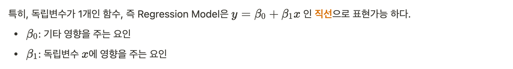
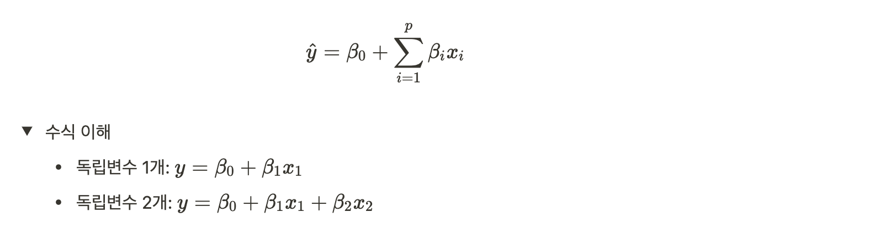

## Regression(회귀)

> Regression toward mean

- 어느 방향으로 움직인다. 평균으로 돌아간다.

- 프란시스 골턴이 최초로 회귀라는 용어를 사용

- 우생학(선택적인 출산) - 인종을 개선하는 과학

  : 훌륭한 사람은 환경보다는 유전적 영향을 더 많이 받는다. 이를 증명하기 위해 여러가지 조사를 시행하였는데, 자식들의 키는 자식 또래의 평균에 맞춰진다는 것을 발견하게 된다.

- 결국 모든 데이터는 평균으로 돌아가게 된다.

- 따라서 평균을 알게되면 미래의 데이터에 대한 예측을 할 수 있게 된다.

### Regression Model(회귀모델) 정의

-----

Regression Model(회귀모델)은 어떠한 데이터에 대해서 그 데이터 값 각각에 영향을 주는 조건들, 즉 값(회귀계수)을 고려하여, 데이터의 평균을 구하기 위한 **함수**

- **평균?**

  : 평균적이라는 표현은 **대표성**을 나타낸다.

따라서 회귀모델이란, 그 데이터를 가장 잘 표현하는 함수

### Regression Model(회귀모델) 수식

어떤 연속형 데이터 y와 이 y에 원인으로 생각되는 x간의 관계를 추정하기 위해서 만든 하나의 관계식

**[모델을 만드는 이유]**

우리가 해결해야 하는 현실은 너무 복잡하므로 수식으로 단순하게 표현하여 해결하기 위한 용도

즉, 단순화(수식화)시키는 과정을 모델이라 하며 이 때, 가정이 들어가게 된다. 가정들이 많아질 수록 모델은 더 단순화 되어지고, 가정에 맞지 않을 경우 해당 모델을 사용할 수 없게 된다. 

### ✔️ Classical Linear Regression Model(고전적 선형 회귀 모델)

-----

: 우리가 구현하는 Regression Model은 독립변수가 한 개인 경우, 주어진 데이터를 가장 잘 표현하는 "직선"을 찾는 것이다.

특히 우리는 **단변량(종속변수가 1개) 선형 회귀모델**을 사용할 것이다.

**선형 회귀모델의 종류**

- 단변량 선형 회귀모델: 종속변수가 1개
- 다변량 선형 회귀모델: 종속변수가 여러개
- 단순(simple) 선형 회귀모델: 독립변수가 1개
- 다중(multiple) 선형 회귀모델: 독립변수가 여러개 

**고전적 선형 회귀 모델의 가정**

- 오차항의 평균 = 0 이고, 정규분포 형태를 지닌다.
- 정규분포를 가진다.
- 독립변수와 종속변수는 선형관계이다.
- 데이터에 아웃라이어가 없어야한다.
- 독립변수와 오차항은 독립이어야 한다.
- 등등  

**일반 수식**

