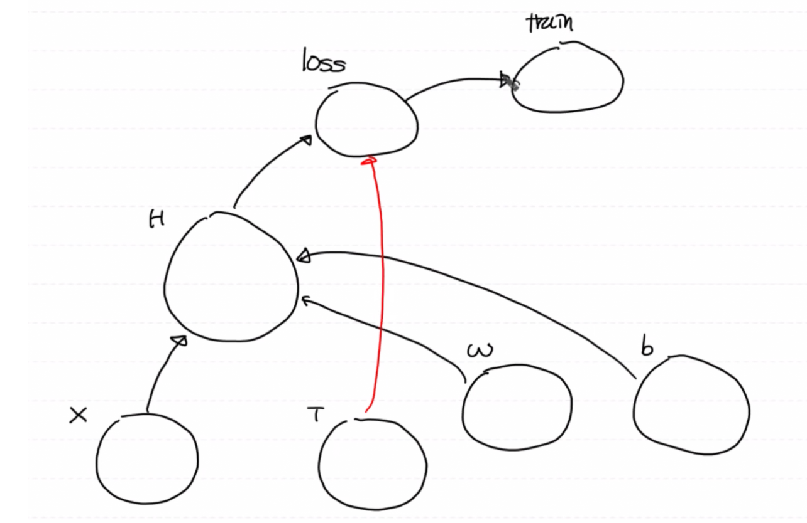

# Tensorflow 연습

### 코드 이해

- `tf.constant`: 상수노드 생성 코드로 실제 머신러닝 구현 시에는 자주 사용이 되지 않는다.

- `tf.float32`: 데이터 타입 중 tensorflow의 실수는 32비트가 기본으로 사용된다.

- `tf.placeholder`: 노드를 실행시키는 시점에 graph에 값을 주입 (node의 값을 설정)

  (입력값을 "받아주는" 입력 파라미터 노드)

  1. Training Data Set을 받아들여서 모델을 학습하는 용도
  2. 모델이 완성된 후, 미지의 x값을 모델에 넣어 예측값을 도출하기 위한 용도

- `feed_dict`: 딕셔너리 형태로 데이터를 `placeholder`에 전달


```python
import tensorflow as tf

# 상수노드 생성 (자주 사용 안됨)
node1 = tf.constant(10, dtype=tf.float32) 
node2 = tf.constant(10, dtype=tf.float32) 

# 수치연산
node3 = node1 + node2 

# 그래프 실행
sess = tf.Session() # 2.x버전에서는 session이 삭제됨
print(sess.run(node3)) # 30.0

# Data Flow Graph에 입력값 할당 시, placeholder를 이용
import tensorflow as tf

node1 = tf.placeholder(dtype=tf.float32) # 입력 파라미터를 "받아주는" 바구니
node2 = tf.placeholder(dtype=tf.float32)
node3 = node1 + node2

sess = tf.Session()
result = sess.run(node3, feed_dict={node1: 10, node2: 20})
print(result) # 30.0
```


# Simple Linear Regression

## 1. Tensorflow

실제로 학습이 진행될 수록 손실함수 값이 0과 가까워 지는 지를 확인하여 학습이 제대로 진행되는 지 간접적으로 판단해야 한다.

모델의 정확도에 대한 판단은 정확도 측정(accuracy, recall, precision)을 통해 가능하다.

------

### 코드 이해

- `tf.Variable`: 값이 변하는 노드를 지칭

- `tf.random.normal(shape)`: 0과 1사이의 표준정규분포에서 실수 난수 값을 발생

- `tf.placeholder(shape, dtype)`를 사용시, 입력 데이터가 2차원 이상일 경우 차원을 명시해줘야 한다.

  그런데, 그래프 수행이 끝나서 Predict Model이 만들어지고 사용자가 입력 데이터 x를 모델에 주입하게 될 때를 고려하여 `shape=[None, 1]`으로 써줘야 한다.

  이때 `1`은 컬럼의 수(예를 들어, 공부시간 또는 시험성적)을 의미하고 변하지 않기 때문에 열의 수는 반드시 명시를 해주어야 한다.

  즉, Simple Linear Regression은 독립변수가 한 개이기 때문에 `1`인 것이다.

  반면, `None`은 placeholder가 몇 개의 데이터(레코드)가 들어올 지는 상관하지 않는다를 의미한다.

  따라서 `shape=[None, 1]`: 2차원 Matrix이고, 컬럼의 갯수가 한 개, 대신 레코드의 수는 상관 없음

- `tf.matmul()`: 행렬곱 연산 함수

- `tf.reduce_mean()`: 다차원 행렬의 평균을 구하는 함수로 defult는 모든 원소의 평균이며 axis를 지정하면 행의 평균, 열의 평균을 리턴한다.

- `tf.Session().run(tf.global_variables_initializer())`

  : Tensorflow의 변수를 내부적으로 사용 시, **반드시** 초기화 작업을 진행해줘야 한다.

  (2.x 버전에서는 삭제됨)

- `_`: 리턴값 사용 안함


```python
import numpy as np      
import pandas as pd      
import tensorflow as tf 

# 1. Training Data Set
x_data = (np.array([1,2,3,4,5])).reshape(5,1)  
t_data = (np.array([3,5,7,9,11])).reshape(5,1) 
print(x_data)

# 2. Placeholder
X = tf.placeholder(shape=[None,1], dtype=tf.float32) 
T = tf.placeholder(shape=[None,1], dtype=tf.float32)

# 3. Hypothesis

# Weight ,bias 
W = tf.Variable(tf.random.normal([1,1]), name='weight')
b = tf.Variable(tf.random.normal([1]), name='bias')  

# Predict Model
H = tf.matmul(X, W) + b 
    
# 4. Loss Function
loss = tf.reduce_mean(tf.square(H - T)) # 행렬차에 대해 각각의 값을 제곱 후 평균구함

# 5. train
train = tf.train.GradientDescentOptimizer(learning_rate=1e-3).minimize(loss) 

# 6. Session 및 전역변수 초기화
sess = tf.Session() 
sess.run(tf.global_variables_initializer()) 

 
# 7. Learning
for step in range(30000): 
    _, W_val, b_val, loss_val  = sess.run([train, W, b, loss], feed_dict={X: x_data, T: t_data}) 
    
    if step%3000 == 0: 
        print('W: {}, b: {}, loss: {}'.format(W_val, b_val, loss_val))
        
        
# 8. Prediction
result = sess.run(H, feed_dict={X: [[9]]}) 
print('예측값: {}'.format(result)) # 18.999674
```

<details>
  <summary>#5 까지의 Tensorflow 그래프 형태</summary>
  
</details>


**[스텝 별 정리]**

-----

**epoch 수?**

학습 **데이터의 양**, 특성 또는 Tensorflow 그래프 상태에 따라 조절

epoch 수를 적정량보다 크게 잡을 경우, overfitting 현상이 발생하고 적게 잡을 경우 underfitting 현상이 발생한다.

1. **Training Data Set**

   - 입력 데이터
   - 1차원 벡터 → 2차원 행렬(matrix)

   ```python
   import numpy as np       # 자료구조
   import pandas as pd      # 데이터핸들링
   import tensorflow as tf  # 머신러닝 
   
   # Training Data Set
   x_data = (np.array([1,2,3,4,5])).reshape(5,1)  # 독립변수 1개
   t_data = (np.array([3,5,7,9,11])).reshape(5,1) # lable
   print(x_data)
   ```

2. **Placeholder**

   1. Data → Data Flow Graph
   2. 예측 모델이 완성된 후에는 미지의 X를 입력하여 예측값을 도출하는 용도로 사용

   ```python
   # Placeholder
   X = tf.placeholder(shape=[None,1], dtype=tf.float32) 
   T = tf.placeholder(shape=[None,1], dtype=tf.float32)
   ```

3. **Hypothesis**

   일차함수: y = Wx + b

   - **Weight, bias 설정**

     - 랜덤한 초기값
     - 나중에 그래프가 반복적으로 수행되면서 값이 계속 갱신됨

   - **Predict Model 정의**

     일차함수를 행렬식으로 변환: y=X•W+b

     - X, W: 2차원 행렬
     - b: 스칼라 (broadcasting)
     - y: 예측값 (=prediction model)

   ```python
   # Weight ,bias 설정 - 계속 변하는 값
   # Simple Linear Regression이므로 독립변수가 한개니까 W도 한 개만 구하면 된다.
   # [1,1]: 2차원 Matrix 형태로 W "한개" 구함
   W = tf.Variable(tf.random.normal([1,1]), name='weight') 
                                                           
   
   # 행렬곱 연산을 안하므로 굳이 2차원 Matrix 형태로 구할 필요 없음
   # [1]: 1차원 벡터 형태로 W "한개" 구함
   b = tf.Variable(tf.random.normal([1]), name='bias') 
   
   # Predict Model 정의 
   H = tf.matmul(X, W) + b # y = Wx + b => 2차원 행렬로 처리 => y = X dot W + b
   ```

4. **Loss Function**

   - W,b를 구하기 위해 평균제곱오차를 이용한 최소제곱법을 통해 손실함수 정의
   - 행렬차에 대해 각각의 값을 제곱 후 평균구함

   ```python
   # Loss Function
   loss = tf.reduce_mean(tf.square(H - T))
   ```

5. **train 노드 생성**

   손실함수를 미분해나가면서 W, b를 갱신

   - 경사하강법 알고리즘을 수행할 학습용 노드 생성하여 (미분을 통해) 손실함수의 값을 줄여가면서 W, b의 값을 1번 갱신
   - 위의 작업을 반복 수행하여 최적의 W, b를 구함

   ```python
   # train
   train = tf.train.GradientDescentOptimizer(learning_rate=1e-3).minimize(loss)
   ```

6. **Session, 전역변수 초기화**

   - Tensorflow 그래프를 실행
   - 2.x 버전에서는 불필요

   ```python
   # Session, 초기화
   sess = tf.Session() 
   sess.run(tf.global_variables_initializer()) 
   ```

7. **반복 학습 (Learning)**

   - 1 epoch: Training Data Set 전체를 이용하여 한 번 학습
   - 학습용 - train 노드만 실행하면 모든 하위노드들이 실행됨
   - 확인용 - 구해야하는 값: W, b 그리고 손실함수 값: 0과 가까워질 만큼 작아져야함

   ```python
   # Learning
   for step in range(30000): # 3000 epoch
       _, W_val, b_val, loss_val  = sess.run([train, W, b, loss], feed_dict={X: x_data, T: t_data}) 
       
       if step%3000 == 0: # 10번만 출력
           # y = 2x + 1, 따라서 W = 2, b = 1
           print('W: {}, b: {}, loss: {}'.format(W_val, b_val, loss_val))
   ```

8. **예측 (Prediction)**

   학습 종료 후 최적의 W, b가 계산되면 이를 이용하여 모델(H)이 완성됨

   ```python
   # Prediction(예측) 작업
   
   result = sess.run(H, feed_dict={X: [[9]]}) # X: 2차원 Matrix 형태이므로 중첩 리스트(1행1열)로 구현
   print('예측값: {}'.format(result)) # 18.999674
   ```

## 2. Python

### 코드 이해

- 손실함수: W, b의 함수

  따라서 W, b를 인자로 받아서 손실함수를 계산해야 한다. 손실함수를 미분할 때 이 인자들을 수치미분 함수의 인자로 넘겨주어야 하는데, 만약 인자를 각각 따로 써주게 되면 수치미분 함수 내에서 손실함수를 처리하기가 힘들게 된다.

  그래서 손실함수의 인자값을 하나의 리스트로 주지만 그 인자값을 손실함수 내에서는 2개의 값으로 따로 사용한다.

- `ravel()`: 2차원 Matrix → 1차원 벡터로 변경

- `numpy.concatenate(axis=0)`: 가로 방향으로 결합

- `[:1]`: 첫 번째 요소를 벡터로 뽑아냄

  이때 `[:1]`대신 `[0]`을 해주면 스칼라 값이 나오기 때문에 벡터에 대해서만 쓸 수 있는 `reshape()` 함수를 사용하지 못하게 된다.

  즉, 연산을 위해 slicing을 통해 ndarray 형태를 유지하기 위함이다.


**[Python 코드 구현시 주의해야할 사항]**

- 편미분을 통해 W, b 갱신
- 데이터 구조(shape) 처리


**[스텝 별 정리]**

```python
import numpy as np

# 1. Training Data Set
x_data = np.array([1,2,3,4,5]).reshape(5,1)
t_data = np.array([3,5,7,9,11]).reshape(5,1)

# 2. Weight, bias
W = np.random.rand(1,1) 
b = np.random.rand(1)   

# 3. Hypothesis 
def predict(x):
    
    y = np.dot(x, W) + b 
    return y

# 4. Loss Function
def loss_func(input_obj):
    
    # input_obj = [W, b]
    input_W = input_obj[0]
    input_b = input_obj[1]
    
    y = np.dot(x_data, input_W) + input_b     
    
    return np.mean(np.power((t_data - y), 2)) 

# 5. 다변수 함수(W, b)에 대한 수치미분
def numerical_derivative(f, x):
    
    # f: 편미분하려고 하는 다변수 함수 -> 손실함수
    # x: 편미분하려고 하는 모든 값 -> W, b
    # 따라서, [W, b]에 대해 각각 편미분이 진행
    
    delta_x = 1e-4
    derivative_x = np.zeros_like(x) 
    
    it = np.nditer(x, flags=['multi_index'])
    
    while not it.finished: 
        idx = it.multi_index 
        print('현재의 idx: {}'.format(idx)) 

        tmp = x[idx]                        
        print('현재의 tmp: {}'.format(tmp)) # 1.0 # 2.0
        
        # x에 대한 편미분
        x[idx] = tmp + delta_x 
        fx_plus_delta = f(x) 
        
        # 중앙차분 미분 준비
        x[idx] = tmp - delta_x
        fx_minus_delta = f(x) 
        
        # 중앙차분
        derivative_x[idx] = (fx_plus_delta - fx_minus_delta) / (2 * delta_x)
        
        # 두번째 독립변수에 대해 편미분 시행을 위해 원래 상태로 복구
        x[idx] = tmp 
    
        it.iternext() # 다음 iterator, 다음 칸으로 넘어감
        
    return derivative_x

# 6. learning rate
learning_rate = 1e-4

# 7. Learning
for step in range(300000):
		# 현재 W, b값을 입력 파라미터 값으로 저장하여 편미분 함수에 인자값으로 넘기기 위한 용도: [W b]
    input_param = np.concatenate((W.ravel(), b.ravel()), axis=0) 
    
    # 손실함수를 input_param에 대해 편미분 시행
    derivative_result = learning_rate * numerical_derivative(loss_func, input_param)
    
    # W, b 갱신
    W = W - derivative_result[:1].reshape(1.1) 
    b = b - derivative_result[1:] 
    
    if step % 30000 == 0:
        print('W: {}, b: {}'.format(W, b)) # W: [[2.0000058]], b: [0.99997904]
```

1. **Training Data Set**

   ```python
   # Training Data Set
   x_data = np.array([1,2,3,4,5]).reshape(5,1)
   t_data = np.array([3,5,7,9,11]).reshape(5,1)
   ```

2. **Weight, bias**

   ```python
   # Weight, bias
   W = np.random.rand(1,1) # 2차 Matrix: [[0.32456]]
   b = np.random.rand(1)   # 스칼라
   ```

3. **Hypothesis**

   모델 학습이 종료된 후 모델이 생성되고 나서, 예측값을 구할 때 사용

   ```python
   # Hypothesis
   def predict(x):
       
       y = np.dot(x, W) + b # y = X dot W + b
       return y
   ```

   - 

4. **Loss Function**

   - W와 b의 함수이므로 W와 b를 인자로 받아서 손실함수를 계산
   - 그런데, 수치미분을 위해 W, b를 하나의 리스트 안에 넣어서 하나의 인자: `(input_obj)`로 받음
   - 따라서 아래의 함수는 W, b가 한 개인 경우로 Hard Code했기 때문에 Simple Linear Regression에서만 사용 가능

   ```python
   # 손실함수
   def loss_func(input_obj):
       
       # input_obj = [W, b]
       input_W = input_obj[0]
       input_b = input_obj[1]
       
       y = np.dot(x_data, input_W) + input_b     # Hypothesis
       
       return np.mean(np.power((t_data - y), 2)) # 손실함수
   ```

5. **다변수 함수(W, b)에 대한 수치미분**

   특정 W, b에서 손실함수를 편미분 -> 최적의 W, b?

   **인자값**

   - f: 편미분하려고 하는 다변수 함수 -> 손실함수

   - x: 편미분하려고 하는 모든 값 -> W, b

     따라서, [W, b]에 대해 각각 편미분이 진행

   ```python
   # 다변수함수에 대한 수치미분 코드
   def numerical_derivative(f, x):
       
       delta_x = 1e-4
       derivative_x = np.zeros_like(x) 
       
       it = np.nditer(x, flags=['multi_index'])
       
       while not it.finished: 
           idx = it.multi_index 
           print('현재의 idx: {}'.format(idx)) 
   
           tmp = x[idx]                        
           print('현재의 tmp: {}'.format(tmp)) # 1.0 # 2.0
           
           # x에 대한 편미분
           x[idx] = tmp + delta_x 
           fx_plus_delta = f(x) 
           
           # 중앙차분 미분 준비
           x[idx] = tmp - delta_x
           fx_minus_delta = f(x) 
           
           # 중앙차분
           derivative_x[idx] = (fx_plus_delta - fx_minus_delta) / (2 * delta_x)
           
           # 두번째 독립변수에 대해 편미분 시행을 위해 원래 상태로 복구
           x[idx] = tmp 
       
           it.iternext() # 다음 iterator, 다음 칸으로 넘어감
           
       return derivative_x
   ```

6. **Learning Rate 설정**

   ```python
   # learning rate
   learning_rate = 1e-4
   ```

7. **반복 학습**

   손실함수 미분 -> W, b 갱신

   ```python
   for step in range(300000):
       
       # 현재 W, b값을 입력 파라미터 값으로 저장하여 편미분 함수에 인자값으로 넘기기 위한 용도
       # [W b]
       input_param = np.concatenate((W.ravel(), b.ravel()), axis=0) # 1차원 벡터끼리 연결하기 위해 ravel 사용
       
       # 손실함수를 input_param에 대해 편미분 시행
       derivative_result = learning_rate * numerical_derivative(loss_func, input_param)
       
       # W, b 갱신
       # 위에서 합쳐진 인자를 각각 뽑아서 계산
       W = W - derivative_result[:1].reshape(1.1) # 2차원 - 2차원
       b = b - derivative_result[1:] # 1차원 벡터
       
       if step % 30000 == 0:
           print('W: {}, b: {}'.format(W, b)) # W: [[2.0000058]], b: [0.99997904]
   ```

## 3. Sklearn

### 설정

- `conda avtivate data_env`
- `pip install sklearn`

### 코드 이해

- `model.coef_`: 완성된 모델에 대한 W값
- `model.intercept_`: 완성된 모델에 대한 b값

```python
import numpy as np
from sklearn import linear_model

# 1. Training Data Set
x_data = np.array([1,2,3,4,5]).reshape(5,1)
t_data = np.array([3,5,7,9,11]).reshape(5,1)

# 2. Model
model = linear_model.LinearRegression()

# 3. Learning
model.fit(x_data, t_data)
# Weight, bias 출력
print('W: {}, b: {}'.format(model.coef_, model.intercept_)) # W: [[2.]], b: [1.]

# 4. Prediction
print(model.predict([[9]])) # [[19.]]
```


**[스텝 별 정리]**

1. **Training Dat Set**

   ```python
   import numpy as np
   from sklearn import linear_model
   
   # Training Data Set
   x_data = np.array([1,2,3,4,5]).reshape(5,1)
   t_data = np.array([3,5,7,9,11]).reshape(5,1)
   ```

2. **Model**

   Linear Regression Model 생성

   ```python
   # Model
   model = linear_model.LinearRegression()
   ```

3. **Learning**

   ```python
   # 모델 학습
   model.fit(x_data, t_data)
   
   # Weight, bias 출력
   print('W: {}, b: {}'.format(model.coef_, model.intercept_)) # W: [[2.]], b: [1.]
   ```

4. **Prediction**

   ```python
   print(model.predict([[9]])) # [[19.]]
   ```

------

Reference: [ML_0224.ipynb](https://github.com/sammitako/TIL/blob/master/Machine%20Learning/source-code/ML_0224.ipynb)

