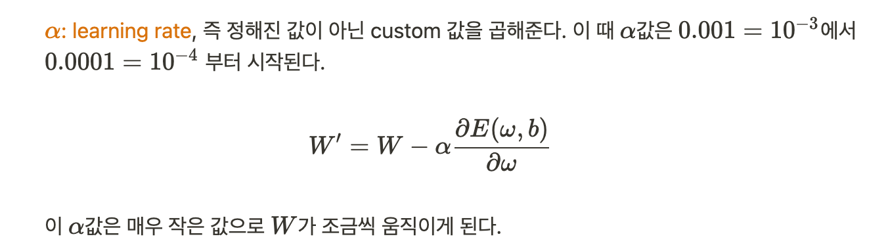

# 머신러닝에서의 학습(Learning)

: 회귀모델을 예로 들면, 프로그램 계산을 통해 주어진 데이터와 가장 잘 표현하는 직선을 찾아가는 과정이다.


## **회귀모델 - 해당 데이터를 가장 잘 표현하는 모델(직선)**

**[예]** 입력 Feature(독립변수)가 1개인 경우 단순 선형 회귀모델을 사용하며 그래프는 **직선형태**로 표현됨

이때 우리는, **Classical Linear Regression Model**의 일반식을 사용한다.

(참고) Linear: 회귀 계수들을 선형적으로 결합

- **산점도(scatter)** -  데이터의 분포 확인용 (x축, y축)
- **직선(plot)**

```python
import numpy as np
import pandas as pd
import matplotlib.pyplot as plt

my_dict = {
    '공부시간(x)': [1,2,3,4,7,8,10,12,13,14,15,18,20,25,28,30], # 독립변수 1개
    '시험점수(t)': [5,7,20,31,40,44,45,46,49,60,70,82,85,91,97,99]
}
df = pd.DataFrame(my_dict)
display(df.head())

plt.scatter(df['공부시간(x)'], df['시험점수(t)']) # x축, y축

# Classical Linear Regrssion Model에 따른 임의의 직선 그래프
plt.plot(df['공부시간(x)'], df['공부시간(x)']*2 + 3, color='r') # x축, y축(y=2x+3)
plt.plot(df['공부시간(x)'], df['공부시간(x)']*5 - 7, color='g') 
plt.plot(df['공부시간(x)'], df['공부시간(x)']*1 + 8, color='b') 
plt.plot(df['공부시간(x)'], df['공부시간(x)']*4 - 10, color='magenta') 

# 기울기, 절편

plt.show()
```

<details>
  <summary><b>출력형태</b></summary>
  	
</details>


<u>**[머신러닝에서의 회귀모델 수식] Predict Model**</u>


### 어떻게 가장 알맞은 직선을 찾아가는 지?

결론적으로 평균제곱오차(MSE: 오차를 제곱해서 평균을 구한 값)가 최소가 되는 W와 b를 찾으면 된다.


<u>**[용어정리]**</u>

```python
# Linear Regression Model 
# 주어진 데이터에 가장 잘 맞는 직선을 찾아보자.

plt.scatter(df['공부시간(x)'], df['시험점수(t)'])

# Hypothesis
plt.plot(df['공부시간(x)'], df['공부시간(x)']*5 - 10, color='magenta')
```


<u>**[목적] 가설(직선) = 모델을 완성시키는 것**</u>

모델을 완성시키기 위해 오차의 합이 최소가 되는 W와 b를 찾아야 한다.

(잘 만들어진 모델은 미래의 예측 데이터에 대한 오차도 작을 것이다.)

1. 각 데이터에 대한 오차를 줄인다.

   

2. 오차들의 총 합이 최소가 되도록 한다.

이때, 각 오차에 부호가 존재하므로,

1. ~~절대값을 이용해서 error의 합 사용 (W를 구할 때 문제가 생김)~~
2. 평균제곱오차(Mean Squared Error) 사용

   : 각 오차들의 값에 제곱을 취한 다음 평균을 구해서 오차의 합을 구한다.

   * 오차가 크면 클수록 제곱하면 값이 더 커지므로 가중치를 줄 수 있게 된다.
   * 부호의 문제를 상쇄시키면서 좋은 모델과 안좋은 모델에 대한 가중치를 부여할 수 있다.

   ⇒ 이때, MSE를 이용해서 $W$, $b$를 구하는 작업을 하기 위해서는 **손실함수(loss function)**를 정의해야 한다.


<u>**[정의] 손실함수(Loss Function) 또는 비용함수(Cost Function)**</u>

: Training Data Set의 정답값(t)과 입력값(x)에 대한 계산 값(y=모델의 예측값)의 차이(오차)를 모두 더해 수식으로 나타낸 식


------

**[목표] 최소제곱법을 이용해서 만든 손실함수의 값을 최소(0)가 되게 하는 $W$와 $b$를 학습과정을 통해 찾는다.**

<u>**손실함수의 최소값을 어떻게 구하지?**</u>


1. 손실함수의 생김새를 봐보자.

   b는 상수이므로, W에 대한 이차함수인 양의 포물선 형태의 그래프이다.  


2. 손실함수의 값이 최소가 되게하는 W를 찾기 위해 경사하강법(Gradient Descent Algorithm)을 사용

   손실함수, 즉 양의 포물선에서 최소점은 꼭지점이다.


- 경사하강법?

  :  양의 이차 포물선에서 최소점인 꼭지점의 값을 찾아가는 알고리즘이다.

  즉, 손실함수의 편미분을 통해 손실함수가 최소가 되는 W를 찾는 알고리즘이다.


- 경사하강법 알고리즘 설명

  먼저 임의의 가중치(W) 점을 찍는다.

  이 점이 손실함수의 최소값인지 확인하기 위해 W에 대해서 편미분을 하여 접선의 기울기(미분계수)가 0인 지점(W)을 찾는다.

  접선의 기울기 값이 양수이고 기울기의 경사가 클경우, 현재의 위치에서 W값을 왼쪽(안쪽)으로 옮겨서 기울기 값(미분값)을 작게 해준다.

  즉 다음 W값을 구하기 위해 현재 W값에서 편미분값을 빼준다.

  

  그런데 편미분값이 현재 W값보다 더 클 경우가 있으므로,

  


여기까지가 전체 데이터를 이용해서 한 번 학습한 것을 1 cycle = **1 epoch**이다.

손실함수 값이 최소값, 즉 0이 되도록 학습의 반복수(epoch)도 우리가 적절히 정해주어야 한다. Normalization 기법을 통해 손실함수 값을 0과 근사하게 만들 수 있다.


- Hyper Parameter: 내가 임의로 결정하는 값을 통칭하며 컴퓨팅 파워, 데이터의 양, 모델의 사이즈 등과 같은 요인을 고려하여 결정해야 한다.
- Overfitting: 학습 반복수가 많아질 수록 입력 데이터의 형태가 우리의 학습 데이터와 비슷하게 되는 현상으로 결과적으로 안 좋은 모델이 나온다.
- 발산: 알파값이 커서 최적의 W를 뛰어넘는 현상, running rate가 너무 커서 앞뒤로 왔다갔다해서 최적의 W를 못찾거나 그래프를 뛰어넘는 현상


손실함수는 학습의 판단 기준으로만 사용되고 나중에 모델의 성능을 평가할 시에는 손실함수를 사용하지 않는다.

------


## Simple Linear Regression 코드 구현

Hypothesis = Predict Model

- Classical Linear Model: y=Wx+b, (x: 입력값, y: 예측값)
- Training Data Set을 가장 잘 표현하는 최적의 W, b를 구하기 위해 손실함수와 경사하강법을 이용

  

<u>**[Coding Steps]**</u>

1. Training Data Set 준비 - ndarray를 이용

2. Lineaer Regression Model을 정의 - y=Wx+b

   - Weight와 bias를 정의
   - 이를 이용하여 Hypothesis(Predict Model)을 정의

   **[데이터 연산 처리] 행렬곱연산 - Dot Product**

   - 2차원 Matrix
   - Numpy 사용


3. Loss Function 정의 - 손실함수를 코드로 표현
   * Learning rate를 정의 (Hyper Parameter 설정)


4. 학습을 반복적으로 진행 - 편미분을 이용하여 W와 b의 값을 업데이트 처리
   * epoch수 정의  (Hyper Parameter 설정)  


**(9시간 공부하면 시험성적은 어떻게 될까요?)**

✔️ `%reset`: Magic Command로 현재 모든 셀의 변수 지워준다. Test 코드 작성 시 자주 사용된다.

```python
%reset

import numpy as np

# 0. 수치미분 코드
def numerical_derivative(f, x):
    # f: loss function
    # x: W, b
    
    delta_x = 1e-4
    derivative_x = np.zeros_like(x) 
    
    it = np.nditer(x, flags=['multi_index'])
    
    while not it.finished: 
        idx = it.multi_index 
        print('현재의 idx: {}'.format(idx)) 

        tmp = x[idx]                        
        print('현재의 tmp: {}'.format(tmp)) # 1.0 # 2.0
        
        # x에 대한 편미분
        x[idx] = tmp + delta_x 
        fx_plus_delta = f(x) 
        
        # 중앙차분 미분 준비
        x[idx] = tmp - delta_x
        fx_minus_delta = f(x) 
        
        # 중앙차분
        derivative_x[idx] = (fx_plus_delta - fx_minus_delta) / (2 * delta_x)
        
        # 두번째 독립변수에 대해 편미분 시행을 위해 원래 상태로 복구
        x[idx] = tmp 
    
        it.iternext() # 다음 iterator, 다음 칸으로 넘어감
        
    return derivative_x

# 미분하려는 다변수함수
def my_func(input_data):
    x = input_data[0]
    y = input_data[1]
    
    return 2*x + 3*x*y + np.power(y,3)

param = np.array([1.0, 2.0]) 
result = numerical_derivative(my_func, param) 
print('미분한 결과: {}'.format(result))

# 1. Training Data Set

# 입력 데이터, Lable
# View(복사값): 1차원 벡터 -> 5행 1열
x_data = np.array([1,2,3,4,5]).reshape(5,1) 
t_data = np.array([3,5,7,9,11]).reshape(5,1)

# 2. Linear Regression Model

#(2-1) Weight, bias 정의
W = np.random.rand(1,1) # 초기값(랜덤) - 1행 1열
b = np.random.rand(1) # 초기값(랜덤) - 스칼라

#(2-2). 학습종료 후 임의의 데이터에 대해서 예측값을 알아오는 함수
def predict(x):
    # Predict Model = Hypothesis
    y = np.dot(x, W) + b # Y = X dot W + b 
    
    return y

# 3. Loss Function 정의
def loss_func():
    pass
```

Python 코드로 작성하려니 너무 힘들다...😢

Tensorflow를 이용하여 다시 구현해보자.


## Tensorflow를 이용한 Simple Linear Regression 코드 구현

**[세팅]**

- `conda avtivate data_env`
- `conda install tensorflow=1.15`


**[들어가기 전] Tensorflow Basics**

Tensorflow는 Google이 만든 Deep Learning Open Source Library

- 1.x 버전: 머신러닝의 개념의 이해와 Low Level 코딩을 요구하므로 대중화 및 접근성이 낮음
- 2.x 버전: 2019년 10월에 정식으로 출시, 상위 API인 Keras가 기본으로 포함되어있어서 구현이 쉬움

(참고) PyTorch는 Facebook이 만든 Deep Learning Open Source Library  


**[정의] Tensorflow**

**Data Flow Graph 구조로 수치연산**

Tensorflow는 그래프를 만들어서 그 그래프 상의 특정 노드를 실행시키는 구조이다.

예를 들어, 한 노드를 실행하기 위해서는 하위에 연결된 노드들의 실행이 선행되어야 한다.  


<u>**Data Flow Graph란?**</u>

: Node와 Edge로 구성된 방향성이 있는(데이터가 한 방향으로만 흐르는) Graph

노드가 한 개만 있어도 Tensorflow Graph가 된다.  


- **Node**: 실제 Tensor의 수치연산과 데이터의 입출력을 담당

- **Edge**: 각각의 노드를 잇는 선으로 Tensor(데이터)를 Node로 실어 나르는 역할을 한다.

  즉 Edge를 통해서 데이터가 한 Node에서 다른 Node로 이동 하게 된다.

- **Data**: 동적 크기의 다차원 배열로 Tensor라고 부른다.  


**[Tensorflow 코드 연습]**

- session: 그래프 안의 특정 노드를 실행시킨다.
- 세션 실행: `tf.Session().run(node)`

```python
import tensorflow as tf
print(tf.__version__) # 1.15.0


## 1. 문자열
node1 = tf.constant('Hello World') # 상수노드 생성
print(node1) # Tensor("Const:0", shape=(), dtype=string) # 노드 안에 Tensor(data)가 들어가 있음

# 그래프를 실행하기 위해서 1.x 버전에서는 session이 필요
sess = tf.Session()
print(sess.run(node1)) # node1 - 데이터 입출력 작업 실행 # b: bite string
print(sess.run(node1).decode()) # 문자열


## 2. 수치연산
node1 = tf.constant(10, dtype=tf.float32)
node2 = tf.constant(30, dtype=tf.float32)

node3 = node1 + node2

# node3 실행
sess = tf.Session()
print(sess.run(node3))

# 여러개 노드 실행
print(sess.run([node3, node1]))
```


-----

Reference: [ML_0223.ipynb](https://github.com/sammitako/TIL/blob/master/Machine%20Learning/source%20code/ML_0223.ipynb)

