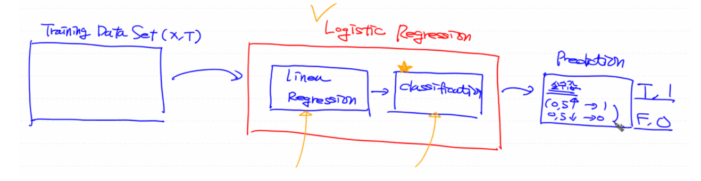
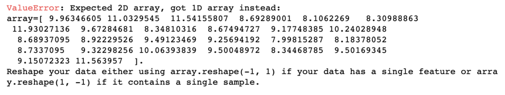
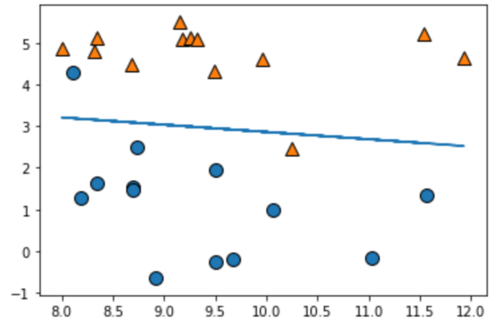
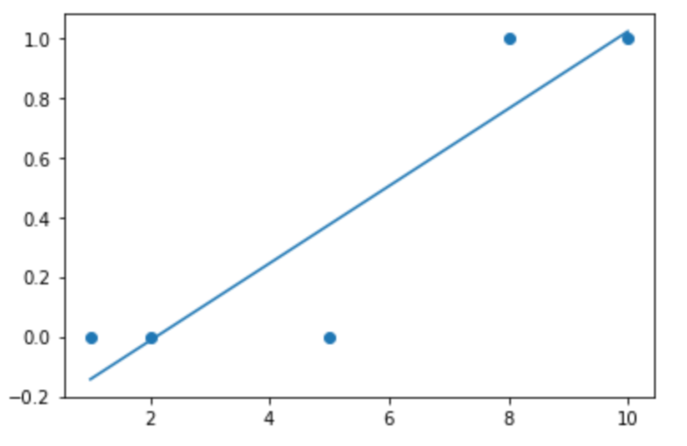
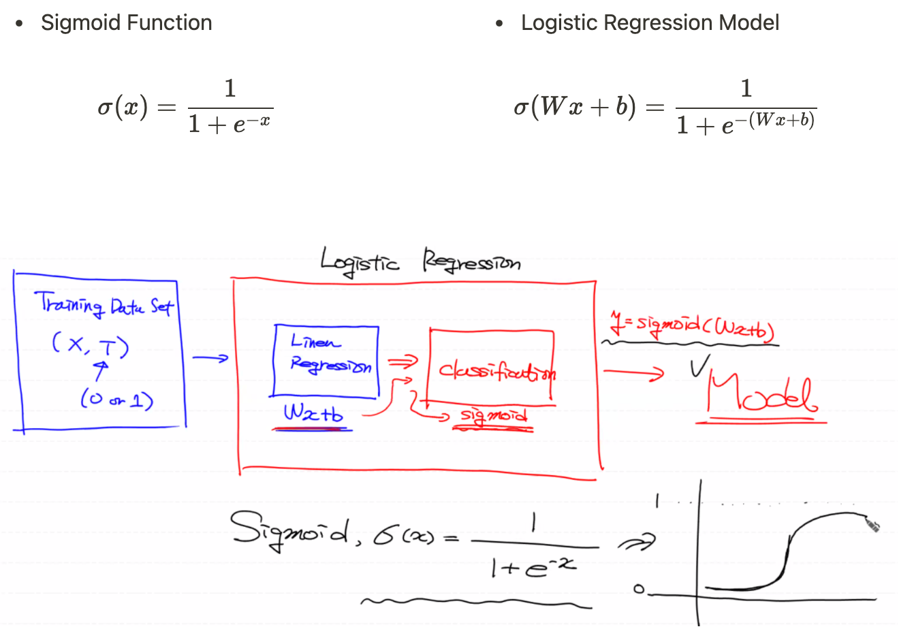
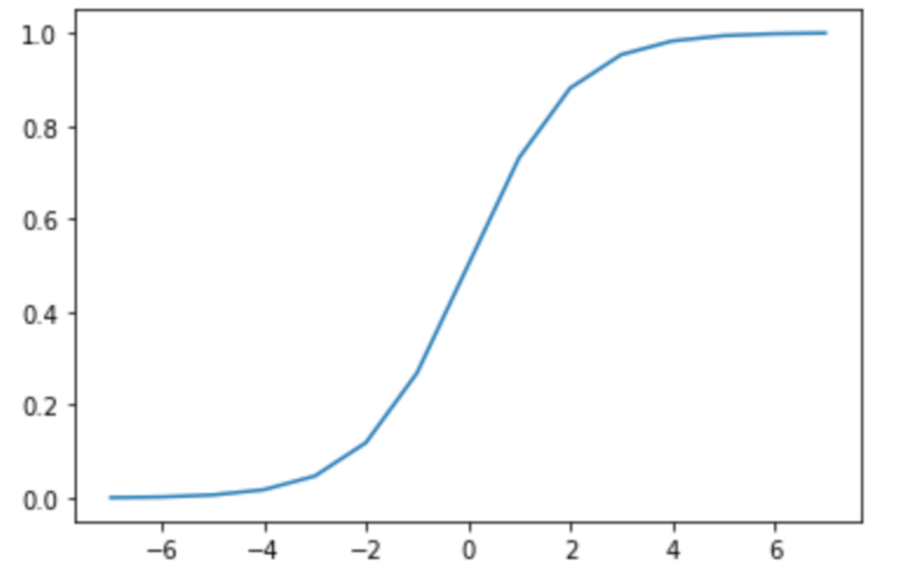
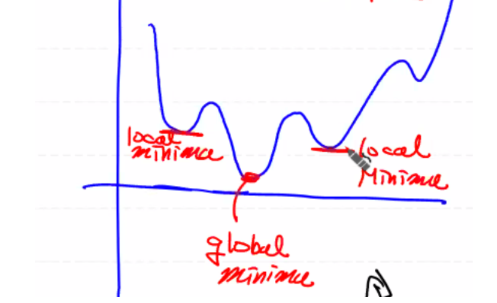
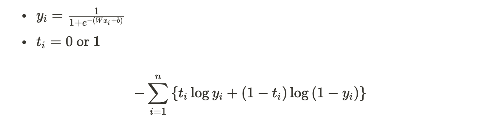
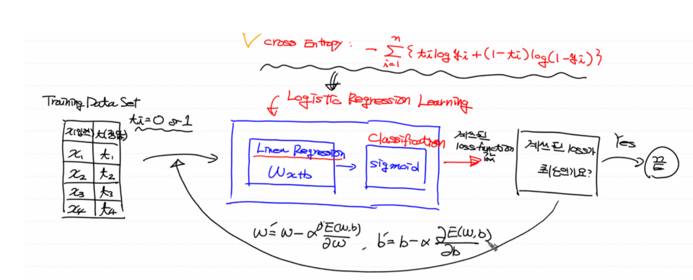

# Classification System

Training Data Set의 특징과 분포를 이용하여 학습한 후, 미지의 데이터에 대해 결과가 어떤 종류의 값으로 분류될 수 있는 지 예측하는 작업

다시 말해, 1에 가까워질 확률값을 알아내는 작업이다.

**[Classification Algorithm]**

- **Logistic Regression**
- KNN
- Naive Baise
- Decision Tree
- Random Forest

위의 알고리즘으로 Linear Regression 작업(=값을 구하는 작업)을 할 수도 있다.  


# Logistic Regression

대표적인 분류 알고리즘 중 정확도가 상당히 높은 기법 중 하나로 나중에 딥러닝의 기본 Component로 사용된다.

Logistic Regression은 **Linear Regression 직선을 기준으로** 얼마 정도의 확률로 **어느 영역에 들어가는 지 판단**한다.

(Linear Regression은 직선 상의 값을 예측하는 기법)

<details>
  <summary>그림으로 정리</summary>
  
</details>


## Scikit-learn

`pip3 install mglearn`: 데이터 셋을 가져오기 위한 유틸리티 모듈

- `x`: ndarray 2차원 평면의 데이터 형태로, x축 좌표와 y축 좌표를 나타냄 (좌표값)

- `y`: 어떤 형태의 점인 지 나타냄

- `mglearn.discrete_scatter(x축의 값, y축의 값, 점의 형태)`

- 2차원 데이터로 학습

  x데이터(입력)와 y데이터(정답) 모두 2차원 행렬 데이터로 바꿔줘야 함

  

### Simple Linear Regression

```python
## Training Data Set
x, y = mglearn.datasets.make_forge() # tuple
print(x) # x축 좌표, y축 좌표
print(y) # 점의 형태

# Visualization
mglearn.discrete_scatter(x[:,0], x[:,1], y)

## Linear Regression

# model
model = linear_model.LinearRegression()

# learning (2차원)
model.fit(x[:,0].reshape(-1,1), x[:,1].reshape(-1,1))

# 결과
print(model.coef_) # Weight: [[-0.17382295]]
print(model.intercept_) # bias: [4.5982984]

# Visualization (1차원)
mglearn.discrete_scatter(x[:,0], x[:,1], y)
plt.plot(x[:,0], x[:,0] * model.coef_.ravel() + model.intercept_) # (x, y) 그래프
plt.show()
```

<details>
  <summary>데이터의 분포 파악</summary>
  
</details>


🙋🏻‍♀️ **그러면 Linear Regression 직선으로는 분류를 할 수 없나요?**

공부시간에 따른 합격 여부를 판단해보자. (t_lable 자체가 0부터 1로 되어있으므로) 해결된다.

```python
import numpy as np
from sklearn import linear_model
import matplotlib.pyplot as plt

# Training Data Set
x_data = np.array([1, 2, 5, 8, 10]) # 공부시간
t_data = np.array([0, 0, 0, 1, 1])  # 합격여부 (0: Fail, 1: Pass)

# sklearn
model = linear_model.LinearRegression()
model.fit(x_data.reshape(-1,1), t_data.reshape(-1,1))
print('기울기: {}, 절편: {}'.format(model.coef_, model.intercept_))

# visualization
plt.scatter(x_data, t_data)
plt.plot(x_data, x_data * model.coef_.ravel() + model.intercept_)
plt.show()

# prediction
result = model.predict([[7]])
print(result) # [[0.63265306]] => 0.5보다 크기 때문에 시험에 합격한다고 간주

# 그럼 시험에 통과하기 위한 최소 시간?
time = (0.5 - model.intercept_) / model.coef_.ravel()
print(time) # [5.97368421]
```

<details>
  <summary>직선 형태</summary>
  
</details>


🙋🏻‍♀️ **굳이 왜 Logistic Regression을 사용해야 하나요?**

결측치와 이상치 처리?

실제 데이터의 의미를 알 수 없기 때문에 도메인 관리자와 상의한 후 이상치 또는 지대점을 처리해야 한다.

트레이닝 데이터 셋에 따라 정확하지 않은 모델이 도출되어 예측이 되지 않는다. 결국 Linear Regression으로 문제 해결 실패.

```python
import numpy as np
from sklearn import linear_model
import matplotlib.pyplot as plt

# Training Data Set
x_data = np.array([1, 2, 5, 8, 10, 30]) # 공부시간
t_data = np.array([0, 0, 0, 1, 1, 1])  # 합격여부 (0: Fail, 1: Pass)

# sklearn
model = linear_model.LinearRegression()
model.fit(x_data.reshape(-1,1), t_data.reshape(-1,1))
print('기울기: {}, 절편: {}'.format(model.coef_, model.intercept_))

# visualization
plt.scatter(x_data, t_data)
plt.plot(x_data, x_data * model.coef_.ravel() + model.intercept_)
plt.show()

# prediction
result = model.predict([[7]])
print(result) # [[0.41831972]] => 0.5보다 작기 때문에 시험에 불합격으로 간주

# 그럼 시험에 통과하기 위한 최소 시간?
time = (0.5 - model.intercept_) / model.coef_.ravel()
print(time) # [9.33333333]
```

<details>
  <summary>직선 형태</summary>
  
</details>

🤷🏻‍♀️ **그럼 어떻게 해야하지?**

직선은 x 값이 커지면 t 값도 커지는 원리이기 때문에 위와 같은 문제가 발생하는 것이다.

다시 말해, 직선 모델 자체가 0과 1사이의 값을 가져야 판단 기준점인 0.5로 예측이 가능하지만, 큰 값의 데이터가 존재하게 될 경우 확률값이 도출되지 않는 문제가 생긴다.

따라서 직선 모델을 0과 1사이의 값을 가지는 곡선 모델로 바꿔줘야 한다.

즉 Linear Regression 직선: Wx + b 를 0과 1사이의 S자 곡선: sigmoid(Wx + b) 로 변환시켜야 한다.


## Simple Logistic Regression

시그모이드 함수를 이용하여 Linear Regression 직선을 S자 곡선 형태의 그래프로 변환

결과적으로, Linear Regression 모델(출력): Wx+b가 어떠한 값을 가지더라도 출력함수인 시그모이드 함수를 이용하면 0과 1사이의 실수값으로 도출된다.

이때 실수값이 0.5이상이면 1을 출력하고 0.5 미만이면 0으로 출력한다.



```python
import numpy as np
import matplotlib.pyplot as plt

x_data = np.arange(-7, 8)
sigmoid_t_data = 1 / (1 + np.exp(-1 * x_data))

plt.plot(x_data, sigmoid_t_data)
plt.show()
```

<details>
  <summary>시그모이드 함수의 형태</summary>
  
</details>


**Linear Regression**

최소제곱법을 이용하여 손실함수를 정의하고 경사하강법을 통해 반복적으로 손실함수를 미분하여 W, b를 갱신하여 최적의 W, b를 구한다.

* y: 로지스틱 모델
* E: 손실함수


**Logistic Regression**

**￮  시그모이드 모델**


그래프의 모양이 Convex 형태가 아니기 때문에 경사하강법을 사용할 시, 어느 지점에서나 local minima가 발생할 수 있어서 최적의 W, b값을 지닌 global minima을 찾을 수가 없게 된다.

따라서 위의 손실함수(E를 사용할 수 없다.

<details>
  <summary>Exponential 함수 모양</summary>
  
</details>


**￮  Cross Entropy(=Log Loss)**: Logistic Regression에서 사용되는 손실함수

Exponential 함수를 Convex 함수로 변환시키는 수식



<details>
  <summary>Logistic Regression 과정 설명</summary>
  <p>
    Linear Regression 모델에서 <b>모델과 손실함수만</b> 바뀌고 과정은 Linear Regression과 동일하다.
  </p>
  
</details>


## Simple Logistic Regression 구현

### Python

-----

단변수일 때만 사용 가능

- 수치미분함수
- `delta = 1e-7`: 로그 연산 시, 무한대로 발산하는 경우를 방지하기 위해 아주 작은 더미 값 설정

```python
import numpy as np

# 수치미분함수
def numerical_derivative(f, x):
    # f: 손실함수, x: ndarray => [W, b]
    
    delta_x = 1e-4
    derivative_x = np.zeros_like(x) 
    
    it = np.nditer(x, flags=['multi_index'])
    
    while not it.finished: 
        idx = it.multi_index 
        tmp = x[idx]                        

        x[idx] = tmp + delta_x 
        fx_plus_delta = f(x) 
        
        x[idx] = tmp - delta_x
        fx_minus_delta = f(x) 
        
        derivative_x[idx] = (fx_plus_delta - fx_minus_delta) / (2 * delta_x)
        
        x[idx] = tmp 
    
        it.iternext() 
        
    return derivative_x

# Training Data Set
x_data = np.arange(2,21, 2).reshape(-1,1) # 공부시간(독립변수): 2 ~ 20 짝수
t_data = np.array([0,0,0,0,0,0,1,1,1,1]).reshape(-1,1)  # 합격여부(14시간부터 합격)

# W, b
W = np.random.rand(1,1) # 행렬곱 연산을 위해 2차원 배열로 생성
b = np.random.rand(1)   # braodcasting
    
# loss function
def loss_func(input_obj): #[W, b]
    input_W = input_obj[0]
    input_b = input_obj[1]
    
    # linear regression hypothesis
    z = np.dot(x_data, input_W) + input_b
    
    # logistic regression hypothesis
    y = 1 / (1 + np.exp(-1 * z))
    
    
    # cross entropy
    # 로그 연산 시, 무한대로 발산하는 경우를 방지하기위해 delta 값 설정
    delta = 1e-7 # 아주 작은 더미값
    
    log_loss = -np.sum(t_data*np.log(y+delta) + (1 - t_data)*np.log(1 - y+delta)) 
    
    return log_loss

# learning rate
learning_rate = 1e-4

# learning - Gradient Descent Algorithm 수행
for step in range(300000):
    # [W b]
    input_param = np.concatenate((W.ravel(), b), axis=0)
    
    # learning_rate * 편미분
    derivative_result = learning_rate * numerical_derivative(loss_func, input_param)
    
    # W, b 갱신
    W = W - derivative_result[0].reshape(-1, 1)
    b = b - derivative_result[1]
    
    if step % 30000 == 0:
        input_param = np.concatenate((W.ravel(), b), axis=0)
        print('W: {}, b: {}, loss: {}'.format(W.ravel(), b, loss_func(input_param)))

# Prediction - 13시간 공부할 경우?
def logistic_predict(x): # x = [[13]]
    z = np.dot(x, W) + b
    y = 1 / (1 + np.exp(-1 * z))
    
    if y < 0.5:
        result = 0
    else:
        result = 1
        
    return result, y # (result: 결과값, y: 확률값)

study_hour = np.array([[13]])
print(logistic_predict(study_hour)) # 결과: 1(합격), 확률: 0.54451492
```


### Tensorflow

-----

- `placeholder`: 1.x 버전에서만 존재, 2.x 버전에서는 삭제됨

```python
import tensorflow as tf

# Training Data Set
x_data = np.arange(2,21, 2).reshape(-1,1)
t_data = np.array([0,0,0,0,0,0,1,1,1,1]).reshape(-1,1)

# placeholder
X = tf.placeholder(shape=[None,1], dtype=tf.float32)
T = tf.placeholder(shape=[None,1], dtype=tf.float32)

# W, b
W = tf.Variable(tf.random.normal([1,1]), name='weight')
b = tf.Variable(tf.random.normal([1]), name='bias')

# model
linear_model = tf.matmul(X, W) + b 
H = tf.sigmoid(linear_model) 

# log loss
loss = tf.reduce_mean(tf.nn.sigmoid_cross_entropy_with_logits(logits=linear_model, labels=T))

# gradient descent algorithm
train = tf.train.GradientDescentOptimizer(learning_rate=1e-4).minimize(loss)

# learning
sess = tf.Session()
sess.run(tf.global_variables_initializer())

for step in range(300000):
    _, W_val, b_val, loss_val = sess.run([train, W, b, loss], feed_dict={X: x_data, T: t_data})
    
    if step % 30000 == 0:
        print('W: {}, b: {}, loss: {}'.format(W_val, b_val, loss_val))

# prediction
study_hour = np.array([[13]])
result = sess.run(H, feed_dict={X: study_hour})
print(result) # [[0.5790821]] 확률로 합격
```


### Scikit-learn

```python
from sklearn import linear_model

model = linear_model.LogisticRegression()
model.fit(x_data, t_data.ravel()) # 2번째 인자: 1차원

result = model.predict(study_hour)

result_proba = model.predict_proba(study_hour) # [[떨어질 확률, 합격할 확률]]

print('W: {}, b: {}, 확률: {}'.format(model.coef_, model.intercept_, result_proba))
print(result) # 0: 불합격
```


------

Reference: [ML_0302](https://github.com/sammitako/TIL/blob/master/Machine%20Learning/source-code/ML_0302.ipynb)

