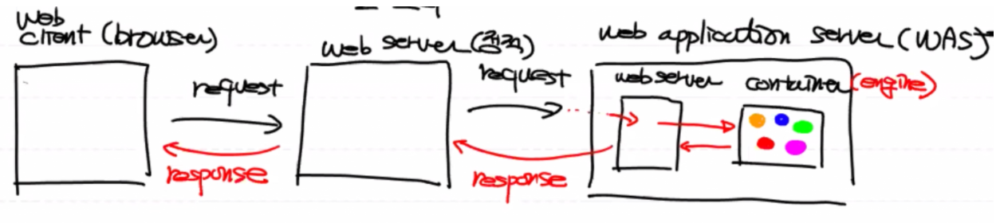
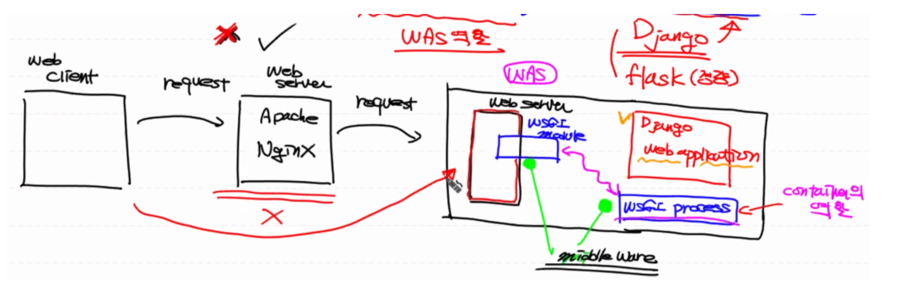
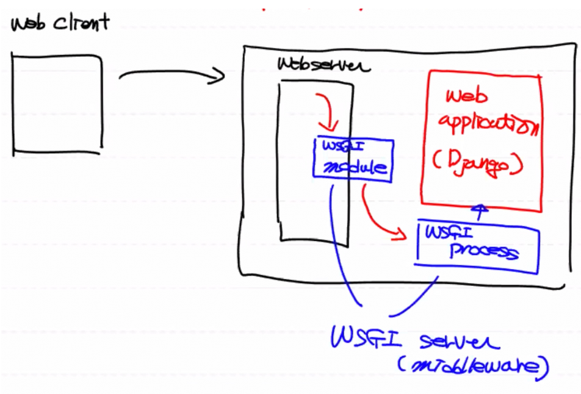
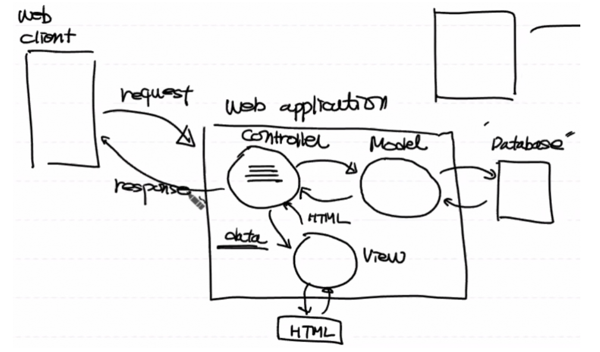

# Django 들어가기

**[WEB 용어 정리]**

- Web Server: 인터넷을 통해 클라이언트(웹 클라이언트; 브라우저)의 요청이 오면 서버에 있는 정적인 컨텐츠를 찾아서 실행시키는 하드웨어 또는 소프트웨어

  - 정적 리소스?

    : 이미 가지고 있는 파일 (HTML, 이미지, 동영상 등등)

  - 프로그램 실행 (X)

- CGI(Common Gateway Interface): 웹 서버에서 프로그램(application)을 수행시키기 위한 규칙(규약)

  - 목적: 정적인 기능을 하는 웹 서버가 동적인 프로그램(application)을 수행시킬 수 있는 기능을 부여

  - C, Perl 작동 방식

    클라이언트 request → Web Server (Apache, NginX) → Web Server가 직접 프로그램을 실행

  - 문제점: 웹 서버에 부하가 과중됨

- WAS(Web Application Server): 일반적으로 Web Server와 웹 프로그램(application)을 동작시킬 수 있는 Container를 분리시킴 (다른 컴퓨터로 위치시킴)

  - (1) WAS는 여러개의 프로그램의 묶음
  - (2) 프로그램이 돌아가는 컴퓨터

  <details>
    <summary><b>동작 방식 보기</b></summary>
    <ul>
      <li> Web Application Server 안에 Web Server와 Container가 존재</li>
      <li> Web Server: 클라이언트의 요청을 받아옴</li>
      <li> Container: 동적 프로그램을 실행시키는 프로그램 (=engine)</li>
      
    </ul>
  </details>

- 외부 Web Server를 빼고 WAS가 가지고 있는 Web Server로 클라이언트가 바로 요청을 보내도 되지만, WAS의 서버 과부화가 초래됨

  따라서 **정적 리소스**에 대해서는 첫번째 외부 Web Server가 처리하고, **동적 리소스**에 대해서는 WAS안의 Web Server에서 처리하게 된다.

- **정리**

  클라이언트 Request → Web Server → WAS → 프로그램 실행(개발자가 구현)


# WSGI(Web Server Gateway Interface)

: 파이썬으로 개발한 python script (web application)가 웹 서버와 통신하기 위한 규약

(파이썬에 종속된 개념)

**동작방식**

: 클라이언트 Request → 웹 서버 (Apache, NginX) → **WSGI Server(Middleware)** → WSGI ****규약을  준수하는 웹 어플리케이션을 실행

- WSGI Middleware ≒ WAS

- Django Framework를 이용해서 WSGI 규약을 준수하는 웹 어플리케이션을 개발할 수 있다.

- **동작방식 자세히**

  - WAS 안에 존재

    1. Web Server
       * WSGI Module
    2. WSGI Process (≒Container)

    이 위에 Django를 이용한 웹 어플리케이션이 올라감

  - WSGI Module과 WSGI Process가 연동이 되서 웹 서버에서 WSGI Process를 통해서 웹 어플리케이션을 수행시킴

  - 일반적으로 WSGI Module + WSGI Process = WSGI Middleware (다운로드 받아야 함)

  - **여기서는** 외부 Web Server를 사용하지 않고 Web Client에서 바로 WAS안의 Web Server로 request를 보내는 구조로 프로그램 구현할 것이다.

    <details>
      <summary><b>동작 방식 보기</b></summary>
        
    </details>
  

# Django Web Application

: 파이썬으로 만들어진 무료로 사용할 수 있는(오픈소스) 웹 어플리케이션 **프레임워크**

**프레임워크?** WSGI 규약을 준수하면서 프로그램을 작성할 수 있게 도와주는 코드 체계

## Django 특징

**1. MVT 패턴**

- **MVC 패턴 사용**

  **디자인 패턴 (24, 42)**

  : 프로그램 유지・보수를 위해, 문제 해결 시 최적의 결과를 위해, 재사용성과 협업을 위해 프로그램 설계

  특정 기능에 대해 논리적으로 구체화시켜 놓은 개념

  프로그램을 작성하는 방법론 (구조화)

  - **MVC 패턴(MVC Pattern)**
  - 싱글톤 패턴(Singleton Pattern)
  - 옵저버 패턴(Observer Pattern)

  

  **MVC 패턴**

  : 프로그램 전체 구조에 대한 패턴

  - M(Model) → Data (Database에 있는 데이터를 핸들링하는 것과 관련)
  - V(View) → UI
  - C(Controller) → Business Logic

  ⇒ 클래스 혹은 파일로 코드를 분리

  - **여기서의 Django 작동 방식**

    Web Client에서 request가 오면 WAS 안의 Web Server가 WSGI Module을 통해서 WSGI Process에게 request를 보낸다.(작업 위임)

    실제 Django Framework를 이용한 웹 어플리케이션은 WSGI Process에 의해서 실행된다.

    이때 WSGI Module + WSGI Process = WSGI Middleware 라고 한다.

    **오리지널 동작방식은**

    

    

    **Web Application만 분리해서 보면 MVC 패턴이 보인다.**

    Controller: 클라이언트의 request를 받아서 전체 로직을 처리

    (Controller = 객체, 함수)

    이 때 데이터 핸들링을 위해 Controller는 Model이라는 객체를 통해 데이터 처리 결과값을 받고, View한테 데이터(로직 처리 결과)를 주면 View는 클라이언트에 보여줄 화면(HTML, CSS, JS)를 가지고 와서 Controller의 데이터를 적용시킨 뒤 다시 Controller에 보내준다.

    그러면 Controller가 마지막으로 클라이언트에 response를 보낸다.
    
    
    
    
    
    

- M(Model) → Data

- V(View) → Business Logic

- T(Template) → UI

**2. ORM(Object Relational Mapping)**

객체 관계 매핑

데이터베이스를 이용하는 특수한 기법

**[정의]**

- Object - 클래스, 객체

- Relational - 데이터베이스 테이블

- Mapping - Object와 Relational을 매핑시켜서 데이터베이스를 제어

원래 Database를 제어하려면 SQL 언어를 사용한다.

Django는 SQL을 안쓰고 파이썬의 클래스의 **객체**를 통해 데이터베이스를 제어한다.

(내부적으로 SQL이 자동으로 생성되서 사용된다.)


**잠깐, 데이터베이스?**

- 계층형 데이터베이스

  : 초창기의 DB 시스템으로, 상위 카테고리 - 하위 카테고리 개념이 존재하는 폴더구조이다.

  탑다운 방식의 트리구조.

  (분류별, 조직화 정리)

  **단점**: 데이터 간의 연동이 어려워서 결국 유지・보수가 힘들다.

- 네트워크 데이터베이스

  : 하위 노드가 연결되있어서 데이터의 연동이 쉽다.

  그래프 구조.

  **단점**: 이론은 좋았으나 구현이 어렵다.

- 관계형 데이터베이스

  - Relation 논문 발표 (수학자)
  - 테이블 구조 = Relation 자료구조(형태)
  - 연산 정의
  - 이 논문을 기반으로 IBM이 데이터베이스를 구현시킴 (DB2)

- 객체-관계형 데이터베이스

  - 객체지향의 시대가 도래 (1990년대)
  - 객체지향 데이터베이스
  - 망함
  - 이유
    - 데이터베이스 구축 어렵다.
    - 관계형 데이터베이스가 너무 좋다.
  - 그런데 객체지향의 개념을 관계형 데이터베이스에 포함시킴
  - **정형 데이터 처리에 가장 적합 (테이블 구조)**

- 비정형 데이터 처리를 위한 데이터베이스


**3. 관리자 페이지 자동 생성**

**4. Elegant URL**

일반적으로 웹 프로그램 할 때 URL 디자인(URL 형태 지정) 시, 직관적이고 쉽게 표현할 수 있다.


## Django 실습

- **Django 환경설정**

  - 아나콘다 가상환경 이용 (MyFirstWeb 환경)

  ```bash
  conda install django
  python -m django --version # 2.2.5
  ```

  - PyCharm 툴 다운로드 (Professional)

- **Django 용어정리**

  일반적으로 Server-side Web Application(전체 프로젝트)

  - 프로젝트 - 개발할 전체 프로젝트 (구현할 웹사이트, 웹 프로그램)로 어플리케이션들의 집합

  - 어플리케이션 - 프로젝트 내에서 모듈화된 단위 프로그램들 (하나의 기능과 관련)

    예) 도서관련, 회원관련, 자동차렌트 관련

- **MVT 패턴 도식화**

  - **URLConf**: 클라이언트 Request 분석
  - View: 함수의 집합 (일반 파이썬 함수, 클래스의 메소드)으로 로직(기능)을 수행
  - Model: ORM을 이용하여 데이터 CRUD 작업 수행
  - Template: 클라이언트에 보여줄 화면 작업(데이터 기반의 HTML) 수행

  