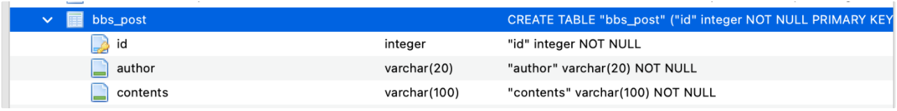
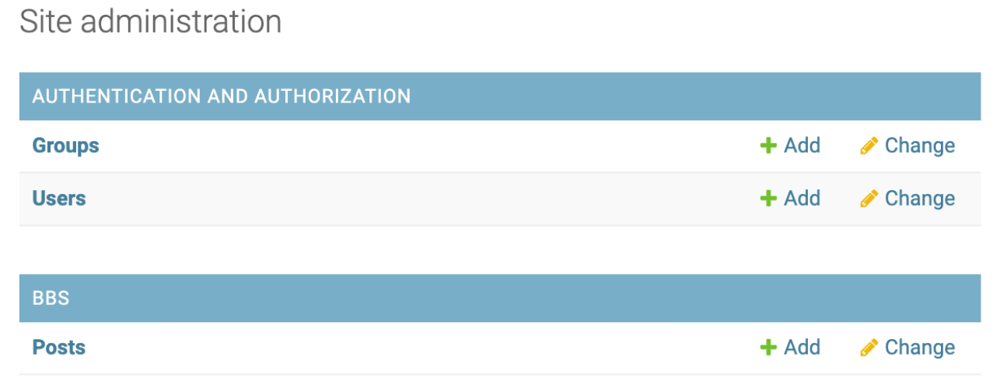
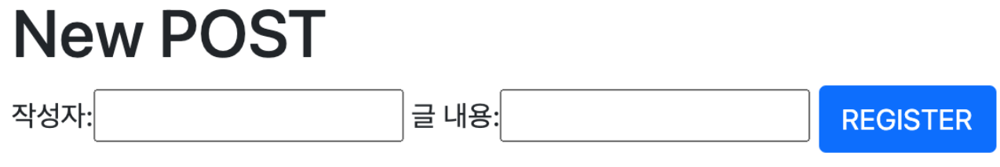
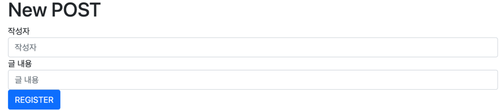

# 게시판 작성 (CRUD)

- **프로젝트 생성**

  - Project 폴더 이름 변경: MyShoppingMall 
    									 (설정 폴더와 이름 다르게 하기 위해)
  - PyCharm에서 어플리케이션 생성

  ```bash
  conda activate base
  cd python-Django
  django-admin startproject shoppingmall
  cd shoppingmall
  python manage.py startapp bbs  
  ```

  

  - 프로젝트 설정

      **(settings.py)**

      - 프로젝트 단 **static 파일 관리 폴더 생성**
          - js
          - css
          - img

      ```python
      DEBUG = True # False - 서비스 모드
      ALLOWED_HOSTS = ['localhost', '127.0.0.1'] # '도메인 이름', '실제 IP 주소'
      
      INSTALLED_APPS = [
          'django.contrib.admin',
          'django.contrib.auth',
          'django.contrib.contenttypes',
          'django.contrib.sessions',
          'django.contrib.messages',
          'django.contrib.staticfiles',
          'bbs.apps.BbsConfig'
      ]
      
      ROOT_URLCONF = 'shoppingmall.urls' # 클라이언트의 request 제일 먼저 처리
      
      # Project단의 templates 폴더 생성
      TEMPLATES = [
          {
              'BACKEND': 'django.template.backends.django.DjangoTemplates',
              'DIRS': [os.path.join(BASE_DIR), 'templates'],
              'APP_DIRS': True,
              'OPTIONS': {
                  'context_processors': [
                      'django.template.context_processors.debug',
                      'django.template.context_processors.request',
                      'django.contrib.auth.context_processors.auth',
                      'django.contrib.messages.context_processors.messages',
                  ],
              },
          },
      ]
      
      TIME_ZONE = 'Asia/seoul'
      
      # Static files (CSS, JavaScript, Images)
      # https://docs.djangoproject.com/en/2.2/howto/static-files/
      
      # url이 '/static/'으로 들어올 경우, 프로젝트단의 static 폴더를 찾아감 
      STATIC_URL = '/static/'
      STATICFILES_DIRS = [
          os.path.join(BASE_DIR, 'static')
      ]
      ```

      

  - 프로젝트 시작

      ```python
      # 기본 테이블 생성
      python manage.py migrate

      # 어드민 계정 생성
      python manage.py createsuperuser

      # 서버 실행
      python manage.py runserver
      ```

  

  ## 어플리케이션 설계

  - **Model 생성**

      Model 클래스와 DB 테이블과 1:1 맵핑  

      

      **(bbs/models.py)**

      ```python
      from django.db import models
      
      # bbs_post라는 이름의 table로 Database에 생성됨
      class Post (models.Model):
          # DB columns = 클래스의 속
          author = models.CharField('작성자', max_length=20)
          contents = models.CharField('글 내용',max_length=100)
      
      		def __str__(self):
              return self.contents
      ```

      

      **(bbs/admin.py)**

      ```python
      from django.contrib import admin
      from bbs.models import Post
      
      admin.site.register(Post)
      ```

      

  - **Admin 사이트에 DB 등록**

      ```python
      # DB에 변경사항 적용하기 위한 migration 초안(명세서) 생성
      python manage.py makemigrations

      # 실제 DB에 초안(명세서) 적용
      python manage.py migrate
      ```

      - **DB 확인**

          **(Database Tool)**

          - `어플리케이션 명_클래스 명` - DB 테이블 명
          - `id` - 정수형 pk 컬럼이 자동 생성
          - `author`, `contents` - 파이썬 클래스의 속성 명

          

          **(localhost:8000/admin)**

          

  - **URL 경로 설정**

      ROOT_URLConf 먼저 설정  

      

      1. **메인 페이지 생성**

          **[url pattern 설정 시, 사용하는 함수]**

          1. `url()`: 특정 url과 View를 매핑하는 함수의 원조, 정규표현식을 포함해서 일반적인 설정이 가능

          2. `path()`: 일반 문자열 형태로 url configuration 할 때 사용

          3. `re_path()`: 정규표현식으로 url configuration 할 때 사용  

             

          **[정규표현식]**

          - `[ 문자 ]`: 대괄호 안의 문자 중 한 개 지칭

              <details>
                <summary>예</summary>
                				[adh]: a d h <br>
              					[a-z]: 영문자 소문자 1개 (b)
              </details>
              
          - `{ 숫자 }`: 몇 번 중복       
          
              <details>
                          <summary>예</summary>
                          [a-z]{3}: 영문자 소문자 3개 (att) <br>
                           ^: Caret, 문자열의 시작 <br>
                        	 $: 문자열의 끝
                        </details>

  ​     

  **(shoppingmall/urls.py)**
            

  - `from django.conf.urls import url`
           - `url()`을 사용하여 메인 페이지 설정


  ​    

  **[TemplateView]**  

  메인 페이지 - 프로그램 처리를 안하는 정적 컨텐츠  

  ​	`from django.views.generic.base import TemplateView`  

  ​	`TemplateView.as_view(template_name='파일명.html')`    

  ​	: View 함수를 거치지 않고 프로젝트 단의 template 폴더 안에 있는 Template 파일을 결과로 바로 보여줌
  ​          	

```python
          from django.contrib import admin
          from django.urls import path, include
          from django.conf.urls import url
          from django.views.generic.base import TemplateView
          
          urlpatterns = [
              # 메인 페이지 설정
              url(r'^$', TemplateView.as_view(template_name='index.html')),  # ''
              path('admin/', admin.site.urls),
          ]
```


**(MyshoppingMall/templates/index.html)**
​          

- Bootstrap4 사용
          
    - View Page Source (Example - Cover) 
      
    - CDN via jsDelivr
      
    - MyShoppingMall/`static/css/`cover.css 파일 저장 (Inspect - Source)
    
- Anchor Button Link 설정
          
```html
          <!doctype html>
          <html lang="en" class="h-100">
          <head>
              <meta charset="utf-8">
              <title>Welcome to My Shopping Mall</title>
          
              <!-- Bootstrap core CSS (CDN) -->
              <link href="https://cdn.jsdelivr.net/npm/bootstrap@5.0.0-beta1/dist/css/bootstrap.min.css" rel="stylesheet" integrity="sha384-giJF6kkoqNQ00vy+HMDP7azOuL0xtbfIcaT9wjKHr8RbDVddVHyTfAAsrekwKmP1" crossorigin="anonymous">
              <script src="https://cdn.jsdelivr.net/npm/bootstrap@5.0.0-beta1/dist/js/bootstrap.bundle.min.js" integrity="sha384-ygbV9kiqUc6oa4msXn9868pTtWMgiQaeYH7/t7LECLbyPA2x65Kgf80OJFdroafW" crossorigin="anonymous"></script>
          
              <style>
                  .bd-placeholder-img {
                      font-size: 1.125rem;
                      text-anchor: middle;
                      -webkit-user-select: none;
                      -moz-user-select: none;
                      user-select: none;
                  }
          
                  @media (min-width: 768px) {
                      .bd-placeholder-img-lg {
                          font-size: 3.5rem;
                      }
                  }
              </style>
          
              <!-- Custom styles for this template -->
              <link href="../static/css/cover.css" rel="stylesheet">
          </head>
          <body class="d-flex h-100 text-center text-white bg-dark">
          
          <div class="cover-container d-flex w-100 h-100 p-3 mx-auto flex-column">
              <header class="mb-auto">
                  <div>
                      <h3 class="float-md-start mb-0">Sam's Mall</h3>
                  </div>
              </header>
          
              <main class="px-3">
                  <h1>Welcome to My Shopping Mall</h1>
                  <p class="lead">You want to go to the board?</p>
                  <p class="lead">
                      <a href="/bbs/list" class="btn btn-lg btn-secondary fw-bold border-white bg-white">Go to BOARD</a>
                  </p>
              </main>
          
              <footer class="mt-auto text-white-50">
                  <p></p>
              </footer>
          </div>
          
          </body>
          </html>
```


​          
2. **게시판 리스트 페이지 생성**
   
    **(shoppingmall/urls.py)**
    
    ```python
          from django.contrib import admin
          from django.urls import path, include
          from django.conf.urls import url
          from django.views.generic.base import TemplateView
          
          urlpatterns = [
              # 메인 페이지 설정
              url(r'^$', TemplateView.as_view(template_name='index.html')),  # ''
              path('admin/', admin.site.urls),
              path('bbs/', include('bbs.urls'))
          ]
    ```
    
      
    
    **(bbs/url.py)**
    
    ```python
          from django.urls import path
          from . import views
          
          app_name = 'bbs'
          urlpatterns = [
              path('list/', views.p_list, name='p_list')
          ]
    ```
    
      
    
    
- **View 함수 생성**
  
    **(bbs/views.py)**
  
    게시판의 리스트를 보여주는 함수 생성
  
    ```python
      from django.shortcuts import render
      from bbs.models import Post
      
      def p_list(request):
          # 데이터베이스의 모든 글의 내용을 다 들고옴
          posts = Post.objects.all().order_by('-id') # 최신글
          return render(request, 'bbs/list.html', {'posts': posts})
    ```
  
      
  
  
  
- **공통 HTML Template 생성**
  
    공통되는 프레임적인 부분은 따로 빼서 프로젝트 레벨의 Template 파일로 저장하고, 각 내용은 각 어플리케이션 단의 Template 파일로 작성
  
    즉 HTML에서 공통적으로 사용하는 부분을 하나의 파일에 작성해서 가져다 사용하는 방식을 이용한다.
  
    ​    
  
    
  
    **(MyShoppingMall/templates/base.html)**
    
    - jQuery CDN - jQuery 2.x minified
      - Bootstrap CDN
      - ``
    
        ``
    
        사용시, 
    
              
              
              
               
    
    ```html
      <!DOCTYPE html>
      <html lang="en">
      <head>
          <meta charset="UTF-8">
          <title></title>
          <!-- jQuery CDN -->
          <script src="https://code.jquery.com/jquery-2.2.4.min.js" integrity="sha256-BbhdlvQf/xTY9gja0Dq3HiwQF8LaCRTXxZKRutelT44=" crossorigin="anonymous"></script>
      
          <!-- Bootstrap CDN -->
          <link href="https://cdn.jsdelivr.net/npm/bootstrap@5.0.0-beta1/dist/css/bootstrap.min.css" rel="stylesheet" integrity="sha384-giJF6kkoqNQ00vy+HMDP7azOuL0xtbfIcaT9wjKHr8RbDVddVHyTfAAsrekwKmP1" crossorigin="anonymous">
          <script src="https://cdn.jsdelivr.net/npm/bootstrap@5.0.0-beta1/dist/js/bootstrap.bundle.min.js" integrity="sha384-ygbV9kiqUc6oa4msXn9868pTtWMgiQaeYH7/t7LECLbyPA2x65Kgf80OJFdroafW" crossorigin="anonymous"></script>
      
      </head>
      <body>
          
      			<!-- 이 부분만 내용을 바꾸면 됨 -->
          
    </body>
    </html>
  ```
  
    
  
    
  
- **Template HTML 생성**
  
    **(bbs/templates/bbs/list.html)**
  
    - Bootstrap Dashboard 사용
      - 샘플 데이터 작성 - localhost:8000/admin
    
    ```python
      
      
          <script src="/static/js/posts.js"></script>
          <div class="container">
              <h1>Bulletin Board System(BBS)</h1>
              <button type="button" class="btn btn-primary" onclick="new_post()">
              새글작성
              </button>
              <div class="m-1"></div>
    
            <div class="table-responsive">
                  <table class="table table-striped table-sm">
                      <thead>
                      <tr>
                          <th>#</th>
                          <th>글 작성자</th>
                          <th>글 내용</th>
                          <th>수정</th>
                          <th>삭제</th>
                      </tr>
                      </thead>
                      <tbody>
                      
                      <tr>
                          <td>{{ post.id }}</td>
                          <td>{{ post.author }}</td>
                          <td>{{ post.contents }}</td>
                          <td>버튼1</td>
                          <td>버튼2</td>
                      </tr>
                      
                      </tbody>
                  </table>
              </div>
          </div>
    
    
    ```

​      

## Model Form 객체

Model과 Form을 연동시켜서 Form에서 Model을 관리

HTML에서 사용자 입력 양식 Form을 사용하지 않고 모델을 직접 이용해서 화면에 Form을 자동 생성 즉, Model Form 객체를 HTML에서 템플릿을 사용하면 HTML Form tag가 자동 생성됨

문제는 Model Form 객체는 CSS 적용이 안되므로 따로 붙여줘야 함  


1. Bootstrap 적용

   **(Terminal)**

   ```bash
   pip3 install django-bootstrap4
   ```

   

2. Bootstrap - 어플리케이션으로 인식

   **([settings.py](http://settings.py))**

   ```bash
   INSTALLED_APPS = [
       'django.contrib.admin',
       'django.contrib.auth',
       'django.contrib.contenttypes',
       'django.contrib.sessions',
       'django.contrib.messages',
       'django.contrib.staticfiles',
       'bbs.apps.BbsConfig',
       'bootstrap4'
   ]
   ```

     

3. **Model Form 클래스 정의**

   > class 모델 클래스 이름Form(forms.ModelForm) 
   >
   > ​		class Meta: 
   >
   > ​				model = 모델 클래스 이름 
   >
   > ​				fields = [모델 클래스에서 사용할 속성들]

   - 어플리케이션/forms.py 파일 생성

   - Model Form이 자동으로 Form field(HTML tag)를 생성

   - 사용자가 입력한 데이터가 자동으로 DB에 저장됨  

     

   **(bbs/forms.py)**

   ```bash
   from django import forms
   from bbs.models import Post
   
   class PostForm(forms.ModelForm):
       class Meta:
           model = Post
   
           # 로그인해서 게시글 작성 시, Form에 아이디 적을 필요 없음 (-> fields 옵션 사용)
           fields = ['author', 'contents']
   ```

  


## 새글 작성

**(bbs/static/js/posts.js)**

- 상대경로: 현재 경로를 기준으로 경로를 설정
- 절대경로: url 앞에 `/`로 시작하며 기준 경로는 http:localhost:8000

```jsx
function new_post() {
		// 상대 경로 문제 발생
		// 현재 경로: new_post()를 사용하는 list.html이 있는 경로 = <http://localhost:8000/bbs/list>
    // location.href = 'bbs/create' // <http://localhost:8000/bbs/list/bbs/create>
		location.href = '/bbs/create'   // 절대 경로, GET 방식
}
```

  

**(bbs/urls.py)**

```bash
from django.urls import path
from . import views

app_name = 'bbs'
urlpatterns = [
    path('list/', views.p_list, name='p_list'),
    path('create/', views.p_create, name='p_create')
]
```

  

**(bbs/views.py)**

**서버 호출은 기본이 GET 방식**

Form Tag 안에서 `method="POST"` 인 경우만 제외하고 모두 GET 방식 사용

```python
from django.shortcuts import render
from bbs.models import Post
from bbs.forms import PostForm

def p_list(request):
    # 데이터베이스의 모든 글의 내용을 다 들고옴
    posts = Post.objects.all().order_by('-id') # 최신글
    return render(request, 'bbs/list.html', {'posts': posts})

def p_create(request):
    # 새글작성 버튼 -> GET 방식
    post_form = PostForm() # Model Form 객체 생성
    return render(request, 'bbs/create.html', {'post_form': post_form})
```

  

**(bbs/templates/bbs/create.html)**

- ``: Model Form Bootstrap 적용 (Django가 제공하는 어플리케이션)
- ``
- submit 버튼 눌렀을 때 사용자 데이터`{{ post_form }}`를 포함한 request를 서버로 전송
- 경로 문제 발생 수정 - **(bbs/static/js/posts.js)**
- ``: Form에 Bootstrap 적용

```html




    <div class="container">
        <h1>New POST</h1>
        <!-- 새로운 글 작성 시 서버에 전송되는 FORM -->
        <form method="post">
        
            <!-- {{ post_form }} --> <!-- Model Form 객체, bootstrap 적용 안됨 -->
             <!-- bootstrap 적용 -->
            <button type="submit" class="btn btn-primary">REGISTER</button>
        </form>
    </div>


```

- Bootstrap 미적용 - `{{ post_form }}`

  

- Bootstrap 적용 - ``

  

  

**([views.py](http://views.py))**

- **Form 태그에 action이 없을 경우, 현재 url로 request를 보냄**

- 똑같은 url(화면)에 방식에 따라 다르게 처리함

  - GET 방식

    ⬩  `post_form = PostForm()`: 빈 화면 출력

    ⬩  `return render(request, 'bbs/create.html', {'post_form': post_form})`

  - POST 방식

    ⬩  `post_form = PostForm(request.POST)`: 사용자 데이터를 넣은 PostForm 객체 생성

    ⬩  `if post_form.is_valid():`

    ​	`post_form.save()`
  
    ​	: Model 객체와 Model Form 객체가 연동되있고 Model 객체랑 DB가 연동돼 있으므로 바로 DB에 저장됨

    ⬩ `return redirect('namespace:name')`: 클라이언트가 해당 url로 재접속하게 됨

```python
from django.shortcuts import render, redirect
from bbs.models import Post
from bbs.forms import PostForm

def p_list(request):
    # 데이터베이스의 모든 글의 내용을 다 들고옴
    posts = Post.objects.all().order_by('-id') # 최신글
    return render(request, 'bbs/list.html', {'posts': posts})

def p_create(request):
    # 새글 등록 버튼 -> POST 방식
    # DB에 데이터 저장
    if request.method == 'POST':
        # 사용자가 전달해준 데이터는 request.POST 안에 들어있음
        # 사용자 데이터가 들어있는 Model Form 객체 생성
        post_form = PostForm(request.POST)

        if post_form.is_valid():
            post_form.save()

            # 클라이언트에 해당 url로 재접속 요청하는 response 돌려줌
            return redirect('bbs:p_list')

    # 새글 작성 버튼 -> GET 방식
    # 빈칸 보여줘 (빈 입력 form을 출력하는 코드)
    if request.method == 'GET':
        post_form = PostForm() # Model Form 빈 객체 생성
        return render(request, 'bbs/create.html', {'post_form': post_form})
```


  ## 게시판 작성 후 리스트 보기 까지의 메커니즘 정리

1. 프로젝트 설정
   - static 폴더
   - [settings.py](http://settings.py)
2. Model 생성
   - author, contents
   - **str**(self)
3. URL Conf 설정
   - 프로젝트 단 [urls.py](http://urls.py): 메인 페이지 - TemplateView 사용
   - 어플리케이션 단 [urls.py](http://urls.py): 리스트 페이지
4. View 생성
   - 공통 Template 생성 - jQuery, Bootstrap
   - 리스트 페이지 - 새글 작성 버튼 클릭 시 게시판 작성 페이지로 이동 (→ JavaScript 함수로 경로 이동)
5. Model Form 객체 생성
   - Bootstrap 설정
   - 어플리케이션 단 [forms.py](http://forms.py) 파일 생성
6. bbs/urls.py - JavaScript 경로 적용
7. bbs/views.py - bbs/urls.py 경로에서 언급한 함수 생성
8. bbs/templates/bbs/create.html - Model Form 객체를 이용한 Form 작성
9. bbs/views.py - POST 방식과 GET 방식 따로 처리