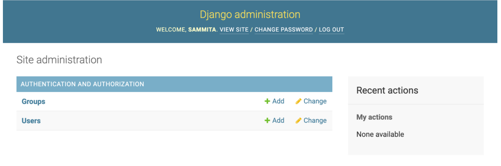
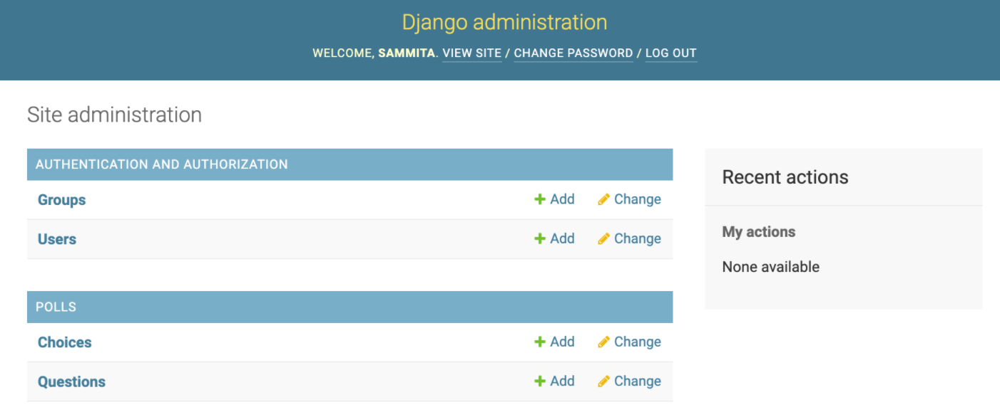
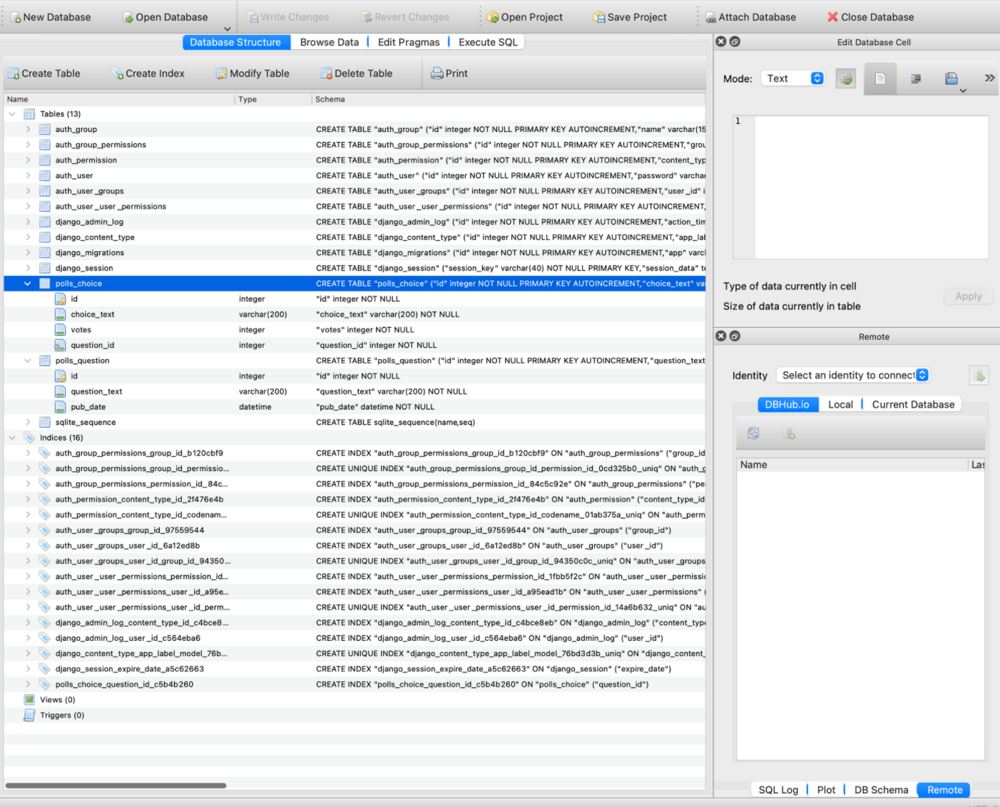
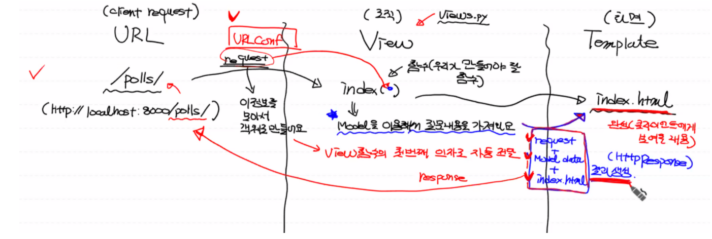
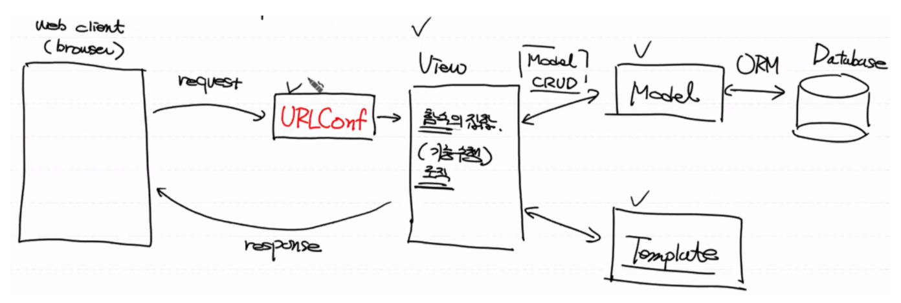

# Poll Application(1) - 각 질문마다 링크 생성까지

**[관리자 페이지]**

사용자 인증에 관련된 테이블이 자동으로 생성됨

관리자 페이지에서 모든 데이터베이스 처리 가능

------

- 어드민 사이트 접속: `localhost:8000/admin`

- 관리자 계정 생성

  (패스워드 복구 불가)

  ```bash
  cd python-Django
  cd MyFirstWeb
  conda activate MyFirstWeb
  
  python manage.py createsuperuser # 관리자 계정 생성
  ```

  

## 1. **ORM을 사용한 모델 정의**

데이터베이스 테이블 생성

`models.py` 파일 안에, **클래스**로 데이터베이스 **테이블**을 구현

> 클래스 = DB 테이블(Question) 클래스의 속성 = DB 테이블의 컬럼(question_text)

- `models` 클래스를 상속받아 클래스를 생성하면 데이터베이스 테이블과 '**매핑'**된다.
- 데이터베이스 테이블과 클래스가 매핑될 때 `id` 속성은 자동 생성된다.

**사용법**

- `컬럼명 = 데이터타입`

  데이터 타입 예) `CharField(max_length=숫자)` - 문자열
  
  ​						`DateTimeField('date published')` - 날짜
  
  ​						`IntegerField(default=초기값)` - 정수


- `def __str__(self)`: 객체의 문자열 표현을 수정해서 객체 출력 시 텍스트 내용이 출력 (메모리 주소가 출력되는 것을 방지)

**Foreign key 관련**

Foreign key에 한해서 컬럼명 생성 시, 컬럼명 뒤에  `_id` 가 자동으로 붙음

Foreign key **생성 방법**

```
models.ForeignKey(연결되는 클래스명, on_delete=models.CASCADE)
```

- Foreign key는 종속의 개념을 가지기 때문에, 제약사항(Constraints)가 붙는다.

  (제약사항: foreign key로 연결되어 있는 테이블의 레코드를 지우기 위해서는 foreign key가 있는 테이블의 레코드 먼저 지워야한다)

- CASCADE

  : Foreign key로 연결된 테이블의 레코드가 제약사항 때문에 삭제가 안되는데, 무결성 유지를 위해 프로그램 상에서 연관된 테이블의 레코드를 같이 지워준다.

  **사용법**

  `on_delete=models.CASCADE`: Foreign key 로 연결된 테이블의 레코드가 지워질 때 CASCADE 해라. (연결된 테이블도 같이 지워라)

**(polls/models.py)**

```bash
# 기본 클래스 상속
from django.db import models

class Question(models.Model): # 모델 클래스 상속받음
    # ORM: 데이터베이스 테이블과 매핑됨 (id 속성 자동 생성)

    question_text = models.CharField(max_length=200)
    pub_date = models.DateTimeField('date published') # '설명'

    # 객체 출력 시 텍스트 내용이 출력 (메모리 주소 출력 방지)
    def __str__(self):
        return self.question_text

class Choice(models.Model):

    choice_text = models.CharField(max_length=200)
    votes = models.IntegerField(default=0)
    question = models.ForeignKey(Question, on_delete=models.CASCADE) # 종속개념

    def __str__(self):
        return self.choice_text
```

**[관리자 페이지에 클래스 등록]**

- 모델에서 만들어진 DB 테이블 클래스를 관리자 페이지에서 보이도록 클래스를 등록

- 클래스 등록 함수 구현

  `admin.site.register(클래스명)`

**(polls/admin.py)**

```bash
from django.contrib import admin
from polls.models import Question, Choice

admin.site.register(Question)
admin.site.register(Choice)
```

**[데이터베이스에 테이블 생성]**

데이터베이스에 변경 사항 발생 시, Terminal에 + 버튼을 눌러서 아래의 명령줄 실행

- `makemigrations`: 데이터베이스 변경사항을 파일(명세서)로 생성
- `migrate`: `migrations`를 통해 생성된 파일을 통해 변경 사항에 대한 내용을 실제 데이터베이스에 적용

```bash
# 정의된 모델을 실제 데이터베이스에 적용시켜보자.

# 모델의 (데이터)변경 사항을 파일에 기록
python manage.py makemigrations

# 데이터베이스에 테이블을 생성
python manage.py migrate
```



**[데이터베이스 확인]**

브라우징 툴을 통해 `db.sqlite3` 안의 생성된 테이블 확인

- [sqlite browser Download](https://sqlitebrowser.org/)
- Open Database
  - 어플리케이션 이름_클래스 이름
  - `id`가 자동 생성되었음
  
  

## 2. **클라이언트 request 작업 수행**

- **수행 구조**

  

- **URL (클라이언트의 request)**

  **요청** - http://localhost:8000/polls/

  **URLConf**

  클라이언트의 요청 내용 파악 (mysite/settings.py, ROOT_URLCONF 위치 정보 확인)

  - Django가 클라이언트의 request의 모든 정보를 모아서 request 객체로 만들어줌

    이 requeest 객체는 **View 함수의 첫 번째 매개변수로 자동으로 전달됨**

  - **mysite/urls.py**

    path와 특정 함수를 연결시킴

    **사용법**

    `path('polls/', views.index, name='index')`

    - path: 경로가 주어지면 View의 특정 함수가 자동으로 호출됨
    - views.py라는 이름의 Model 모듈안에 View에 대한 모든 함수가 들어있음
    - 후에 Template에서 사용하기 위해 논리적 이름을 부여

  **([urls.py](http://urls.py))**

  ```python
  from django.contrib import admin
  from django.urls import path
  from polls import views
  
  # 고정 url: <http://localhost:8000/>
  urlpatterns = [
      path('admin/', admin.site.urls),
      path('polls/', views.index, name='index') # view.py 모델에 있는 index 함수 지정 # 논리적 이름 부여
  ]
  ```

- **View (로직처리)**

  **사용자 정의 함수** - index()

  내부적으로 모델을 이용해서(데이터 테이블을 이용) 질문 내용을 가져옴

  렌더함수의 결과물을 클라이언트에게 HTML 파일 형태로 response를 보냄

  - request 객체가 View 함수의 첫 번째 매개변수로 들어옴

  - **클래스의 객체(Question.objects) = 테이블의 레코드**

    - `question_list`: 클래스의 객체(질문) 3개가 리스트 형태로 담김, 레코드들의 리스트
    - `all()`: 모든 객체 다 가져옴
    - `get()`: 원하는 객체만 가져옴

  - Context: 전달되는 객체

    - 일반적으로 딕셔너리로 생성
    - 렌더함수에서 `index.html` Template한테 `Context`를 던져주면 Template이 템플릿 문법을 이용해서 데이터를 사용하기 위해 만들어짐

  - 렌더함수

    Httpresponse 객체 생성

    : request 객체 + Model의 데이터(context) + HTML 파일(templates)

    - shortcuts 패키지 안에 있는 render 함수를 이용해서 request 객체 + (Model에서 얻은)데이터 + HTML을 합쳐서 최종 결과를 생성

      (View가 렌더함수한테, request, context 데이터 객체 가지고 Template 파일을 이용해서 결과를 만들라고 시킴)

    - 렌더함수가 만든 최종결과를 View가 클라이언트에 response로 리턴해줌 (HTML 형식)

  **([views.py](http://views.py))**

  ```python
  from django.shortcuts import render
  from polls.models import Question
  
  def index(request): # request 객체가 첫번째 매개변수로 전달됨
      # 데이터베이스에서 설문 목록을 가져옴 (Model)
      # DB 테이블 명: polls_question, Python 클래스 명: Question
      # 클래스의 객체 = 해당 테이블의 레코드
      question_list = Question.objects.all().order_by('-pub_date')[:5] # 이 클래스의 객체를 모두 가져옴 (테이블 안에 있는 모든 레코를 가져옴)
  									                                                   # pub_date 컬럼으로 내림차순, 최근날짜 (기본: 오름차순)
  									                                                   # 리스트로 리턴됨 (Question 클래스의 인스턴스 형태)
  
      # 데이터 전달용 딕셔너리 생성
      context = {'q_list': question_list}  # 모델 데이터
  
  		# 렌더 함수: request 객체 + Model data + index.html => Httpresponse 결과 객체 생성
      return render(request, 'index.html', context)  # View가 클라이언트에 response로 리턴
  ```

## 3. Template (화면처리)

  Template이란 기반이라는 뜻으로, 기본 HTML 형태에 템플릿 태그를 이용해서 데이터를 얹어서 클라이언트에게 보내줌 (클라이언트에게 보내줄 내용의 기반이 되는 틀)

  **결과 화면** - index.html

  - 모델의 내용을 HTML 파일에 렌더링하면 클라이언트에게 보여줄 화면이 완성됨
  - Model에서 받은 데이터를 View에서 딕셔너리 객체로 생성된 데이터를 넘겨받아 화면 구성

  **사용법**

  - 각 어플리케이션 하단에 **templates 라는 이름으로 폴더 생성**
  - templates 폴더에 index.html 파일 생성

------

  **[Template Tag: python → HTML]**

  Django에서만 사용하는 템플릿 문법 (별도의 표기법, 언어)

  **사용법**

  1. `` - 파이썬 로직 표현
  2. `{{ 문자열로 표현되는 값 }}` - 문자열 값

  **문법**

  - if 문: if ~ else ~ endif
  - for 문: for ~ endfor

  **(index.html)**

  확인용: localhost:8000/polls

  ```html
  <!DOCTYPE html>
  <html lang="en">
  <head>
      <meta charset="UTF-8">
      <title>Title</title>
  </head>
  <body>
  
       <!-- 리스트 안에 내용이 있으므로 True -->
          <ul>
               <!-- question: 객체 -->
                  <li><a href="/polls/{{ question.id }}">{{ question.question_text }}</a></li> <!-- 링크 클릭시, URL 변경 -->
              
          </ul>
      
          <h1>데이터가 없음</h1>
      
  
  </body>
  </html>
  ```

**[데이터베이스 테이블 레코드 생성]**

localhost:8000/admin

**Question**

- Question text: 취미, 연예인, 사는 지역
- Date published: 현재, 어제, 저번달

**Choice**

Foreign key, `__str__`을 지정해 놓았기 때문에 **Question: 한글**로 뜸

- Choice text
- Question

## 여기까지 **작동 메커니즘 정리**



1. 프로젝트 및 어플리케이션 생성
2. [settings.py](http://settings.py) 설정
3. default 데이터베이스 생성 (관리자 페이지)
4. 관리자 계정 생성
5. Model - [models.py](http://models.py) 작성
6. 관리자 페이지에 클래스 등록 ([admin.py](http://admin.py))
7. 데이터베이스 변경 사항 등록 (terminal) 후 브라우징 툴을 통해 테이블 확인 가능
8. URLConf - [urls.py](http://urls.py) 연동 (request 객체 생성)
9. Views - 사용자 정의 함수 설정
10. 데이터베이스 테이블 레코드 생성 (localhost:8000/admin)
11. Template - 템플릿 태그를 사용하여 작성 (Context 객체 사용)