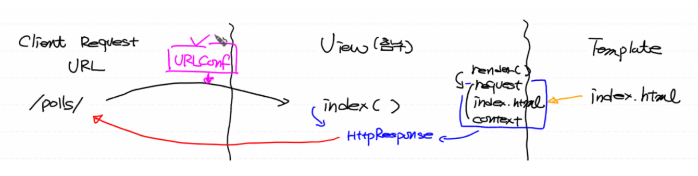

# Poll Application(2) - 설문조사 완성

**[Poll Application(1) 복습]**



## Poll Application (1) **수정사항 - Namespace**

1. <u>**계층구조로 URL 관리**</u>

   URL을 각 Application마다 따로 관리해야 한다.  

   

   **이전 버전의 문제점**

   Application 마다 링크가 모두 다를 경우, 루트 url configuration에서 Client Request URL을 모두 관리해야 하므로 유지 보수가 힘들다.  

   

   **해결책**

   URLConf 관리 구조 변경

   최상위 URL Configuration ([settings.py](http://settings.py))인 Root_URL_CONF이 원래는 클라이언트의 Request를 모두 처리했지만, 이제는  url을 각 Application마다 분배하는 역할로 변경해야 된다.

   따라서

   `path('application name/', include('application name.urls'))`

   을 해주면 이 `'링크/'`에 대한 모든 내용을 `include` 안에 잡은 모듈로 전달하게 된다.  
   
   
   
   **(mysite/urls.py) 수정**
   
   ```python
   from django.contrib import admin
   from django.urls import path, include
   
   # 고정 url: <http://localhost:8000/>
   urlpatterns = [
    path('admin/', admin.site.urls),
   
		# 이 링크에 대한 모든 내용은 작업 위임 
       path('polls/', include('polls.urls')) 
]
   ```
   
     
   
   **(polls/urls.py) 생성**
   
   `polls` 라는 이름의 Application 안으로 들어오는 url 만 처리
   
   ```python
   from django.urls import path
   from . import views # . 현재 폴더
   
   # 고정 url: <http://localhost:8000/polls/>
   urlpatterns = [
       path('', views.index, name='index')
   ]
   ```

  

**[Namespace]**

다른 Application과의 논리적 이름 충돌을 원천적으로 방지

논리적 이름인 `name='index'`가 Template에서 사용될 때, 다른 Application에서 사용되는 논리적 이름 `name='index'`과 구별하기 위해 **namespace**를 사용한다.

따라서 각 Application마다 사용되는 논리적 이름을 구별하기 위해 **namespace** 이용함  


**사용법**

- [urls.py](http://urls.py) - `app_name = '어플리케이션 이름'`

- Template file - `Application 이름:논리적 이름` 이렇게 명명해줘야 함  

  

**(polls/urls.py) 수정**

```python
from django.urls import path
from . import views

**app_name = 'polls' # namespace** 
urlpatterns = [
    path('', views.index, name='index') # polls:index 
]
```

 

2. <u>**Template**</u>

각 어플리케이션 마다 templates/HTML 파일이 존재  


**문제점**

프로젝트 밑에 `templates` 폴더가 있고, 각 어플리케이션 마다 존재하는 `templates` 폴더 안에 프로젝트의 `templates` 폴더 안 HTML 파일과 동일명의 HTML 파일이 있을 경우,  `view.py`에서 render 함수는 프로젝트(루트) 단위의 `templates` 폴더에서 먼저 HTML 파일을 찾게된다.  


**해결책**

Namespace 역할 부여

1. [settings.py](http://settings.py) 수정

2. 각 어플리케이션의 templates 폴더 안에 어플리케이션 이름으로 폴더 생성 (최종 html 파일 보관소)  

   

**([settings.py](http://settings.py)) 수정**

```
'DIRS': [os.path.join(BASE_DIR), 'templates'],
```

: 공통 템플릿 폴더 루트 추가 설정

- 템플릿 폴더를 프로젝트 레벨의 `BASE_DIR`: 프로젝트 루트 아래로 설정 (`os.path.join`: 경로(프로젝트 루트 폴더에 '폴더명'을 붙여라, 연결해라)
- 따라서 동일명의 Templates을 찾을 때 `BASE_DIR` 아래의 Templates 부터 찾게됨
- 그 후 Application 레벨로 내려와 찾는다.

```python
# 클라이언트에 돌려줄 HTML 파일들의 위치 폴더 설정
TEMPLATES = [
    {
        'BACKEND': 'django.template.backends.django.DjangoTemplates',
        'DIRS': [os.path.join(BASE_DIR), 'templates'], # template 위치 명시
        'APP_DIRS': True, # 어플리케이션 마다 templates 폴더 사용 허용
        'OPTIONS': {
            'context_processors': [
                'django.template.context_processors.debug',
                'django.template.context_processors.request',
                'django.contrib.auth.context_processors.auth',
                'django.contrib.messages.context_processors.messages',
            ],
        },
    },
]
```

  

**(polls/templates/polls)**

**([views.py](http://views.py)) 변경**

- `어플리케이션/templates/어플리케이션`
- 따라서 `polls/templates/polls` 이름의 폴더 생성

```python
from django.shortcuts import render
from polls.models import Question

def index(request): 
    question_list = Question.objects.all().order_by('-pub_date')[:5] 
    context = {'q_list': question_list}  

    return render(request, 'polls/index.html', context)  # index.html 루트 재설정
```

  

## 질문 클릭 시 보기 항목 띄우기  - 투표 화면

**(polls/urls.py)**

각 질문마다 서버에 request(url 링크)를 다르게 전달

`polls/urls.py`에서 URLConf 설정 적용  


**`<`변하는 값`>`에 대한 Django 문법**

```
<데이터 타입:데이터 값>
```

- 기본적인 <u>데이터 타입</u>은 `str`
- 이때 <u>데이터값 변수</u>는 View 함수의 두번째 파라미터 값으로 전달됨 
  (첫번째 인자는 항상 클라이언트의 request 객체)

```python
from django.urls import path
from . import views

# 고정 url: <http://localhost:8000/polls/>
app_name = 'polls' # namespace
urlpatterns = [
    path('', views.index, name='index'), # polls:index

    # polls/숫자/
    # 변하는 값 명시 <숫자:데이터>
    path('<int:question_id>/', views.detail, name='detail') # detail: 해당 설문에 대한 항목 리스트
]
```

  

**(views.py)**

`get_object_or_404`: 객체 하나 가져옴 (없을 경우 404 에러남)

```python
from django.shortcuts import render, get_object_or_404
from polls.models import Question

def index(request): 
    question_list = Question.objects.all().order_by('-pub_date')[:5]
    context = {'q_list': question_list}  # 모델 데이터
    return render(request, 'polls/templates/polls/index.html', context)

def detail(request, question_id):

    # question_id(설문 pk) 숫자가 들어옴
    question = get_object_or_404(Question, pk=question_id) # Question의 pk = id 컬럼
    context = {'selected_question': question}
    return render(request, 'polls/detail.html', context)
```

  

**(polls/templates/polls/detail.html)**

- <u>**Form - 사용자 입력 양식 (라디오 버튼)**</u>

  **[`Form` 태그 사용 시, 첫줄에 꼭 사용]**

  ``: 크래킹 해킹 기법을 방지 (웹 보안 처리 양식)  

  

  **[라디오 버튼의 이해]**

  - 중복체크 허용(default)

  - `name`: 여러 개의 라디오 버튼에 대해서 단일 체크 가능

    `name` 속성의 이름이 같을 경우, 라디오 버튼 항목들이 그룹으로 묶이기 때문에 그 그룹에 한해서 단일 체크 가능

  - `value`: 서버에 전송하는 데이터 값 (선택한 보기)

    ​			  (`name=value값` 형태로 서버에 전송됨, 후에 view.py에서 사용)
  
- `id`: 라디오 버튼의 이름 부여
  
  `<label for="라디오 버튼의 id명">`: 라디오 버튼에 라벨 적용  
  
    
  
- <u>**Django 템플릿 문법**</u>

  - `selected_question.choice_set.all`

    : `selected_question`과 연결된 `choice` 테이블(클래스) 집합(레코드)을 `all` 다 가져옴

    (selected_question 과 choice 테이블이 foreign key로 연결되 있기 때문에 가능)

    따라서 `` 에서 `choice` 는 `Choice` 클래스의 인스턴스로 질문 항목들에 대한 리스트 형태

  - `{{ forloop.counter }}`

    : for loop의 인덱스 (0부터 시작), 매칭용

  - 함수 호출 시 괄호를 사용하지 않음  

    

- <u>**특수한 기능을 하는 버튼**</u>

  Form 태그 안에 존재하도록 생성

  `<input type="submit" value="Vote!"> ` 

  

- <u>**Client Request url**</u>

  **Form 태그**에서는 **POST 방식**으로 서버에 request 전송

  - `action="url"`: url 생성

  - `method="POST"`: Client Request 전송 방법

  - `<form action="" method="POST"`

    : `polls` 라는 네임스페이스에 `vote` 라는 이름으로 되어있는 url를 이용

    여기서 `polls:vote` 의 url을 보면 `<int:question_id>` 라는 숫자가 들어가기 때문에 `selected_question.id` 를 인자로 넘겨줌

    따라서 사용자가 투표 버튼(submit)을 누르면 사용자가 선택한 라디오 버튼 정보(보기 항목)가 POST 방식으로 서버에 request를 보낸다. 
(선택 항목은 Request body에 들어가있음)  
    

    
    **(polls/urls.py)**
    
    ```python
    from django.urls import path
    from . import views
    
    # 고정 url: <http://localhost:8000/polls/>
    app_name = 'polls' # namespace
    urlpatterns = [
        path('', views.index, name='index'), 
        path('<int:question_id>/', views.detail, name='detail'), 
    
    		# <http://localhost:8000/polls/1/vote/>
        path('<int:question_id>/vote/', views.vote, name='vote') # polls:vote
    ]
    ```

```html
<!DOCTYPE html>
<html lang="en">
<head>
    <meta charset="UTF-8">
    <title>Title</title>
</head>
<body>
    <h1>{{ selected_question.question_text }}</h1>
    <!-- <http://localhost:8000/polls/>{{ selected_question.id }}/vote/ -->
    <form action="" method="POST">
    
        
        <input type="radio" name="my_choice" id="kaka{{ forloop.counter }}" value="{{ choice.id }}">
        <label for="kaka{{ forloop.counter }}">{{ choice.choice_text }}</label><br>
        
        <br>
        <input type="submit" value="Vote!">
    </form>
</body>
</html>
```

  

## 사용자가 선택한 항목의 득표수 수정

URL POST 방식 이해  


**([views.py](http://views.py))**

```
question.choice_set.get(pk=request.POST['my_choice'])
```

: POST 방식으로 request (`name=value`)가 서버로 넘어올 때, `name`으로 넘어온 값(`value`)을 받아서 primary key로 사용

그렇기 때문에 (detail.html)에서 `value` 값을 `choice_id` 로 잡았음

클라이언트가 POST 방식으로 보낸 request 안에 들어있는 `'my_choice'` 라는 데이터를 꺼내라. 그러면 사용자가 선택한 항목의 id 값이 pk의 값으로 설정됨

```python
from django.shortcuts import render, get_object_or_404
from polls.models import Question

def index(request):
    question_list = Question.objects.all().order_by('-pub_date')[:5]
    context = {'q_list': question_list}  # 모델 데이터
    return render(request, 'polls/templates/polls/index.html', context)

def detail(request, question_id):
    # question_id(설문 pk) 숫자가 들어옴
    question = get_object_or_404(Question, pk=question_id) # Question의 pk = id 컬럼
    context = {'selected_question': question}
    return render(request, 'polls/detail.html', context)

def vote(request, question_id):
    question = get_object_or_404(Question, pk=question_id)

    # 템플릿 코드 함수와 혼돈 X
    # 클라이언트가 선택한 보기 알아내기
    selected_choice = question.choice_set.get(pk=request.POST['my_choice']) 

    # 투표수 수정
    selected_choice.votes += 1
    selected_choice.save() # 객체 값의 변경 내용을 데이터베이스에 적용

    context = {'selected_question': question}
    return render(request, 'polls/detail.html', context)
```

  

<u>**[예외처리] 사용자가 보기 선택을 안했을 경우**</u>

**([views.py](http://views.py))**

```python
from django.shortcuts import render, get_object_or_404
from polls.models import Question, Choice

def index(request):
    question_list = Question.objects.all().order_by('-pub_date')[:5]
    context = {'q_list': question_list} 
    return render(request, 'polls/templates/polls/index.html', context)

def detail(request, question_id):
    question = get_object_or_404(Question, pk=question_id) 
    context = {'selected_question': question}
    return render(request, 'polls/detail.html', context)

def vote(request, question_id):
    question = get_object_or_404(Question, pk=question_id)

    try:
        selected_choice = question.choice_set.get(pk=request.POST['my_choice'])
    except(KeyError, Choice.DoesNotExist):
        # PK가 없어서 오류가 발생할 경우
        return render(request, 'polls/detail.html', {'selected_question': question,
                                                     'error_message': 'Nothing was chosen'}) # {context}
    else:
        selected_choice.votes += 1
        selected_choice.save()
        context = {'selected_question': question}
        return render(request, 'polls/detail.html', context)
```

  

**(detail.html)**

```html
<!DOCTYPE html>
<html lang="en">
<head>
    <meta charset="UTF-8">
    <title>Title</title>
</head>
<body>
    <h1>{{ selected_question.question_text }}</h1>
    
    <!-- 에러 처리 -->
    
        <div>{{ error_message }}</div>
    

    <!-- <http://localhost:8000/polls/>{{ selected_question.id }}/vote/ -->
    <form action="" method="POST">
    
        
        <input type="radio" name="my_choice" id="kaka{{ forloop.counter }}" value="{{ choice.id }}">
        <label for="kaka{{ forloop.counter }}">{{ choice.choice_text }}</label><br>
        
        <br>
        <input type="submit" value="Vote!">
    </form>
</body>
</html>
```

   

## 투표결과 화면

**([views.py](http://views.py))**

```
HttpResponseRedirect(reverse('namespace:name', args=(url에서 바뀌는 숫자)))
```

: 클라이언트한테 URL을 전송해서 다시 서버에 호출할 request url을 보내라, 이때 url 주소는 urls.py에 지정해 놓은 논리적 이름으로 역추적해라. 그리고 이 url 주소로 클라이언트가 재접속하게 됨

- `HttpResponse()`: 렌더함수로 생성된 HTML 형식의 클래스 타입 객체로, 클라이언트가 이 결과를 브라우징하게됨

- `HttpResponseRedirect()`: 클라이언트가 다시 서버에 request 보낼 수 있도록 URL을 보냄

- `reverse()`: URL Configuration ([urls.py](http://urls.py))에 있는 `name`을 이용해서 url 형식으로 변환 (논리적 이름으로 url path 역추적)  

  

```python
from django.shortcuts import render, get_object_or_404
from polls.models import Question, Choice
from django.http import HttpResponseRedirect
from django.urls import reverse

def index(request):
    question_list = Question.objects.all().order_by('-pub_date')[:5]
    context = {'q_list': question_list}  # 모델 데이터
    return render(request, 'polls/templates/polls/index.html', context)

def detail(request, question_id):
    # question_id(설문 pk) 숫자가 들어옴
    question = get_object_or_404(Question, pk=question_id) # Question의 pk = id 컬럼
    context = {'selected_question': question}
    return render(request, 'polls/detail.html', context)

def vote(request, question_id):
    question = get_object_or_404(Question, pk=question_id)

    try:
        selected_choice = question.choice_set.get(pk=request.POST['my_choice'])
    except(KeyError, Choice.DoesNotExist):
        # PK가 없어서 오류가 발생할 경우
        return render(request, 'polls/detail.html', {'selected_question': question,
                                                     'error_message': 'Nothing was chosen'}) # {context}
    else:
        selected_choice.votes += 1
        selected_choice.save()

        return HttpResponseRedirect(reverse('polls:results', args=(question.id, ))) # 인자가 1개인 튜플 형태
        # context = {'selected_question': question}
        # return render(request, 'polls/detail.html', context) # HttpResponse 객체가 리턴됨 (클라이언트가 이 결과 HTML를 브라우징함)
```

  

**([urls.py](http://urls.py))**

```python
from django.urls import path
from . import views

# 고정 url: <http://localhost:8000/polls/>
app_name = 'polls' # namespace
urlpatterns = [
    path('', views.index, name='index'), # polls:index

    # polls/숫자/
    # 변하는 값 명시 <숫자:데이터>
    path('<int:question_id>/', views.detail, name='detail'), # detail: 해당 설문에 대한 항목 리스트
    path('<int:question_id>/vote/', views.vote, name='vote'), # polls:vote
    
    # <http://localhost:8000/polls/1/results/>
    path('<int:question_id>/results/', views.results, name='results') # polls:results
]
```

  

**([views.py](http://views.py))**

results 함수 정의

```python
from django.shortcuts import render, get_object_or_404
from polls.models import Question, Choice
from django.http import HttpResponseRedirect
from django.urls import reverse

def index(request):
    question_list = Question.objects.all().order_by('-pub_date')[:5]
    context = {'q_list': question_list}  # 모델 데이터
    return render(request, 'polls/templates/polls/index.html', context)

def detail(request, question_id):
    # question_id(설문 pk) 숫자가 들어옴
    question = get_object_or_404(Question, pk=question_id) # Question의 pk = id 컬럼
    context = {'selected_question': question}
    return render(request, 'polls/detail.html', context)

def vote(request, question_id):
    question = get_object_or_404(Question, pk=question_id)

    try:
        selected_choice = question.choice_set.get(pk=request.POST['my_choice'])
    except(KeyError, Choice.DoesNotExist):
        # PK가 없어서 오류가 발생할 경우
        return render(request, 'polls/detail.html', {'selected_question': question,
                                                     'error_message': 'Nothing was chosen'}) # {context}
    else:
        selected_choice.votes += 1
        selected_choice.save()

        return HttpResponseRedirect(reverse('polls:results', args=(question.id, ))) # 인자가 1개인 튜플 형태
        # context = {'selected_question': question}
        # return render(request, 'polls/detail.html', context) # HttpResponse 객체가 리턴됨 (클라이언트가 이 결과 HTML를 브라우징함)

def results(request, question_id):
    question = get_object_or_404(Question, pk=question_id)
    return render(request, 'polls/results.html', {
        'question': question 
    })
```

  

**(results.html)**

```html
<!DOCTYPE html>
<html lang="en">
<head>
    <meta charset="UTF-8">
    <title>Title</title>
</head>
<body>
    <h1>{{ question.question_text }}</h1>
    <ul>
        
            <li>{{ choice.choice_text }} - {{ choice.votes }}</li> <!-- 보기 - 득표수 -->
        
    </ul>
    <a href="">REVOTE?</a>
</body>
</html>
```

   

## 여기까지 **작동 메커니즘 정리**

1. [urls.py](http://urls.py) 역할 수정 - 폴더: mysite, polls
2. polls/urls.py 네임스페이스 설정
3. [urls.py](http://urls.py) TEMPLATES 설정
4. Application Templates 폴더 재설정 후, [views.py](http://views.py) - 렌더함수 매개변수 변경

------

1. 질문 클릭 시 보기 항목 페이지 이동
   - polls/urls.py - 질문에 따라 url이 변하도록 path 설정
   - [views.py](http://views.py) - polls/urls.py 에서 명시한 함수 정의
   - detail.html - form 태그, 라디오버튼
   - polls/urls.py - form 태그에서 명시한 url 생성
2. 사용자가 선택한 항목의 득표수 수정
   - [views.py](http://views.py) - detail.html의 form 태그에서 지정한([urls.py](http://urls.py) 에서도 언급한) url에 대한 함수 생성
   - 사용자가 보기 항목 선택을 안하고 버튼을 눌렀을 때의 예외처리 - [views.py](http://views.py), detail.html
3. 투표결과 페이지 생성
   - [views.py](http://views.py) - HttpResponseRedirect 함수, reverse 함수를 이용하여 클라이언트에 url 리턴
   
   - [urls.py](http://urls.py) - 투표 페이지 path 설정
   
   - [views.py](http://views.py) - urls.py에서 설정한 함수 생성  
   
     

## 전체 어플리케이션 작동 **메커니즘 정리**

1. 프로젝트 및 어플리케이션 생성
2. [settings.py](http://settings.py) 설정
3. default 데이터베이스 생성 (관리자 페이지)
4. 관리자 계정 생성
5. Model - [models.py](http://models.py) 작성
6. 관리자 페이지에 클래스 등록 ([admin.py](http://admin.py))
7. 데이터베이스 변경 사항 등록 (terminal) 후 브라우징 툴을 통해 테이블 확인 가능
8. URLConf - [urls.py](http://urls.py) 연동 (폴더: mysite, polls)
9. polls/urls.py 네임스페이스 설정
10. mysite/urls.py TEMPLATES 설정 (각 어플리케이션의 Templates 폴더 안 폴더명 주의)
11. Views - 사용자 정의 함수 설정
12. 데이터베이스 테이블 레코드 생성 (localhost:8000/admin)
13. Template - 템플릿 태그를 사용하여 작성 (Context 객체 사용)
14. 질문 클릭 시 보기 항목 페이지 이동
    - polls/urls.py - 질문에 따라 url이 변하도록 path 설정
    - [views.py](http://views.py) - polls/urls.py 에서 명시한 함수 정의
    - detail.html - form 태그, 라디오버튼
    - polls/urls.py - form 태그에서 명시한 url 생성
15. 사용자가 선택한 항목의 득표수 수정
    - [views.py](http://views.py) - detail.html의 form 태그에서 지정한([urls.py](http://urls.py) 에서도 언급한) url에 대한 함수 생성
    - 사용자가 보기 항목 선택을 안하고 버튼을 눌렀을 때의 예외처리 - [views.py](http://views.py), detail.html
16. 투표결과 페이지 생성
    - [views.py](http://views.py) - HttpResponseRedirect 함수, reverse 함수를 이용하여 클라이언트에 url 리턴
    - [urls.py](http://urls.py) - 투표 페이지 path 설정
    - [views.py](http://views.py) - urls.py에서 설정한 함수 생성