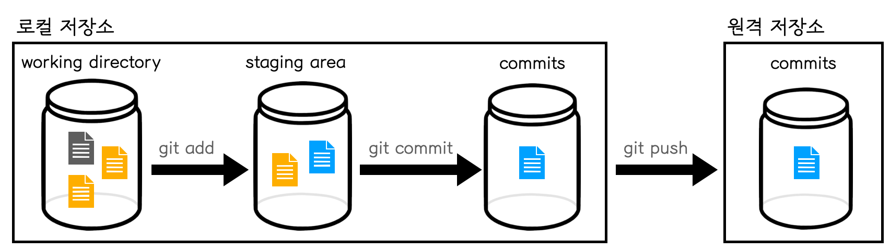

# [git 기초] git, 정말 지옥에서 왔을까?


## git 이란? 분산 버전 관리 시스템 (DVCS)

> 코드의 히스토리를 관리하는 도구

* 개발된 과정과 역사를 단계적으로 볼 수 있음
* 프로젝트의 이전 버전을 복원하고 변경 사항을 비교, 분석 및 병합도 가능함


## git의 작업 흐름

> 로컬 저장소의 **세 개의 통**만 기억하자



### [로컬 저장소]

#### 1. working directory

* **[정의]** 우리가 폴더를 만들고 파일을 만드는 작업 공간

* **[사용법]** `git add` 를 하면 `staging area` 로 이동

#### 2. staging area

* **[정의]** 커밋을 하려고 하는 대상 파일들이 있는 공간
* **[사용법]** `git commit` 을 하면 `commits` 로 이동

#### 3. commits

* **[정의]** 특정 시점의 **스냅샷**으로 원격 저장소(remote repository)로 들어가기 직전의 공간
* **[사용법]** `git push` 를 하면 원격 저장소(remote repository)로 올라감


### [원격 저장소]

> 위의 로컬 저장소의 세번 째 통인 `commits` 박스


## git 사용방법

> 반드시 경로(directory)와 `git status` 를 확인하는 습관이 중요

### 0. 터미널 오픈

* git에 올릴 파일 또는 폴더가 있는 경로로 이동
* 예를 들어, `cd /폴더경로` 입력 후 엔터! 

### 1. git commit author 설정

* `git config --global user.name '사용자 이름 입력'`
* `git config --global user.email '사용자 이메일 주소(github 이메일과 동일하게 설정)'`
* **git commit author 체크용:** `git config --global -l` 

### 2. 로컬 저장소 설정

```bash
git init
```

* 저장소 초기화
*  `.git` 폴더가 생성되고, 여기에 모든 **git과 관련된 정보들**이 저장됨

### 3. add

```bash
# 상황에 맞게 한 줄만 타이핑 후 엔터!

git add . # . : 현재 디렉토리 (하위 디렉토리 포함)
git add a.txt # 특정 파일
git add my_folder/ # 특정 폴도
git add a.txt b.txt c.txt # 복수의 파일
```

* *working directory* 의 변경사항을 *staging area* 상태로 변경
* `commit` 할 대상 파일을 관리


### 4. commit

```bash
git commit -m 'First Commit Message'
```

* 지금 상태를 **스냅샷** 찍음

* 커밋 메세지는 지금 기록하는 이력을 충분히 잘 나타낼 수 있도록 작성

  **[부록] 좋은 git 커밋 메세지 작성 방법**

  * [좋은 git 커밋 메시지를 작성하기 위한 7가지 약속](https://meetup.toast.com/posts/106)
  * [좋은 git commit 메시지를 위한 영어 사전](https://blog.ull.im/engineering/2019/03/10/logs-on-git.html)


### 5. 기타 명령어

#### 로컬 저장소의 상태 확인

* `git status`

#### 커밋 히스토리 확인

* `git log`
* `git log --oneline`
* `git log -1` : 최신 커밋 한개만 보여줘!
* `git log --oneline -1`

#### 커밋 삭제 (경로 꼭 확인 후 사용, 비권장 명령어...)

* `rm -rf .git`

  

## [부록] github 란? 사용법?

> git이 관리한 내 컴퓨터 코드를 업로드 할 **원격 저장소(remote repository)**


### 바로 사용해보자!

### 1. Create a new repository

* 자신의 github에 접속 후 **new repository** 클릭

- Repository name 설정
- Description 입력
- **Public** or Private (Pbulic 권장)
- Create repository 클릭

### 2. 아래의 명령어를 터미널에 입력

```bash
# 항상 경로 확인! (github에 업로드 할 파일이 저장된 폴더로 이동 후 작업)
cd /Users/sammita/__git init으로 생성한 폴더 이름__

git remote add origin __url__ # 이 명령어는, 위 1번에서 repository 생성 후 나오는 페이지에서 …or create a new repository on the command line 박스에 있는 명령어를 복사  
git push origin master 

git remote -v # 체크용
```

### 3. 해당 파일을 추가 작업 시 이것만 해주면 끝!

```bash
# 항상 경로 확인! (github에 업로드 할 파일이 저장된 폴더로 이동 후 작업)
cd /Users/sammita/__git init으로 생성한 폴더 이름__

git add .
git commit -m 'commit message'
git push origin master
git remote -v # 체크용
```

